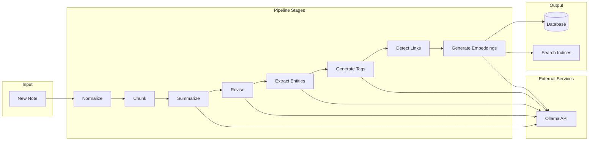

# NLP Pipeline Architecture

## Overview
The NLP pipeline is a modular, asynchronous system that processes notes through multiple stages of enhancement while maintaining the original content immutable.

## Pipeline Architecture



## Core Components

### Pipeline Manager
```rust
pub struct PipelineManager {
    stages: Vec<Box<dyn PipelineStage>>,
    ollama_client: Arc<OllamaClient>,
    db_pool: Arc<PgPool>,
    config: PipelineConfig,
}

impl PipelineManager {
    pub async fn process_note(&self, note_id: Uuid) -> Result<PipelineResult> {
        let mut context = PipelineContext::new(note_id);
        
        for stage in &self.stages {
            stage.execute(&mut context).await?;
            self.emit_progress(&context).await;
        }
        
        Ok(context.into_result())
    }
}
```

### Pipeline Context
```rust
pub struct PipelineContext {
    pub note_id: Uuid,
    pub original_content: String,
    pub normalized_content: Option<String>,
    pub chunks: Vec<TextChunk>,
    pub summary: Option<String>,
    pub revised_content: Option<String>,
    pub entities: Vec<Entity>,
    pub tags: Vec<String>,
    pub links: Vec<DetectedLink>,
    pub embeddings: Vec<Embedding>,
    pub metadata: HashMap<String, Value>,
}
```

## Pipeline Stages

### 1. Normalization Stage
**Purpose**: Clean and standardize input text

```rust
pub struct NormalizationStage {
    rules: Vec<Box<dyn NormalizationRule>>,
}

impl PipelineStage for NormalizationStage {
    async fn execute(&self, context: &mut PipelineContext) -> Result<()> {
        let mut text = context.original_content.clone();
        
        // Apply normalization rules
        text = self.fix_encoding(&text)?;
        text = self.normalize_whitespace(&text);
        text = self.fix_line_endings(&text);
        text = self.remove_control_chars(&text);
        
        context.normalized_content = Some(text);
        Ok(())
    }
}
```

**Operations**:
- UTF-8 encoding validation
- Whitespace normalization
- Line ending standardization
- Control character removal
- Unicode normalization (NFC)

### 2. Chunking Stage
**Purpose**: Split text into processable segments

```rust
pub struct ChunkingStage {
    strategy: ChunkingStrategy,
    max_chunk_size: usize,
    overlap: usize,
}

pub enum ChunkingStrategy {
    Sentence,
    Paragraph,
    SlidingWindow,
    Semantic,
}

impl ChunkingStage {
    async fn chunk_text(&self, text: &str) -> Vec<TextChunk> {
        match self.strategy {
            ChunkingStrategy::Sentence => self.chunk_by_sentence(text),
            ChunkingStrategy::Paragraph => self.chunk_by_paragraph(text),
            ChunkingStrategy::SlidingWindow => self.chunk_sliding(text),
            ChunkingStrategy::Semantic => self.chunk_semantic(text).await,
        }
    }
}
```

**Strategies**:
- **Sentence**: Split on sentence boundaries
- **Paragraph**: Split on paragraph breaks
- **Sliding Window**: Fixed size with overlap
- **Semantic**: Content-aware splitting

### 3. Summarization Stage
**Purpose**: Generate concise summary

```rust
pub struct SummarizationStage {
    ollama_client: Arc<OllamaClient>,
    model: String,
    prompt_template: String,
}

impl PipelineStage for SummarizationStage {
    async fn execute(&self, context: &mut PipelineContext) -> Result<()> {
        let prompt = self.build_prompt(&context.normalized_content.as_ref().unwrap());
        
        let response = self.ollama_client
            .generate(GenerateRequest {
                model: self.model.clone(),
                prompt,
                options: GenerateOptions {
                    temperature: 0.3,
                    max_tokens: 500,
                },
            })
            .await?;
        
        context.summary = Some(response.text);
        Ok(())
    }
}
```

**Prompt Template**:
```
Summarize the following text concisely while preserving key information:

{text}

Summary:
```

### 4. Revision Stage
**Purpose**: Enhance clarity and structure

```rust
pub struct RevisionStage {
    ollama_client: Arc<OllamaClient>,
    revision_rules: Vec<RevisionRule>,
}

impl RevisionStage {
    async fn revise(&self, text: &str) -> Result<String> {
        // Apply rule-based improvements
        let mut revised = self.apply_rules(text)?;
        
        // LLM-based enhancement
        let prompt = format!(
            "Improve the clarity and structure of this text while preserving meaning:\n\n{}",
            revised
        );
        
        let response = self.ollama_client.generate(/* ... */).await?;
        
        Ok(response.text)
    }
}
```

**Revision Rules**:
- Grammar correction
- Sentence structure improvement
- Paragraph organization
- Clarity enhancement
- Redundancy removal

### 5. Entity Extraction Stage
**Purpose**: Identify named entities and concepts

```rust
pub struct EntityExtractionStage {
    ollama_client: Arc<OllamaClient>,
    entity_types: Vec<EntityType>,
}

#[derive(Debug, Clone)]
pub enum EntityType {
    Person,
    Organization,
    Location,
    Date,
    Concept,
    Technology,
    Custom(String),
}

impl EntityExtractionStage {
    async fn extract_entities(&self, text: &str) -> Result<Vec<Entity>> {
        let prompt = self.build_extraction_prompt(text);
        
        let response = self.ollama_client
            .generate_json(prompt)
            .await?;
        
        self.parse_entities(response)
    }
}
```

**Output Format**:
```json
{
  "entities": [
    {
      "text": "Microsoft",
      "type": "Organization",
      "confidence": 0.95
    },
    {
      "text": "machine learning",
      "type": "Concept",
      "confidence": 0.88
    }
  ]
}
```

### 6. Tag Generation Stage
**Purpose**: Auto-generate relevant tags

```rust
pub struct TagGenerationStage {
    ollama_client: Arc<OllamaClient>,
    existing_tags: Arc<RwLock<HashSet<String>>>,
    max_tags: usize,
}

impl TagGenerationStage {
    async fn generate_tags(&self, context: &PipelineContext) -> Result<Vec<String>> {
        // Combine entities and key phrases
        let candidates = self.extract_candidates(context);
        
        // Score and rank candidates
        let scored = self.score_candidates(candidates).await?;
        
        // Select top tags
        let tags = scored
            .into_iter()
            .take(self.max_tags)
            .map(|(tag, _)| tag)
            .collect();
        
        Ok(tags)
    }
}
```

**Tag Scoring Factors**:
- Entity relevance
- Term frequency
- Existing tag similarity
- Domain specificity

### 7. Link Detection Stage
**Purpose**: Find related notes and external references

```rust
pub struct LinkDetectionStage {
    db_pool: Arc<PgPool>,
    similarity_threshold: f32,
}

impl LinkDetectionStage {
    async fn detect_links(&self, context: &PipelineContext) -> Result<Vec<DetectedLink>> {
        let mut links = Vec::new();
        
        // Find related notes by content similarity
        let similar_notes = self.find_similar_notes(context).await?;
        
        // Detect explicit references
        let references = self.detect_references(&context.revised_content);
        
        // Identify URL mentions
        let urls = self.extract_urls(&context.revised_content);
        
        links.extend(similar_notes);
        links.extend(references);
        links.extend(urls);
        
        Ok(links)
    }
}
```

**Link Types**:
- **Related**: Content similarity > threshold
- **Reference**: Explicit mention
- **Citation**: Academic reference
- **Task**: TODO/action items

### 8. Embedding Generation Stage
**Purpose**: Create vector representations for semantic search

```rust
pub struct EmbeddingStage {
    ollama_client: Arc<OllamaClient>,
    model: String, // nomic-embed-text
    dimension: usize, // 768
}

impl EmbeddingStage {
    async fn generate_embeddings(&self, chunks: &[TextChunk]) -> Result<Vec<Embedding>> {
        let mut embeddings = Vec::new();
        
        for chunk in chunks {
            let vector = self.ollama_client
                .embed(EmbedRequest {
                    model: self.model.clone(),
                    text: chunk.text.clone(),
                })
                .await?;
            
            embeddings.push(Embedding {
                chunk_id: chunk.id,
                vector: vector.into(),
                model: self.model.clone(),
            });
        }
        
        Ok(embeddings)
    }
}
```

## Ollama Integration

### Client Implementation
```rust
pub struct OllamaClient {
    base_url: String,
    client: reqwest::Client,
    timeout: Duration,
}

impl OllamaClient {
    pub async fn generate(&self, req: GenerateRequest) -> Result<GenerateResponse> {
        let response = self.client
            .post(&format!("{}/api/generate", self.base_url))
            .json(&req)
            .timeout(self.timeout)
            .send()
            .await?;
        
        response.json().await
    }
    
    pub async fn embed(&self, req: EmbedRequest) -> Result<EmbedResponse> {
        let response = self.client
            .post(&format!("{}/api/embeddings", self.base_url))
            .json(&req)
            .send()
            .await?;
        
        response.json().await
    }
}
```

### Model Configuration
```yaml
models:
  generation:
    name: gpt-oss:20b
    temperature: 0.7
    max_tokens: 2000
    
  embedding:
    name: nomic-embed-text
    dimension: 768
    
  fallback:
    name: llama3:8b
    temperature: 0.5
```

## Error Handling

### Retry Strategy
```rust
pub struct RetryPolicy {
    max_attempts: usize,
    base_delay: Duration,
    max_delay: Duration,
}

impl PipelineStage for RetryableStage {
    async fn execute(&self, context: &mut PipelineContext) -> Result<()> {
        retry_with_backoff(
            || self.inner.execute(context),
            &self.retry_policy,
        ).await
    }
}
```

### Fallback Mechanisms
1. **Ollama Unavailable**: Skip enhancement, keep original
2. **Model Missing**: Use fallback model
3. **Timeout**: Partial processing with warning
4. **Error**: Log and continue pipeline

## Performance Optimization

### Parallel Processing
```rust
pub async fn process_batch(notes: Vec<Uuid>) -> Vec<Result<PipelineResult>> {
    let semaphore = Arc::new(Semaphore::new(10)); // Max 10 concurrent
    
    let tasks: Vec<_> = notes
        .into_iter()
        .map(|note_id| {
            let sem = semaphore.clone();
            async move {
                let _permit = sem.acquire().await;
                process_note(note_id).await
            }
        })
        .collect();
    
    futures::future::join_all(tasks).await
}
```

### Caching
```rust
pub struct PipelineCache {
    embeddings: LruCache<String, Vec<f32>>,
    summaries: LruCache<String, String>,
    ttl: Duration,
}
```

### Resource Management
- **Connection Pooling**: Reuse Ollama connections
- **Batch Processing**: Group similar operations
- **Memory Limits**: Stream large texts
- **Timeout Control**: Per-stage timeouts

## Monitoring & Metrics

### Pipeline Metrics
```rust
pub struct PipelineMetrics {
    pub stage_durations: HashMap<String, Duration>,
    pub total_duration: Duration,
    pub tokens_processed: usize,
    pub errors: Vec<PipelineError>,
}
```

### Progress Tracking
```rust
pub enum PipelineEvent {
    Started { note_id: Uuid },
    StageCompleted { stage: String, progress: f32 },
    Completed { result: PipelineResult },
    Failed { error: PipelineError },
}
```

## Testing Strategy

### Unit Tests
```rust
#[cfg(test)]
mod tests {
    #[tokio::test]
    async fn test_normalization() {
        let stage = NormalizationStage::default();
        let mut context = PipelineContext::new(Uuid::new_v4());
        context.original_content = "Test\r\n  content".to_string();
        
        stage.execute(&mut context).await.unwrap();
        
        assert_eq!(
            context.normalized_content.unwrap(),
            "Test\n content"
        );
    }
}
```

### Integration Tests
- Mock Ollama responses
- Test full pipeline flow
- Verify database updates
- Check index generation

### Performance Tests
- Measure stage durations
- Test concurrent processing
- Validate memory usage
- Check timeout behavior