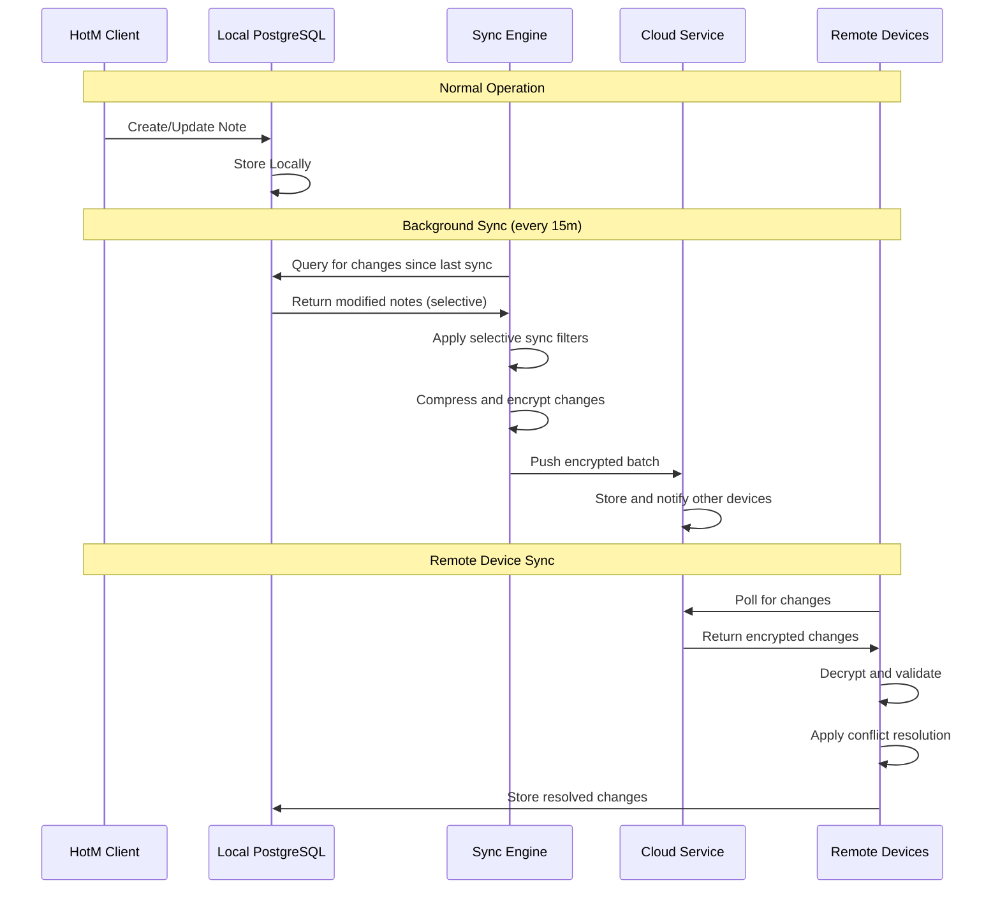

# Cloud Sync Architecture

## Overview

HotM's cloud sync architecture enables cross-device portability while maintaining the local-first principle. The embedded PostgreSQL/DocumentDB on each client provides full local capability, with selective cloud synchronization for multi-device workflows and large-scale AI inference needs.

## Architecture Principles

### Local-First Design
- **Primary Data Store**: Embedded PostgreSQL with pgvector on each client
- **Full Local Capability**: All core features work offline without cloud dependency  
- **Cloud as Enhancement**: Sync and large AI inference are additive capabilities
- **User Control**: Selective sync based on collections, tags, or explicit user choice

### Sync Strategy
- **Push-based**: Clients push changes to cloud endpoints
- **Conflict Resolution**: Last-write-wins with manual resolution option
- **Selective Sync**: Only tagged collections or explicitly chosen notes sync
- **Bandwidth Aware**: Configurable limits and compression

## Cloud Sync Components

### Client-Side Sync Engine

```rust
// Core sync engine architecture
pub struct SyncEngine {
    local_db: Arc<DatabasePool>,
    cloud_client: Arc<CloudClient>,
    config: SyncConfig,
    conflict_resolver: Box<dyn ConflictResolver>,
    bandwidth_manager: BandwidthManager,
}

pub struct SyncConfig {
    pub provider: CloudProvider,
    pub endpoint: String,
    pub auth: AuthConfig,
    pub sync_interval: Duration,
    pub selective_sync: SelectiveSyncConfig,
    pub bandwidth_limit: BandwidthLimit,
    pub conflict_resolution: ConflictResolution,
}

pub enum CloudProvider {
    HotMCloud,    // Official HotM cloud service
    S3Compatible, // S3, MinIO, DigitalOcean Spaces
    Azure,        // Azure Blob Storage
    GoogleCloud,  // Google Cloud Storage
    Custom(CustomProvider),
}
```

### Selective Sync Configuration

```toml
[cloud_sync]
enabled = true
provider = "hotm_cloud"
endpoint = "https://sync.hotm.app"

# Authentication
auth_method = "api_key"  # api_key, oauth, custom
api_key = "${HOTM_CLOUD_API_KEY}"
device_id = "auto-generated-uuid"

# Sync Behavior
sync_interval = "15m"
auto_sync = true
sync_on_startup = true
sync_on_shutdown = true

# Selective Sync Rules
[cloud_sync.selective]
enabled = true
default_sync = false  # Require explicit opt-in

# Sync by collection tags
sync_collections = ["work", "shared", "public"]
exclude_collections = ["personal", "private"]

# Sync by note tags
sync_tags = ["#shared", "#work", "#collaborate"]
exclude_tags = ["#private", "#local-only"]

# Size and content filters
max_note_size = "10MB"
sync_attachments = true
max_attachment_size = "50MB"
exclude_file_types = [".exe", ".dll", ".sys"]

# Advanced filtering
sync_modified_since = "30d"  # Only sync recent changes
sync_created_by = ["user1", "user2"]  # Multi-user scenarios
```

### Conflict Resolution

```rust
pub enum ConflictResolution {
    LastWriteWins,
    ManualResolve,
    KeepBoth,
    KeepLocal,
    KeepRemote,
}

pub struct ConflictResolver {
    strategy: ConflictResolution,
    ui_handler: Option<Box<dyn ConflictUIHandler>>,
}

// Conflict resolution for different data types
impl ConflictResolver {
    pub async fn resolve_note_conflict(
        &self,
        local: &Note,
        remote: &Note,
        conflict_type: ConflictType,
    ) -> Result<ResolutionResult, ConflictError> {
        match self.strategy {
            ConflictResolution::LastWriteWins => {
                if remote.updated_at > local.updated_at {
                    Ok(ResolutionResult::UseRemote(remote.clone()))
                } else {
                    Ok(ResolutionResult::UseLocal(local.clone()))
                }
            },
            ConflictResolution::ManualResolve => {
                self.present_conflict_ui(local, remote, conflict_type).await
            },
            ConflictResolution::KeepBoth => {
                Ok(ResolutionResult::CreateBranches {
                    local: local.clone(),
                    remote: self.rename_for_conflict(remote),
                })
            },
            // Other strategies...
        }
    }
}
```

### Bandwidth Management

```rust
pub struct BandwidthManager {
    limit: Option<BytesPerSecond>,
    current_usage: Arc<Mutex<BandwidthUsage>>,
    priority_queue: PriorityQueue<SyncTask>,
}

pub struct BandwidthLimit {
    pub per_hour: Option<u64>,     // Bytes per hour
    pub per_day: Option<u64>,      // Bytes per day  
    pub peak_hours: Option<TimeRange>, // Reduced limits during peak hours
    pub metered_connection: bool,   // Detect metered connections
}

impl BandwidthManager {
    pub async fn should_sync_now(&self, task: &SyncTask) -> bool {
        let usage = self.current_usage.lock().await;
        
        // Check hourly limit
        if let Some(hourly_limit) = self.limit.per_hour {
            if usage.last_hour() + task.estimated_size > hourly_limit {
                return false;
            }
        }
        
        // Check if on metered connection
        if self.limit.metered_connection && self.is_metered_connection().await {
            return task.priority == SyncPriority::Critical;
        }
        
        true
    }
}
```

## Cloud Service Integration

### HotM Cloud Service (Official)

```yaml
# HotM Cloud API specification
openapi: 3.0.0
info:
  title: HotM Cloud Sync API
  version: 1.0.0

paths:
  /sync/push:
    post:
      summary: Push local changes to cloud
      requestBody:
        content:
          application/json:
            schema:
              type: object
              properties:
                device_id:
                  type: string
                  format: uuid
                changes:
                  type: array
                  items:
                    $ref: '#/components/schemas/SyncChange'
                checksum:
                  type: string
                  description: Integrity verification

  /sync/pull:
    get:
      summary: Pull remote changes since timestamp
      parameters:
        - name: since
          in: query
          schema:
            type: string
            format: date-time
        - name: device_id
          in: query
          required: true
          schema:
            type: string
            format: uuid

  /sync/status:
    get:
      summary: Get sync status and device list
      responses:
        '200':
          content:
            application/json:
              schema:
                type: object
                properties:
                  devices:
                    type: array
                    items:
                      $ref: '#/components/schemas/Device'
                  last_sync:
                    type: string
                    format: date-time
                  conflict_count:
                    type: integer
```

### S3-Compatible Storage

```rust
pub struct S3SyncProvider {
    client: S3Client,
    bucket: String,
    prefix: String,
    encryption: EncryptionConfig,
}

impl CloudProvider for S3SyncProvider {
    async fn push_changes(&self, changes: Vec<SyncChange>) -> Result<(), SyncError> {
        // Batch changes into compressed, encrypted objects
        let batch = self.create_sync_batch(changes)?;
        let encrypted_data = self.encrypt_batch(batch)?;
        
        // Upload with versioning and metadata
        let key = format!("{}/sync/{}", self.prefix, Uuid::new_v4());
        let put_request = PutObjectRequest {
            bucket: self.bucket.clone(),
            key,
            body: Some(encrypted_data.into()),
            metadata: Some(self.create_sync_metadata()),
            server_side_encryption: Some("AES256".to_string()),
            ..Default::default()
        };
        
        self.client.put_object(put_request).await?;
        Ok(())
    }
    
    async fn pull_changes(&self, since: DateTime<Utc>) -> Result<Vec<SyncChange>, SyncError> {
        // List objects modified since timestamp
        let objects = self.list_sync_objects_since(since).await?;
        
        // Download and decrypt in parallel
        let mut changes = Vec::new();
        for object in objects {
            let encrypted_data = self.download_object(&object.key).await?;
            let batch = self.decrypt_batch(encrypted_data)?;
            changes.extend(batch.changes);
        }
        
        Ok(changes)
    }
}
```

### Azure Integration

```rust
pub struct AzureSyncProvider {
    client: ContainerClient,
    encryption_key: EncryptionKey,
}

impl CloudProvider for AzureSyncProvider {
    async fn push_changes(&self, changes: Vec<SyncChange>) -> Result<(), SyncError> {
        let batch_id = Uuid::new_v4().to_string();
        let encrypted_batch = self.encrypt_changes(changes)?;
        
        // Upload to Azure Blob Storage with metadata
        self.client
            .blob_client(&batch_id)
            .put_block_blob(encrypted_batch)
            .content_type("application/octet-stream")
            .metadata([
                ("sync_timestamp", &Utc::now().to_rfc3339()),
                ("device_id", &self.device_id),
                ("batch_type", "sync_changes"),
            ])
            .await?;
            
        Ok(())
    }
}
```

## Data Flow Architecture

### Sync Process Flow



### Sync State Management

```rust
pub struct SyncState {
    pub last_sync: DateTime<Utc>,
    pub pending_changes: Vec<PendingChange>,
    pub sync_status: SyncStatus,
    pub conflict_queue: Vec<Conflict>,
    pub bandwidth_usage: BandwidthUsage,
}

pub enum SyncStatus {
    Idle,
    Syncing { progress: f32, eta: Option<Duration> },
    Error { error: SyncError, retry_at: DateTime<Utc> },
    Paused { reason: PauseReason },
}

impl SyncEngine {
    pub async fn run_sync_cycle(&self) -> Result<SyncResult, SyncError> {
        // 1. Check bandwidth and network conditions
        if !self.bandwidth_manager.should_sync_now().await? {
            return Ok(SyncResult::Skipped(SkipReason::BandwidthLimit));
        }
        
        // 2. Query local changes since last sync
        let local_changes = self.get_local_changes_since(self.state.last_sync).await?;
        let filtered_changes = self.apply_selective_filters(local_changes).await?;
        
        // 3. Push local changes to cloud
        if !filtered_changes.is_empty() {
            self.cloud_client.push_changes(filtered_changes).await?;
        }
        
        // 4. Pull remote changes from cloud
        let remote_changes = self.cloud_client.pull_changes(self.state.last_sync).await?;
        
        // 5. Resolve conflicts and apply changes
        let resolved_changes = self.resolve_conflicts(remote_changes).await?;
        self.apply_remote_changes(resolved_changes).await?;
        
        // 6. Update sync state
        self.state.last_sync = Utc::now();
        self.persist_sync_state().await?;
        
        Ok(SyncResult::Success)
    }
}
```

## Large AI Inference Integration

### Cloud AI Service for Heavy Workloads

```rust
pub struct CloudAIService {
    endpoint: String,
    auth: AuthConfig,
    models: HashMap<String, CloudModel>,
}

pub struct CloudModel {
    pub name: String,
    pub capabilities: Vec<AICapability>,
    pub cost_per_token: f64,
    pub max_context_length: usize,
    pub throughput: TokensPerSecond,
}

impl CloudAIService {
    pub async fn should_use_cloud_inference(
        &self,
        request: &AIRequest,
        local_capability: &LocalAICapability,
    ) -> bool {
        // Use cloud for:
        // 1. Large context windows beyond local model capability
        // 2. Specialized models not available locally
        // 3. High-throughput batch processing
        // 4. User explicitly requests higher quality
        
        request.context_length > local_capability.max_context ||
        !local_capability.supports_model(&request.model) ||
        request.batch_size > local_capability.max_batch_size ||
        request.priority == Priority::HighQuality
    }
    
    pub async fn process_with_fallback(
        &self,
        request: AIRequest,
        local_ai: &LocalAI,
    ) -> Result<AIResponse, AIError> {
        // Try local first for speed and privacy
        match local_ai.process(request.clone()).await {
            Ok(response) => Ok(response),
            Err(AIError::ModelNotAvailable) | Err(AIError::InsufficientResources) => {
                // Fallback to cloud for capability gaps
                self.process_cloud(request).await
            },
            Err(e) => Err(e),
        }
    }
}
```

### Hybrid AI Processing Pipeline

```toml
[ai.hybrid]
prefer_local = true
local_timeout = "30s"
cloud_fallback = true
cost_awareness = true
max_monthly_cost = "50.00"  # USD

# Model routing rules
[ai.routing]
embeddings = "local_only"      # Always use local embeddings for privacy
summarization = "local_first"  # Try local, fallback to cloud
generation = "quality_aware"   # Use cloud for high-quality requests
search = "local_only"         # Search always stays local

# Cost management
[ai.cost_control]
daily_budget = "5.00"
warn_at_threshold = 0.8  # 80% of budget
pause_at_threshold = 1.0 # 100% of budget
cost_tracking = true
usage_reports = true
```

## Security and Privacy

### End-to-End Encryption

```rust
pub struct SyncEncryption {
    device_key: DeviceKey,
    user_master_key: UserMasterKey,
    cloud_encryption: CloudEncryptionConfig,
}

impl SyncEncryption {
    pub fn encrypt_sync_batch(&self, changes: Vec<SyncChange>) -> Result<EncryptedBatch, EncryptionError> {
        // 1. Generate ephemeral key for this batch
        let batch_key = self.generate_batch_key()?;
        
        // 2. Encrypt changes with batch key
        let encrypted_data = self.encrypt_with_key(&changes, &batch_key)?;
        
        // 3. Encrypt batch key with device key
        let encrypted_batch_key = self.device_key.encrypt(&batch_key)?;
        
        // 4. Create encrypted batch with metadata
        Ok(EncryptedBatch {
            data: encrypted_data,
            key: encrypted_batch_key,
            metadata: SyncBatchMetadata {
                device_id: self.device_key.device_id(),
                timestamp: Utc::now(),
                checksum: self.calculate_checksum(&changes)?,
            },
        })
    }
    
    pub fn decrypt_sync_batch(&self, batch: EncryptedBatch) -> Result<Vec<SyncChange>, EncryptionError> {
        // 1. Decrypt batch key with device key
        let batch_key = self.device_key.decrypt(&batch.key)?;
        
        // 2. Decrypt data with batch key  
        let changes: Vec<SyncChange> = self.decrypt_with_key(&batch.data, &batch_key)?;
        
        // 3. Verify integrity
        if self.calculate_checksum(&changes)? != batch.metadata.checksum {
            return Err(EncryptionError::IntegrityViolation);
        }
        
        Ok(changes)
    }
}
```

### Privacy-Preserving Sync

- **Zero-Knowledge Architecture**: Cloud service never sees plaintext content
- **Selective Encryption**: User controls which data is encrypted vs. searchable
- **Metadata Protection**: Minimal metadata exposure (timestamps, sizes)
- **Device Attestation**: Verify device identity without revealing user identity

## Performance Optimization

### Efficient Delta Sync

```rust
pub struct DeltaSync {
    local_state: SyncState,
    compression: CompressionConfig,
    deduplication: DeduplicationConfig,
}

impl DeltaSync {
    pub async fn create_delta_batch(&self, changes: Vec<Change>) -> Result<DeltaBatch, SyncError> {
        // 1. Calculate deltas from last known state
        let deltas = self.calculate_deltas(changes).await?;
        
        // 2. Apply deduplication across devices
        let deduplicated = self.deduplicate_changes(deltas).await?;
        
        // 3. Compress similar changes
        let compressed = self.compress_batch(deduplicated).await?;
        
        Ok(DeltaBatch {
            changes: compressed,
            base_state: self.local_state.clone(),
            estimated_size: self.calculate_batch_size(&compressed),
        })
    }
}

// Change compression for similar content
pub struct ChangeCompression;

impl ChangeCompression {
    pub fn compress_similar_changes(&self, changes: Vec<Change>) -> Vec<CompressedChange> {
        // Group similar changes (same note, similar timestamps)
        let grouped = self.group_similar_changes(changes);
        
        grouped.into_iter().map(|group| {
            match group.len() {
                1 => CompressedChange::Single(group[0].clone()),
                _ => CompressedChange::Batch {
                    common_fields: self.extract_common_fields(&group),
                    variations: self.extract_variations(&group),
                }
            }
        }).collect()
    }
}
```

This cloud sync architecture provides robust cross-device synchronization while maintaining HotM's local-first principles, ensuring users have full capability regardless of network connectivity while enabling seamless multi-device workflows when desired.