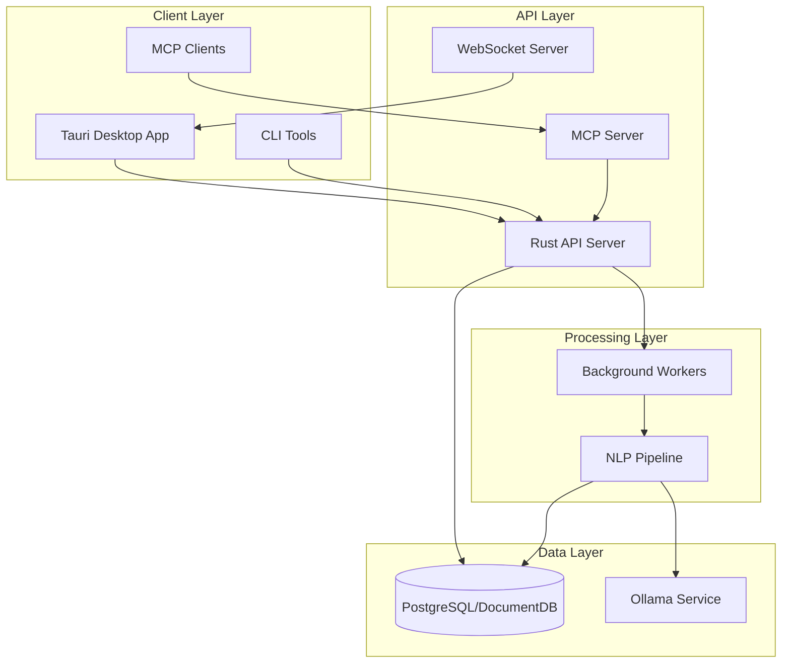

# System Architecture

## Overview
HotM is a distributed system with clear separation between the API server (Rust/Axum), desktop client (Tauri/React), and AI services (Ollama). The architecture follows SOLID principles with modular, testable components.

## High-Level Architecture



## Component Architecture

### 1. Tauri Desktop Application
**Purpose**: Native Windows 11 UI with system integration

**Responsibilities**:
- User interface rendering (React/TypeScript)
- System tray integration
- Global hotkey handling (Ctrl+Alt+H)
- Local settings management
- API client operations

**Technology Stack**:
- Tauri 2.x (Rust backend)
- React 18 with TypeScript
- WebView2 for rendering
- Vite for bundling

### 2. Rust API Server
**Purpose**: Core business logic and data management

**Responsibilities**:
- RESTful API endpoints
- Database operations
- Authentication & authorization
- MCP server hosting
- WebSocket event streaming
- Job queue management

**Technology Stack**:
- Axum web framework
- SQLx for database access
- Tokio async runtime
- Tower middleware stack

### 3. NLP Pipeline
**Purpose**: Asynchronous text processing and enhancement

**Components**:
```rust
pub trait Pipeline: Send + Sync {
    async fn process(&self, note: Note) -> Result<ProcessedNote>;
}

pub struct NlpPipeline {
    stages: Vec<Box<dyn PipelineStage>>,
}

// Pipeline stages
pub trait PipelineStage: Send + Sync {
    async fn execute(&self, context: &mut PipelineContext) -> Result<()>;
}
```

**Stages**:
1. **Normalization**: Clean and standardize text
2. **Chunking**: Split into processable segments
3. **Summarization**: Generate concise summary
4. **Revision**: Enhance clarity and structure
5. **Entity Extraction**: Identify people, places, concepts
6. **Tag Generation**: Auto-generate relevant tags
7. **Link Detection**: Find related content
8. **Embedding**: Generate vector representations

### 4. Background Workers
**Purpose**: Async job processing without blocking API

**Architecture**:
```rust
pub struct WorkerPool {
    workers: Vec<Worker>,
    job_queue: Arc<Mutex<JobQueue>>,
    semaphore: Arc<Semaphore>,
}

pub enum Job {
    ProcessNote { note_id: Uuid },
    GenerateEmbeddings { note_id: Uuid },
    UpdateIndices { note_id: Uuid },
    BatchProcess { note_ids: Vec<Uuid> },
}
```

**Job Types**:
- Note processing
- Embedding generation
- Index updates
- Batch operations
- Scheduled maintenance

### 5. Database Layer
**Purpose**: Persistent storage with hybrid search

**Schema Design**:
- **Relational Tables**: Metadata, relationships
- **JSONB Documents**: Flexible content storage
- **Vector Storage**: pgvector for embeddings
- **Full-Text Search**: tsvector/GIN indexes

**Key Features**:
- Immutable originals
- Versioned revisions
- Materialized search views
- ACID transactions

### 6. MCP Server
**Purpose**: AI assistant integration

**Implementation**:
```rust
pub struct McpServer {
    app_state: Arc<AppState>,
    tools: HashMap<String, Box<dyn Tool>>,
    transport: Box<dyn Transport>,
}

impl McpServer {
    pub async fn handle_request(&self, request: JsonRpcRequest) -> JsonRpcResponse {
        match request.method.as_str() {
            "tools/list" => self.list_tools(),
            "tools/call" => self.call_tool(request.params).await,
            _ => JsonRpcResponse::error(-32601, "Method not found"),
        }
    }
}
```

## Data Flow

### 1. Note Creation Flow
```
User Input -> Tauri UI -> API Server -> Database (Original)
                                     -> Job Queue -> NLP Pipeline
                                                  -> Ollama
                                                  -> Database (Revised)
                                                  -> WebSocket -> UI Update
```

### 2. Search Flow
```
Search Query -> API Server -> Query Parser
                           -> FTS Query -> PostgreSQL
                           -> Vector Query -> pgvector
                           -> Result Fusion -> Response
```

### 3. MCP Tool Flow
```
AI Assistant -> MCP Client -> MCP Server (in API)
                           -> Tool Handler
                           -> Business Logic
                           -> Database
                           -> Response
```

## Deployment Architecture

### Local Deployment (Default)
```yaml
components:
  - name: Desktop App
    type: Tauri
    port: N/A
    
  - name: API Server
    type: Rust Binary
    port: 53211
    
  - name: Database
    type: PostgreSQL
    port: 5432
    
  - name: Ollama
    type: Service
    port: 11434
```

### Network Deployment (Advanced)
```yaml
components:
  - name: API Server
    type: Docker Container
    replicas: 1-3
    load_balancer: nginx
    
  - name: Database
    type: Azure Cosmos DB for PostgreSQL
    replication: Yes
    
  - name: Cache
    type: Redis (optional)
    purpose: Query cache
```

## Security Architecture

### Authentication Flow
```
1. Admin Login -> Username/Password -> JWT Token
2. API Key Generation -> Admin Token -> API Key
3. API Request -> Bearer Token -> Validation -> Access
```

### Data Protection
- **At Rest**: Optional Windows DPAPI encryption
- **In Transit**: TLS 1.3 for network mode
- **Access Control**: Token-based authentication
- **Audit Trail**: All modifications logged

## Scalability Considerations

### Vertical Scaling
- **Database**: Index optimization, partitioning
- **NLP**: GPU acceleration via CUDA
- **Search**: Parallel query execution
- **Workers**: Configurable thread pool

### Horizontal Scaling (Future)
- **API Servers**: Stateless, load balanced
- **Workers**: Distributed job queue
- **Database**: Read replicas
- **Cache Layer**: Redis for hot data

## Error Handling Strategy

### Graceful Degradation
```rust
pub struct ServiceHealth {
    database: bool,
    ollama: bool,
    vector_extension: bool,
}

impl ServiceHealth {
    pub fn capabilities(&self) -> Capabilities {
        Capabilities {
            nlp: self.ollama,
            semantic_search: self.vector_extension && self.ollama,
            full_text_search: self.database,
        }
    }
}
```

### Retry Policies
- **Transient Failures**: Exponential backoff
- **Ollama Timeouts**: Fallback to basic processing
- **Database Errors**: Circuit breaker pattern

## Monitoring & Observability

### Metrics Collection
```rust
pub struct Metrics {
    requests: Counter,
    latency: Histogram,
    errors: Counter,
    active_jobs: Gauge,
}
```

### Health Checks
- `/health` - Overall system health
- `/health/ready` - Ready to serve traffic
- `/health/live` - Process is alive

### Logging
- Structured JSON logs
- Log levels: ERROR, WARN, INFO, DEBUG, TRACE
- Correlation IDs for request tracking

## Technology Decisions

### Why Rust + Axum?
- **Performance**: Near-C speed with memory safety
- **Async**: Tokio for efficient I/O
- **Type Safety**: Compile-time guarantees
- **Ecosystem**: Rich crate ecosystem

### Why Tauri?
- **Native Performance**: Rust backend
- **Small Bundle**: ~10MB base size
- **Security**: Process isolation
- **Platform APIs**: System tray, hotkeys

### Why PostgreSQL/DocumentDB?
- **Hybrid Model**: Relational + Document
- **Extensions**: pgvector, full-text search
- **Azure Integration**: Managed service option
- **ACID Compliance**: Data integrity

### Why Ollama?
- **Local Execution**: Privacy preserved
- **Model Management**: Easy model switching
- **API Compatibility**: Standard REST interface
- **Resource Efficiency**: Optimized inference