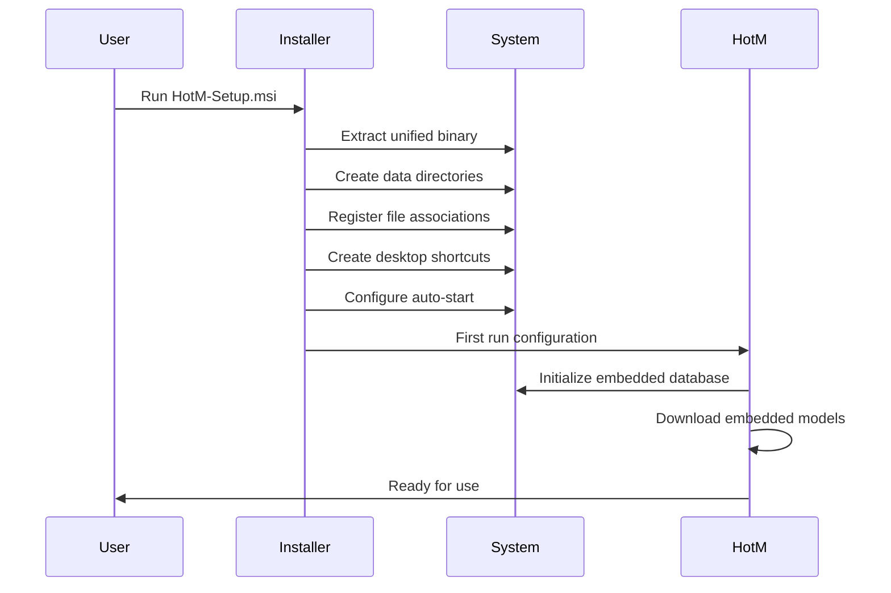
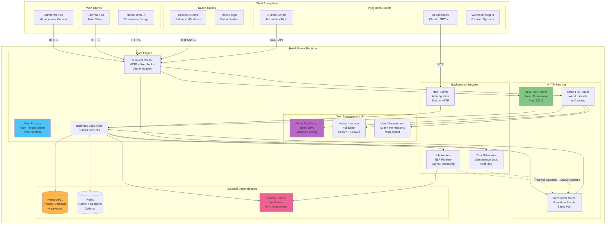
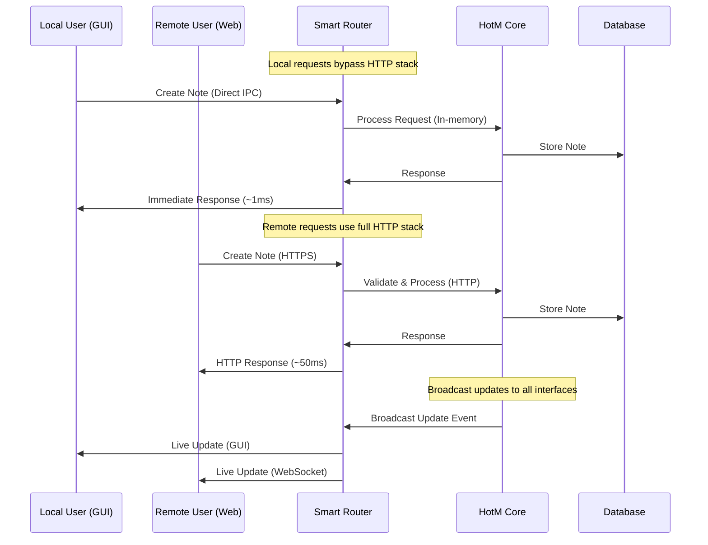
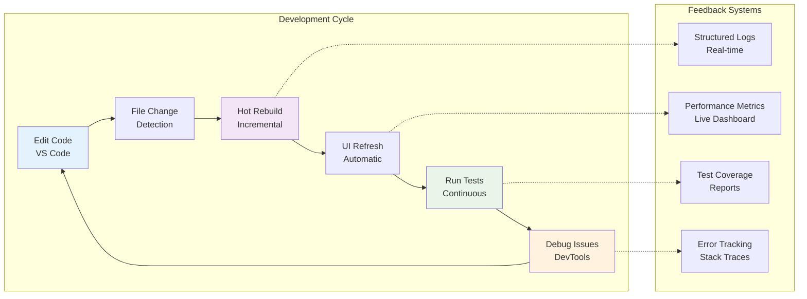
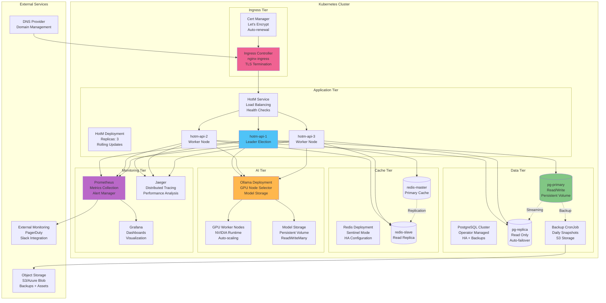
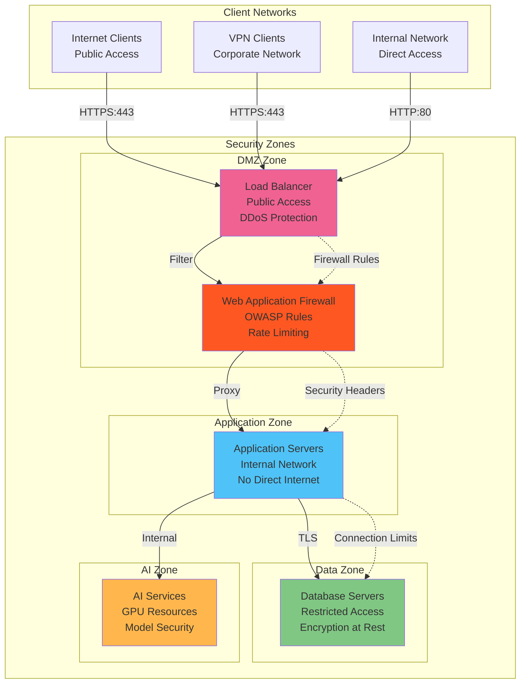

# Deployment Architecture Diagrams

## Overview

This document provides detailed architecture diagrams for all HotM deployment modes, showing component relationships, data flows, and infrastructure topologies. Each diagram includes deployment-specific considerations and scaling patterns.

## Current Architecture Diagrams (v0.1.x)

### Desktop Client Deployment

```mermaid
graph TB
    subgraph "Windows 11 Workstation"
        subgraph "User Space"
            DESKTOP[HotM Desktop App<br/>Tauri + React<br/>Process: hotm-desktop.exe]
            TRAY[System Tray<br/>Quick Actions<br/>Always Running]
        end
        
        subgraph "Background Services"
            API[HotM API Server<br/>Axum + Tokio<br/>Process: hotm-server.exe<br/>Port: 53211]
            WORKER[Background Workers<br/>NLP Processing<br/>Job Queue]
        end
        
        subgraph "Data Storage"
            PGDATA[(PostgreSQL 14<br/>+ pgvector<br/>Port: 5432<br/>~2GB)]
            FILES[File Storage<br/>Attachments<br/>Cache<br/>~1GB)]
        end
        
        subgraph "AI Services"
            OLLAMA[Ollama Service<br/>LLM Inference<br/>Port: 11434<br/>~10GB models)]
        end
    end
    
    subgraph "External Resources"
        MODELS[Model Downloads<br/>Hugging Face<br/>Ollama Registry]
        UPDATES[Application Updates<br/>GitHub Releases]
    end
    
    %% User Interactions
    DESKTOP -.->|Ctrl+Alt+H| TRAY
    TRAY --> DESKTOP
    
    %% Service Communications
    DESKTOP -->|HTTP/WebSocket| API
    API --> WORKER
    API --> PGDATA
    API --> FILES
    API --> OLLAMA
    WORKER --> PGDATA
    WORKER --> OLLAMA
    
    %% External Communications
    OLLAMA -.->|Model Downloads| MODELS
    DESKTOP -.->|Update Checks| UPDATES
    
    %% Styling
    style DESKTOP fill:#e3f2fd
    style API fill:#f3e5f5  
    style PGDATA fill:#e8f5e8
    style OLLAMA fill:#fff3e0
    style TRAY fill:#fce4ec
```

**Resource Requirements:**
- **RAM**: 2-4GB (1GB app + 1GB PostgreSQL + 2GB Ollama)
- **Storage**: 15-50GB (10GB models + 5GB data + OS overhead)
- **CPU**: 4+ cores recommended (2 minimum)
- **Network**: Optional after initial setup

**Process Management:**
- Windows Services: PostgreSQL, Ollama
- User Processes: Desktop App, System Tray
- Background Tasks: API Server, Workers

### Centralized Server Deployment

```mermaid
graph TB
    subgraph "Server Infrastructure"
        subgraph "Docker Host / VM"
            subgraph "Application Tier"
                API[HotM API Server<br/>Port: 53211<br/>Replicas: 1-3]
                NGINX[Nginx Reverse Proxy<br/>Port: 80/443<br/>TLS Termination]
                MCP[MCP Server<br/>AI Integration<br/>Embedded in API]
            end
            
            subgraph "Data Tier"
                PGMASTER[(PostgreSQL Master<br/>Port: 5432<br/>Primary Writes)]
                PGREPLICA[(PostgreSQL Replica<br/>Port: 5433<br/>Read Queries)]
                REDIS[(Redis Cache<br/>Port: 6379<br/>Sessions + Cache)]
            end
            
            subgraph "AI Tier"
                OLLAMA[Ollama Cluster<br/>Port: 11434<br/>GPU Accelerated]
                MODELS[Model Storage<br/>Persistent Volume<br/>50-200GB)]
            end
        end
    end
    
    subgraph "Client Network"
        subgraph "Desktop Clients"
            CLIENT1[Desktop Client 1<br/>Windows/Linux/Mac]
            CLIENT2[Desktop Client 2<br/>Windows/Linux/Mac] 
            CLIENT3[Desktop Client N<br/>Windows/Linux/Mac]
        end
        
        subgraph "Web Clients"
            BROWSER1[Web Browser 1<br/>Chrome/Firefox/Edge]
            BROWSER2[Mobile Browser<br/>iOS/Android]
        end
        
        subgraph "API Clients"
            SCRIPT[Automation Scripts<br/>Python/Node.js/cURL]
            AITOOLS[AI Tools<br/>Claude/ChatGPT/Custom]
        end
    end
    
    %% Client Connections
    CLIENT1 -->|HTTPS/WSS| NGINX
    CLIENT2 -->|HTTPS/WSS| NGINX
    CLIENT3 -->|HTTPS/WSS| NGINX
    BROWSER1 -->|HTTPS| NGINX
    BROWSER2 -->|HTTPS| NGINX
    SCRIPT -->|REST API| NGINX
    AITOOLS -->|MCP/HTTP| NGINX
    
    %% Internal Service Communications
    NGINX --> API
    API --> MCP
    API --> PGMASTER
    API --> PGREPLICA
    API --> REDIS
    API --> OLLAMA
    OLLAMA --> MODELS
    
    %% Database Replication
    PGMASTER -.->|Streaming Replication| PGREPLICA
    
    %% Styling
    style API fill:#4fc3f7
    style PGMASTER fill:#81c784
    style OLLAMA fill:#ffb74d
    style NGINX fill:#f06292
    style REDIS fill:#ba68c8
```

**Infrastructure Requirements:**
- **Server**: 8-32GB RAM, 8+ CPU cores, 200GB+ SSD
- **Network**: Dedicated IP, domain name, SSL certificates
- **Database**: PostgreSQL cluster with replication
- **AI**: GPU recommended for large-scale deployments

**Scaling Patterns:**
- **Horizontal**: Multiple API server instances behind load balancer
- **Vertical**: Increase server resources for single instance
- **Database**: Read replicas, connection pooling, query optimization
- **AI**: GPU clustering, model sharding, batch processing

## Unified Runtime Architecture Diagrams (v0.2.0+)

### Enhanced Desktop Mode

```mermaid
graph TB
    subgraph "HotM Unified Binary"
        subgraph "Runtime Core"
            MAIN[Main Process<br/>hotm.exe<br/>Tokio Runtime]
            CONFIG[Configuration Manager<br/>TOML + Environment]
            SERVICES[Service Registry<br/>Dependency Injection]
        end
        
        subgraph "Interface Layer"
            GUI[Desktop GUI<br/>Tauri Frontend<br/>React + TypeScript]
            TRAY[System Tray<br/>Quick Actions<br/>Background Mode]
            HOTKEY[Global Hotkey<br/>Ctrl+Alt+H<br/>Show/Hide]
        end
        
        subgraph "Core Services"
            DB_SVC[Database Service<br/>SQLite + Vector Ext]
            AI_SVC[AI Service<br/>Embedded + Fallback]
            JOB_SVC[Job Queue Service<br/>Background Processing]
            EVENT_SVC[Event Bus Service<br/>Internal Events]
        end
        
        subgraph "Storage Layer"
            SQLITE[(Embedded SQLite<br/>+ Vector Extension<br/>Single File)]
            FILES[File Storage<br/>Attachments + Cache<br/>Organized Folders)]
        end
        
        subgraph "AI Layer"
            TINY_LLM[Embedded Tiny Models<br/>Fast Inference<br/>~100MB)]
            OLLAMA_CLIENT[Ollama Client<br/>External Service<br/>Fallback)]
        end
    end
    
    subgraph "External Services (Optional)"
        OLLAMA_EXT[External Ollama<br/>Better Models<br/>localhost:11434]
        CLOUD_SYNC[Cloud Sync<br/>Backup + Sharing<br/>OneDrive/Dropbox]
    end
    
    %% Internal Communications
    GUI --> MAIN
    TRAY --> MAIN
    HOTKEY --> GUI
    MAIN --> SERVICES
    SERVICES --> DB_SVC
    SERVICES --> AI_SVC
    SERVICES --> JOB_SVC
    SERVICES --> EVENT_SVC
    DB_SVC --> SQLITE
    DB_SVC --> FILES
    AI_SVC --> TINY_LLM
    AI_SVC -.->|Fallback| OLLAMA_CLIENT
    
    %% External Communications (Optional)
    OLLAMA_CLIENT -.-> OLLAMA_EXT
    FILES -.-> CLOUD_SYNC
    
    %% Event Flow
    EVENT_SVC -.->|Updates| GUI
    EVENT_SVC -.->|Notifications| TRAY
    
    %% Styling
    style MAIN fill:#4fc3f7
    style GUI fill:#81c784
    style DB_SVC fill:#ffb74d
    style AI_SVC fill:#f06292
    style SQLITE fill:#ba68c8
```

**Key Advantages:**
- **Single Binary**: No separate services to manage
- **Embedded Database**: No PostgreSQL installation required  
- **Offline First**: Fully functional without network
- **Fast Startup**: <3 seconds from click to ready
- **Resource Efficient**: 150-400MB RAM usage

**Installation Flow:**


### Server Mode with Web Interface



**Deployment Architecture:**
```mermaid
graph TB
    subgraph "Production Environment"
        subgraph "Load Balancer Tier"
            LB[Load Balancer<br/>Nginx/HAProxy<br/>TLS Termination]
        end
        
        subgraph "Application Tier"
            APP1[HotM Server 1<br/>Primary Instance<br/>Read/Write]
            APP2[HotM Server 2<br/>Secondary Instance<br/>Read Only]
            APP3[HotM Server 3<br/>Standby Instance<br/>Failover]
        end
        
        subgraph "Data Tier"
            PG_PRIMARY[(PostgreSQL Primary<br/>Write Operations<br/>Auto-backup)]
            PG_REPLICA1[(PostgreSQL Replica 1<br/>Read Operations<br/>EU Region)]
            PG_REPLICA2[(PostgreSQL Replica 2<br/>Read Operations<br/>US Region)]
        end
        
        subgraph "Cache Tier"
            REDIS_PRIMARY[(Redis Primary<br/>Sessions + Cache)]
            REDIS_REPLICA[(Redis Replica<br/>High Availability)]
        end
        
        subgraph "AI Tier"
            OLLAMA_CLUSTER[Ollama Cluster<br/>GPU Nodes<br/>Auto-scaling]
            MODEL_STORAGE[Model Storage<br/>Shared NFS<br/>100GB+)]
        end
    end
    
    %% Traffic Flow
    LB --> APP1
    LB --> APP2
    LB --> APP3
    
    %% Database Connections
    APP1 --> PG_PRIMARY
    APP2 --> PG_REPLICA1
    APP3 --> PG_REPLICA2
    
    %% Cache Connections
    APP1 --> REDIS_PRIMARY
    APP2 --> REDIS_PRIMARY
    APP3 --> REDIS_REPLICA
    
    %% AI Service Connections
    APP1 --> OLLAMA_CLUSTER
    APP2 --> OLLAMA_CLUSTER
    APP3 --> OLLAMA_CLUSTER
    OLLAMA_CLUSTER --> MODEL_STORAGE
    
    %% Replication
    PG_PRIMARY -.->|Streaming| PG_REPLICA1
    PG_PRIMARY -.->|Streaming| PG_REPLICA2
    REDIS_PRIMARY -.->|Replication| REDIS_REPLICA
    
    %% Styling
    style LB fill:#f06292
    style APP1 fill:#4fc3f7
    style PG_PRIMARY fill:#81c784
    style OLLAMA_CLUSTER fill:#ffb74d
```

### Hybrid Mode Architecture

```mermaid
graph TB
    subgraph "HotM Hybrid Runtime"
        subgraph "Unified Core Engine"
            CORE[HotM Core<br/>Shared Business Logic]
            ROUTER[Smart Request Router<br/>Local vs Remote Detection]
            EVENT_HUB[Event Hub<br/>Multi-interface Broadcasting]
        end
        
        subgraph "Local Interfaces"
            GUI[Desktop GUI<br/>Primary Interface<br/>Tauri + React]
            TRAY[System Tray<br/>Quick Actions<br/>Status Indicator]
            HOTKEY[Global Hotkey<br/>Instant Access<br/>Ctrl+Alt+H]
        end
        
        subgraph "Server Interfaces"
            HTTP_API[HTTP API Server<br/>REST Endpoints<br/>Port: 53211]
            WS_SERVER[WebSocket Server<br/>Real-time Updates<br/>Same Port]
            WEB_UI[Web Interface<br/>Browser Access<br/>Full Featured]
            MCP_SERVER[MCP Server<br/>AI Integration<br/>Stdio/HTTP]
        end
        
        subgraph "Shared Services"
            DB_SERVICE[Database Service<br/>Single Source of Truth]
            AI_SERVICE[AI Service<br/>Shared Processing]
            JOB_SERVICE[Job Queue Service<br/>Background Tasks]
            CACHE_SERVICE[Cache Service<br/>Performance Layer]
        end
        
        subgraph "Storage & AI"
            DATABASE[(PostgreSQL<br/>Centralized Data<br/>+ pgvector)]
            LOCAL_CACHE[Local Cache<br/>Recently Accessed<br/>Performance Boost]
            OLLAMA[Ollama Service<br/>AI Processing<br/>GPU Accelerated]
        end
    end
    
    subgraph "Access Patterns"
        subgraph "Local Access"
            USER[Primary User<br/>Desktop GUI]
            LOCAL_SCRIPTS[Local Scripts<br/>Direct IPC]
        end
        
        subgraph "Remote Access"
            MOBILE[Mobile Browser<br/>On-the-go Access]
            REMOTE_PC[Remote Desktop<br/>Travel/Office]
            FAMILY[Family Members<br/>Shared Knowledge]
            AI_TOOLS[AI Tools<br/>MCP Integration]
        end
    end
    
    %% Local Access Patterns (High Performance)
    USER --> GUI
    GUI --> ROUTER
    LOCAL_SCRIPTS --> ROUTER
    
    %% Remote Access Patterns (Full Authentication)
    MOBILE -->|HTTPS| HTTP_API
    REMOTE_PC -->|HTTPS/WSS| HTTP_API
    FAMILY -->|HTTPS| WEB_UI
    AI_TOOLS -->|MCP| MCP_SERVER
    
    %% Smart Routing Logic
    ROUTER -->|Local Requests| CORE
    HTTP_API -->|Remote Requests| CORE
    WS_SERVER -->|Real-time| EVENT_HUB
    WEB_UI -->|Web Requests| CORE
    MCP_SERVER -->|AI Requests| CORE
    
    %% Shared Service Access
    CORE --> DB_SERVICE
    CORE --> AI_SERVICE
    CORE --> JOB_SERVICE
    CORE --> CACHE_SERVICE
    
    %% Data Layer
    DB_SERVICE --> DATABASE
    CACHE_SERVICE --> LOCAL_CACHE
    AI_SERVICE --> OLLAMA
    
    %% Event Broadcasting
    EVENT_HUB -.->|Updates| GUI
    EVENT_HUB -.->|Notifications| TRAY
    EVENT_HUB -.->|Live Updates| WS_SERVER
    
    %% Styling
    style CORE fill:#4fc3f7
    style ROUTER fill:#81c784
    style GUI fill:#ffb74d
    style HTTP_API fill:#f06292
    style DATABASE fill:#ba68c8
```



**Request Flow Optimization:**


### Development Mode Architecture

```mermaid
graph TB
    subgraph "HotM Development Environment"
        subgraph "Core Runtime + Dev Tools"
            CORE[HotM Core Engine<br/>Enhanced Logging]
            HOT_RELOAD[Hot Reload System<br/>File Watching<br/>Auto Rebuild]
            DEBUG_SERVER[Debug Server<br/>Introspection APIs<br/>Port: 53212]
        end
        
        subgraph "Development Interfaces"
            GUI_DEV[Desktop GUI<br/>DevTools Enabled<br/>React DevTools]
            WEB_DEV[Development Web UI<br/>Debug Features<br/>Source Maps]
            DEBUG_UI[Debug Dashboard<br/>System State<br/>Performance Metrics]
            API_DOCS[Interactive API Docs<br/>OpenAPI + Swagger<br/>Live Testing]
        end
        
        subgraph "Development Services"
            MOCK_AI[Mock AI Service<br/>Deterministic Responses<br/>Configurable Delays]
            TEST_RUNNER[Integrated Test Runner<br/>Unit + Integration<br/>Auto-retry]
            PROFILER[Performance Profiler<br/>CPU + Memory<br/>Request Tracing]
            LOG_AGGREGATOR[Log Aggregator<br/>Structured Logs<br/>Real-time Filtering]
        end
        
        subgraph "Testing Infrastructure"
            TEST_DB[(Test Database<br/>Auto-reset<br/>Fixture Loading)]
            MOCK_EXTERNAL[Mock External APIs<br/>Ollama + Others<br/>Configurable Responses]
            E2E_RUNNER[E2E Test Runner<br/>Playwright<br/>Visual Regression]
        end
        
        subgraph "Development Tools"
            CODE_GEN[Code Generation<br/>API Clients<br/>Type Definitions]
            PERF_BENCH[Performance Benchmarks<br/>Load Testing<br/>Regression Detection]
            DOC_GEN[Documentation Generator<br/>API Specs<br/>Architecture Diagrams]
        end
    end
    
    subgraph "External Development Tools"
        IDE[VS Code / IDE<br/>Language Servers<br/>Debugger Integration]
        GIT[Git Repository<br/>Pre-commit Hooks<br/>CI/CD Integration]
        BROWSER_DEVTOOLS[Browser DevTools<br/>React DevTools<br/>Network Inspector]
    end
    
    %% Development Workflow
    IDE --> HOT_RELOAD
    HOT_RELOAD --> CORE
    GUI_DEV --> DEBUG_SERVER
    WEB_DEV --> DEBUG_SERVER
    DEBUG_UI --> DEBUG_SERVER
    API_DOCS --> CORE
    
    %% Testing Integration
    TEST_RUNNER --> TEST_DB
    TEST_RUNNER --> MOCK_AI
    TEST_RUNNER --> MOCK_EXTERNAL
    E2E_RUNNER --> GUI_DEV
    E2E_RUNNER --> WEB_DEV
    
    %% Development Services
    CORE --> MOCK_AI
    CORE --> TEST_DB
    DEBUG_SERVER --> PROFILER
    DEBUG_SERVER --> LOG_AGGREGATOR
    
    %% External Integration
    HOT_RELOAD -.->|File Changes| IDE
    DEBUG_SERVER -.->|Debug Info| BROWSER_DEVTOOLS
    TEST_RUNNER -.->|Results| GIT
    
    %% Code Generation
    CODE_GEN --> IDE
    PERF_BENCH --> GIT
    DOC_GEN --> GIT
    
    %% Styling
    style CORE fill:#4fc3f7
    style HOT_RELOAD fill:#81c784
    style DEBUG_SERVER fill:#ffb74d
    style MOCK_AI fill:#f06292
    style TEST_DB fill:#ba68c8
```



**Development Workflow Visualization:**


## Container Architecture Diagrams

### Docker Compose Development Stack

```mermaid
graph TB
    subgraph "Docker Compose Environment"
        subgraph "Application Containers"
            APP_DEV[hotm-dev<br/>Volume Mounts<br/>Hot Reload]
            WEB_DEV[hotm-web-dev<br/>Vite Dev Server<br/>HMR Enabled]
        end
        
        subgraph "Database Containers"
            PG_DEV[(postgres-dev<br/>pgvector enabled<br/>Test data)]
            REDIS_DEV[(redis-dev<br/>Cache + Sessions<br/>Development)]
        end
        
        subgraph "AI Containers"
            OLLAMA_DEV[ollama-dev<br/>CPU-only<br/>Small models)]
        end
        
        subgraph "Development Tools"
            ADMINER[Adminer<br/>Database UI<br/>Port: 8080]
            REDIS_UI[Redis Commander<br/>Cache UI<br/>Port: 8081]
        end
    end
    
    subgraph "Host Development Environment"
        HOST_IDE[VS Code<br/>Remote Containers<br/>Extensions]
        HOST_BROWSER[Browser<br/>http://localhost:53211]
    end
    
    %% Container Communications
    APP_DEV --> PG_DEV
    APP_DEV --> REDIS_DEV
    APP_DEV --> OLLAMA_DEV
    WEB_DEV --> APP_DEV
    
    %% Development Tool Access
    ADMINER --> PG_DEV
    REDIS_UI --> REDIS_DEV
    
    %% Host Access
    HOST_IDE -.->|Volume Mounts| APP_DEV
    HOST_BROWSER --> WEB_DEV
    HOST_BROWSER --> APP_DEV
    HOST_BROWSER --> ADMINER
    HOST_BROWSER --> REDIS_UI
    
    %% Styling
    style APP_DEV fill:#4fc3f7
    style PG_DEV fill:#81c784
    style OLLAMA_DEV fill:#ffb74d
    style WEB_DEV fill:#f06292
```

### Production Kubernetes Deployment



## Network Architecture Patterns

### Security Zones and Communication Flows



These architecture diagrams provide comprehensive visualization of HotM's deployment patterns, showing how the unified runtime approach simplifies deployment while maintaining flexibility for different use cases and environments.