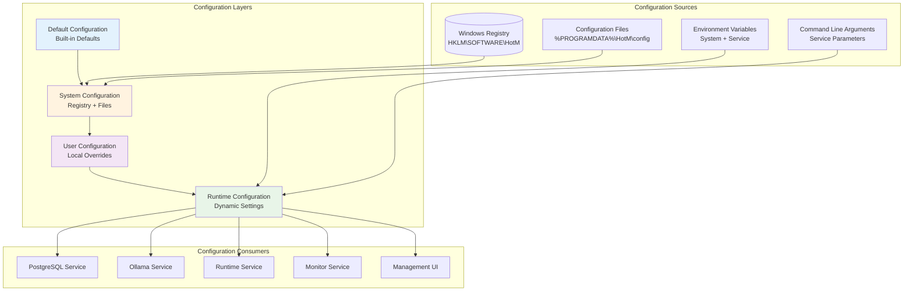

# HotM Windows Service Configuration Management Strategy

## Overview

This document defines a comprehensive configuration management strategy for HotM Windows services, providing centralized configuration, version control, validation, and runtime updates with minimal service disruption.

## Configuration Architecture

### Multi-Layer Configuration System



## Registry-Based Configuration Schema

### Primary Registry Structure

**Base Key:** `HKLM\SOFTWARE\HotM`

```
HKLM\SOFTWARE\HotM\
├── Installation\
│   ├── Version = "0.2.0"
│   ├── InstallPath = "C:\Program Files\HotM"
│   ├── DataPath = "C:\ProgramData\HotM"
│   ├── ConfigPath = "C:\ProgramData\HotM\config"
│   ├── LogPath = "C:\ProgramData\HotM\logs"
│   ├── InstallDate = [REG_QWORD timestamp]
│   └── Installer = "HotM-Setup-0.2.0.msi"
├── Runtime\
│   ├── Mode = "server"          # server|desktop|hybrid|development
│   ├── LogLevel = "info"        # error|warn|info|debug|trace
│   ├── EnableMetrics = 1        # 0|1
│   ├── EnableTelemetry = 0      # 0|1
│   └── ConfigVersion = 1        # Configuration schema version
├── Services\
│   ├── PostgreSQL\
│   │   ├── Enabled = 1
│   │   ├── Port = 54321
│   │   ├── Database = "hotm"
│   │   ├── Username = "hotm"
│   │   ├── MaxConnections = 100
│   │   ├── SharedBuffers = "128MB"
│   │   ├── LogStatement = "error"
│   │   ├── SSLMode = "disable"
│   │   └── AutoVacuum = 1
│   ├── Ollama\
│   │   ├── Enabled = 1
│   │   ├── Port = 11435
│   │   ├── GPUAcceleration = "auto"    # auto|nvidia|amd|cpu
│   │   ├── ModelCacheSize = "8GB"
│   │   ├── MaxConcurrentRequests = 4
│   │   ├── DefaultModels = "gpt-oss:20b,nomic-embed-text"
│   │   ├── ModelUpdateFreq = 168        # hours (weekly)
│   │   └── CPUFallback = 1
│   ├── Runtime\
│   │   ├── Enabled = 1
│   │   ├── Port = 53211
│   │   ├── BindAddress = "127.0.0.1"
│   │   ├── MaxRequestSize = 52428800    # 50MB
│   │   ├── RequestTimeout = 30000       # milliseconds
│   │   ├── MaxWorkers = 4
│   │   ├── WebUIEnabled = 1
│   │   ├── MCPServerEnabled = 1
│   │   ├── CORSOrigins = "http://localhost:3000"
│   │   └── EnableTLS = 0
│   └── Monitor\
│       ├── Enabled = 1
│       ├── CheckInterval = 30000        # milliseconds
│       ├── RestartThreshold = 3
│       ├── HealthTimeout = 10000        # milliseconds
│       ├── MetricsRetention = 168       # hours
│       ├── AlertsEnabled = 1
│       └── LogMetrics = 1
├── Security\
│   ├── ApiKeyLength = 32
│   ├── JWTExpirationHours = 24
│   ├── PasswordMinLength = 8
│   ├── RequireHTTPS = 0
│   ├── TrustStoreLocation = "C:\ProgramData\HotM\certs"
│   └── AllowedHosts = "localhost,127.0.0.1"
└── Features\
    ├── AIProcessing = 1
    ├── VectorSearch = 1
    ├── FullTextSearch = 1
    ├── WebSocket = 1
    ├── BackgroundProcessing = 1
    ├── ExportImport = 1
    └── DiagnosticTools = 1
```

### Registry Data Types and Validation

```rust
#[derive(Debug, Clone, Serialize, Deserialize)]
pub struct RegistrySchema {
    pub keys: HashMap<String, RegistryKey>,
}

#[derive(Debug, Clone, Serialize, Deserialize)]
pub struct RegistryKey {
    pub data_type: RegistryDataType,
    pub default_value: String,
    pub description: String,
    pub validation: Option<ValidationRule>,
    pub requires_restart: bool,
    pub category: ConfigCategory,
}

#[derive(Debug, Clone, Serialize, Deserialize)]
pub enum RegistryDataType {
    String,
    DWord,      // 32-bit integer
    QWord,      // 64-bit integer
    Binary,
    MultiString,
}

#[derive(Debug, Clone, Serialize, Deserialize)]
pub enum ValidationRule {
    Range { min: i64, max: i64 },
    Regex { pattern: String },
    Enum { values: Vec<String> },
    Path { must_exist: bool, is_directory: bool },
    Port { exclude_reserved: bool },
    Custom { validator: String },
}

#[derive(Debug, Clone, Serialize, Deserialize)]
pub enum ConfigCategory {
    Installation,
    Runtime,
    Security,
    Performance,
    Logging,
    Network,
}

// Registry configuration manager
pub struct RegistryConfigManager {
    base_key: String,
    schema: RegistrySchema,
}

impl RegistryConfigManager {
    pub fn new() -> Result<Self> {
        let schema = Self::load_schema()?;
        Ok(Self {
            base_key: r"SOFTWARE\HotM".to_string(),
            schema,
        })
    }
    
    pub fn get_value<T>(&self, key_path: &str) -> Result<T>
    where
        T: FromStr + Default,
    {
        let full_key = format!(r"HKEY_LOCAL_MACHINE\{}\{}", self.base_key, key_path);
        
        match Registry::LocalMachine.open_subkey(&full_key) {
            Ok(key) => {
                let value: String = key.get_value("")?;
                value.parse().map_err(|_| Error::ParseError)
            }
            Err(_) => {
                // Return default value from schema
                let default = self.schema.keys.get(key_path)
                    .map(|k| k.default_value.clone())
                    .unwrap_or_default();
                default.parse().map_err(|_| Error::ParseError)
            }
        }
    }
    
    pub fn set_value<T>(&self, key_path: &str, value: T) -> Result<()>
    where
        T: ToString,
    {
        let full_key = format!(r"HKEY_LOCAL_MACHINE\{}\{}", self.base_key, key_path);
        
        // Validate value against schema
        self.validate_value(key_path, &value.to_string())?;
        
        let key = Registry::LocalMachine.create_subkey(&full_key)?;
        key.set_value("", &value.to_string())?;
        
        // Log configuration change
        info!("Configuration updated: {} = {}", key_path, value.to_string());
        
        Ok(())
    }
    
    fn validate_value(&self, key_path: &str, value: &str) -> Result<()> {
        if let Some(key_config) = self.schema.keys.get(key_path) {
            if let Some(validation) = &key_config.validation {
                match validation {
                    ValidationRule::Range { min, max } => {
                        let num_value: i64 = value.parse()?;
                        if num_value < *min || num_value > *max {
                            return Err(Error::ValidationFailed(
                                format!("Value {} out of range [{}, {}]", num_value, min, max)
                            ));
                        }
                    }
                    ValidationRule::Regex { pattern } => {
                        let regex = Regex::new(pattern)?;
                        if !regex.is_match(value) {
                            return Err(Error::ValidationFailed(
                                format!("Value '{}' doesn't match pattern '{}'", value, pattern)
                            ));
                        }
                    }
                    ValidationRule::Enum { values } => {
                        if !values.contains(&value.to_string()) {
                            return Err(Error::ValidationFailed(
                                format!("Value '{}' not in allowed values: {:?}", value, values)
                            ));
                        }
                    }
                    ValidationRule::Port { exclude_reserved } => {
                        let port: u16 = value.parse()?;
                        if *exclude_reserved && port < 1024 {
                            return Err(Error::ValidationFailed(
                                "Reserved ports (< 1024) not allowed".to_string()
                            ));
                        }
                    }
                    // ... other validation rules
                }
            }
        }
        Ok(())
    }
}
```

## Configuration File Management

### File-Based Configuration Structure

```
%PROGRAMDATA%\HotM\config\
├── runtime.toml              # Main runtime configuration
├── postgresql.conf           # PostgreSQL configuration
├── ollama.env               # Ollama environment variables
├── logging.toml             # Logging configuration
├── security.toml            # Security settings
├── features.toml            # Feature flags
├── network.toml             # Network configuration
└── templates\               # Configuration templates
    ├── runtime.template.toml
    ├── postgresql.template.conf
    └── logging.template.toml
```

### Runtime Configuration (runtime.toml)

```toml
# HotM Runtime Configuration
# Generated from registry settings and user overrides
# Last updated: 2024-01-15 10:30:00 UTC

[meta]
version = "0.2.0"
config_version = 1
generated_at = "2024-01-15T10:30:00Z"
source = "registry+file+env"

[runtime]
mode = "${MODE}"                    # From registry or environment
data_directory = "${DATA_PATH}"
log_level = "${LOG_LEVEL}"
enable_metrics = ${ENABLE_METRICS}
worker_count = ${MAX_WORKERS}

[database]
type = "postgresql"
host = "localhost" 
port = ${POSTGRES_PORT}
database = "${DATABASE_NAME}"
username = "${DB_USERNAME}"
password = "${DB_PASSWORD}"        # From secure storage
ssl_mode = "${SSL_MODE}"
pool_size = ${DB_POOL_SIZE}
connection_timeout = "30s"
idle_timeout = "10m"
max_lifetime = "1h"

[ai]
type = "ollama"
url = "http://localhost:${OLLAMA_PORT}"
generation_model = "${GENERATION_MODEL}"
embedding_model = "${EMBEDDING_MODEL}"
timeout = "60s"
max_retries = 3
fallback_enabled = ${CPU_FALLBACK}

[server]
bind_address = "${BIND_ADDRESS}:${API_PORT}"
enable_tls = ${ENABLE_TLS}
tls_cert_file = "${TLS_CERT_PATH}"
tls_key_file = "${TLS_KEY_PATH}"
cors_origins = [${CORS_ORIGINS}]
max_request_size = "${MAX_REQUEST_SIZE}"
request_timeout = "${REQUEST_TIMEOUT}"
compression = true

[web_ui]
enabled = ${WEB_UI_ENABLED}
path = "/ui"
auth_required = ${WEB_AUTH_REQUIRED}
session_timeout = "${SESSION_TIMEOUT}"
static_files_path = "${STATIC_FILES_PATH}"

[mcp]
enabled = ${MCP_ENABLED}
transport = "stdio"
tools = ["all"]
max_concurrent_sessions = ${MCP_MAX_SESSIONS}

[background_workers]
enabled = ${BG_WORKERS_ENABLED}
worker_count = ${BG_WORKER_COUNT}
queue_size = ${BG_QUEUE_SIZE}
job_timeout = "${BG_JOB_TIMEOUT}"
retry_attempts = ${BG_RETRY_ATTEMPTS}

[logging]
level = "${LOG_LEVEL}"
format = "json"                   # json|pretty|compact
output = ["file", "eventlog"]     # file|console|eventlog|syslog
file_path = "${LOG_FILE_PATH}"
rotation = "daily"               # daily|size|never
max_size = "100MB"
max_files = 7
structured_fields = true

[monitoring]
enabled = ${MONITORING_ENABLED}
health_check_interval = "${HEALTH_CHECK_INTERVAL}"
metrics_collection = ${METRICS_ENABLED}
performance_tracking = ${PERF_TRACKING}
alert_thresholds = { cpu = 80, memory = 85, disk = 90 }

[security]
api_key_length = ${API_KEY_LENGTH}
jwt_expiration = "${JWT_EXPIRATION}"
password_requirements = { min_length = ${PWD_MIN_LENGTH}, require_special = true }
allowed_hosts = [${ALLOWED_HOSTS}]
rate_limiting = { requests_per_minute = 100, burst = 20 }

[features]
ai_processing = ${AI_PROCESSING_ENABLED}
vector_search = ${VECTOR_SEARCH_ENABLED}
full_text_search = ${FTS_ENABLED}
websockets = ${WEBSOCKET_ENABLED}
background_jobs = ${BG_JOBS_ENABLED}
export_import = ${EXPORT_IMPORT_ENABLED}
diagnostics = ${DIAGNOSTICS_ENABLED}
```

### Configuration Template System

```rust
pub struct ConfigurationGenerator {
    registry_manager: RegistryConfigManager,
    template_engine: TemplateEngine,
    output_path: PathBuf,
}

impl ConfigurationGenerator {
    pub async fn generate_all_configs(&self) -> Result<()> {
        let context = self.build_template_context().await?;
        
        // Generate runtime.toml
        self.generate_runtime_config(&context).await?;
        
        // Generate PostgreSQL configuration
        self.generate_postgres_config(&context).await?;
        
        // Generate Ollama environment
        self.generate_ollama_config(&context).await?;
        
        // Generate logging configuration
        self.generate_logging_config(&context).await?;
        
        Ok(())
    }
    
    async fn build_template_context(&self) -> Result<TemplateContext> {
        let mut context = TemplateContext::new();
        
        // Load from registry
        context.insert("MODE", self.registry_manager.get_value("Runtime\\Mode")?);
        context.insert("LOG_LEVEL", self.registry_manager.get_value("Runtime\\LogLevel")?);
        context.insert("POSTGRES_PORT", self.registry_manager.get_value("Services\\PostgreSQL\\Port")?);
        context.insert("OLLAMA_PORT", self.registry_manager.get_value("Services\\Ollama\\Port")?);
        context.insert("API_PORT", self.registry_manager.get_value("Services\\Runtime\\Port")?);
        
        // Load from environment variables
        if let Ok(db_password) = std::env::var("DB_PASSWORD") {
            context.insert("DB_PASSWORD", db_password);
        }
        
        // Load computed values
        context.insert("DATA_PATH", std::env::var("PROGRAMDATA")? + "\\HotM");
        context.insert("LOG_FILE_PATH", std::env::var("PROGRAMDATA")? + "\\HotM\\logs\\runtime.log");
        
        // Load defaults for missing values
        self.apply_defaults(&mut context)?;
        
        Ok(context)
    }
    
    async fn generate_runtime_config(&self, context: &TemplateContext) -> Result<()> {
        let template = self.load_template("runtime.template.toml").await?;
        let rendered = self.template_engine.render(&template, context)?;
        
        let output_path = self.output_path.join("runtime.toml");
        tokio::fs::write(&output_path, rendered).await?;
        
        // Validate generated configuration
        self.validate_toml_syntax(&output_path).await?;
        
        info!("Generated runtime configuration: {}", output_path.display());
        Ok(())
    }
    
    async fn validate_toml_syntax(&self, config_path: &Path) -> Result<()> {
        let content = tokio::fs::read_to_string(config_path).await?;
        
        match toml::from_str::<toml::Value>(&content) {
            Ok(_) => Ok(()),
            Err(e) => {
                error!("Invalid TOML syntax in {}: {}", config_path.display(), e);
                Err(Error::InvalidConfiguration(e.to_string()))
            }
        }
    }
}
```

## Dynamic Configuration Updates

### Hot Configuration Reloading

```rust
pub struct ConfigurationWatcher {
    watchers: HashMap<String, RecommendedWatcher>,
    reload_handlers: HashMap<String, Box<dyn ConfigReloadHandler>>,
    debounce_duration: Duration,
}

impl ConfigurationWatcher {
    pub fn new() -> Self {
        Self {
            watchers: HashMap::new(),
            reload_handlers: HashMap::new(),
            debounce_duration: Duration::from_millis(500),
        }
    }
    
    pub fn watch_file<P: AsRef<Path>>(&mut self, 
        path: P, 
        handler: Box<dyn ConfigReloadHandler>
    ) -> Result<()> {
        let path = path.as_ref().to_path_buf();
        let path_str = path.to_string_lossy().to_string();
        
        let (tx, rx) = mpsc::channel();
        let watcher = RecommendedWatcher::new(tx, self.debounce_duration)?;
        
        // Start watching the file
        watcher.watch(&path, RecursiveMode::NonRecursive)?;
        
        // Store watcher and handler
        self.watchers.insert(path_str.clone(), watcher);
        self.reload_handlers.insert(path_str.clone(), handler);
        
        // Spawn event processing task
        let path_clone = path_str.clone();
        let handlers = Arc::new(self.reload_handlers.clone());
        
        tokio::spawn(async move {
            loop {
                match rx.recv() {
                    Ok(event) => {
                        if let Some(handler) = handlers.get(&path_clone) {
                            if let Err(e) = handler.handle_reload(&path).await {
                                error!("Config reload failed for {}: {}", path_clone, e);
                            }
                        }
                    }
                    Err(e) => {
                        error!("File watcher error: {}", e);
                        break;
                    }
                }
            }
        });
        
        Ok(())
    }
}

#[async_trait]
pub trait ConfigReloadHandler: Send + Sync {
    async fn handle_reload(&self, config_path: &Path) -> Result<()>;
    fn requires_service_restart(&self) -> bool;
}

// Runtime configuration reload handler
pub struct RuntimeConfigHandler {
    service_manager: Arc<ServiceManager>,
}

#[async_trait]
impl ConfigReloadHandler for RuntimeConfigHandler {
    async fn handle_reload(&self, config_path: &Path) -> Result<()> {
        info!("Reloading runtime configuration from: {}", config_path.display());
        
        // Validate new configuration
        let new_config = self.load_and_validate_config(config_path).await?;
        
        // Check if restart is required
        let current_config = self.service_manager.get_current_config();
        let restart_required = self.requires_restart(&current_config, &new_config);
        
        if restart_required {
            warn!("Configuration changes require service restart");
            
            // Schedule restart during next maintenance window
            self.service_manager.schedule_restart(
                "Configuration update",
                Duration::from_secs(300) // 5 minutes
            ).await?;
        } else {
            // Apply hot reload
            self.service_manager.reload_config(new_config).await?;
            info!("Configuration hot-reloaded successfully");
        }
        
        Ok(())
    }
    
    fn requires_service_restart(&self) -> bool {
        true // Runtime config changes typically require restart
    }
}
```

### Registry Change Notifications

```rust
use windows::Win32::System::Registry::*;
use windows::Win32::Foundation::*;

pub struct RegistryWatcher {
    key_handle: HKEY,
    event_handle: HANDLE,
    notification_callback: Box<dyn Fn(&str, &str) -> Result<()>>,
}

impl RegistryWatcher {
    pub fn new(registry_key: &str) -> Result<Self> {
        let key_handle = unsafe {
            let mut handle = HKEY::default();
            RegOpenKeyExW(
                HKEY_LOCAL_MACHINE,
                &windows::core::HSTRING::from(registry_key),
                0,
                KEY_NOTIFY,
                &mut handle,
            )?;
            handle
        };
        
        let event_handle = unsafe {
            CreateEventW(None, false, false, None)?
        };
        
        Ok(Self {
            key_handle,
            event_handle,
            notification_callback: Box::new(|_, _| Ok(())),
        })
    }
    
    pub fn set_callback<F>(&mut self, callback: F)
    where
        F: Fn(&str, &str) -> Result<()> + 'static,
    {
        self.notification_callback = Box::new(callback);
    }
    
    pub async fn start_watching(&self) -> Result<()> {
        loop {
            // Register for registry notifications
            unsafe {
                RegNotifyChangeKeyValue(
                    self.key_handle,
                    true, // Watch subtree
                    REG_NOTIFY_CHANGE_NAME | REG_NOTIFY_CHANGE_LAST_SET,
                    self.event_handle,
                    true, // Asynchronous
                )?;
            }
            
            // Wait for notification
            unsafe {
                WaitForSingleObject(self.event_handle, INFINITE);
            }
            
            // Process registry changes
            self.process_registry_changes().await?;
        }
    }
    
    async fn process_registry_changes(&self) -> Result<()> {
        // Enumerate changed values and call callback
        // This is a simplified implementation
        (self.notification_callback)("Services\\Runtime\\LogLevel", "debug")?;
        Ok(())
    }
}
```

## Configuration Validation and Testing

### Comprehensive Configuration Validation

```rust
pub struct ConfigurationValidator {
    rules: Vec<Box<dyn ValidationRule>>,
    dependencies: HashMap<String, Vec<String>>,
}

impl ConfigurationValidator {
    pub fn new() -> Self {
        let mut validator = Self {
            rules: Vec::new(),
            dependencies: HashMap::new(),
        };
        
        validator.add_built_in_rules();
        validator.add_dependency_rules();
        validator
    }
    
    pub async fn validate_full_configuration(&self) -> Result<ValidationReport> {
        let mut report = ValidationReport::new();
        
        // Validate registry configuration
        report.registry_validation = self.validate_registry().await?;
        
        // Validate configuration files
        report.file_validation = self.validate_config_files().await?;
        
        // Validate service dependencies
        report.dependency_validation = self.validate_dependencies().await?;
        
        // Validate network connectivity
        report.connectivity_validation = self.validate_connectivity().await?;
        
        // Validate resource requirements
        report.resource_validation = self.validate_resources().await?;
        
        report.overall_status = report.compute_overall_status();
        Ok(report)
    }
    
    async fn validate_registry(&self) -> Result<RegistryValidationResult> {
        let mut result = RegistryValidationResult::new();
        
        let reg_manager = RegistryConfigManager::new()?;
        
        // Check required keys exist
        let required_keys = [
            "Services\\PostgreSQL\\Port",
            "Services\\Ollama\\Port", 
            "Services\\Runtime\\Port",
            "Runtime\\Mode",
            "Runtime\\LogLevel",
        ];
        
        for key in &required_keys {
            match reg_manager.get_value::<String>(key) {
                Ok(value) => {
                    result.validated_keys.push(ValidatedKey {
                        path: key.to_string(),
                        value,
                        status: ValidationStatus::Valid,
                        message: None,
                    });
                }
                Err(e) => {
                    result.validated_keys.push(ValidatedKey {
                        path: key.to_string(),
                        value: "".to_string(),
                        status: ValidationStatus::Error,
                        message: Some(e.to_string()),
                    });
                }
            }
        }
        
        // Validate port conflicts
        self.validate_port_conflicts(&mut result).await?;
        
        // Validate resource limits
        self.validate_resource_limits(&mut result).await?;
        
        Ok(result)
    }
    
    async fn validate_port_conflicts(&self, result: &mut RegistryValidationResult) -> Result<()> {
        let reg_manager = RegistryConfigManager::new()?;
        
        let postgres_port: u16 = reg_manager.get_value("Services\\PostgreSQL\\Port")?;
        let ollama_port: u16 = reg_manager.get_value("Services\\Ollama\\Port")?;
        let runtime_port: u16 = reg_manager.get_value("Services\\Runtime\\Port")?;
        
        let ports = [postgres_port, ollama_port, runtime_port];
        
        // Check for duplicates
        for (i, &port1) in ports.iter().enumerate() {
            for &port2 in ports.iter().skip(i + 1) {
                if port1 == port2 {
                    result.errors.push(ValidationError {
                        category: "Port Configuration".to_string(),
                        message: format!("Port conflict detected: {} is used by multiple services", port1),
                        severity: Severity::Error,
                        suggestion: Some("Assign unique ports to each service".to_string()),
                    });
                }
            }
        }
        
        // Check if ports are in use by other processes
        for &port in &ports {
            if self.is_port_in_use(port).await? {
                result.warnings.push(ValidationError {
                    category: "Port Availability".to_string(),
                    message: format!("Port {} appears to be in use by another process", port),
                    severity: Severity::Warning,
                    suggestion: Some(format!("Consider using a different port or stopping the conflicting service")),
                });
            }
        }
        
        Ok(())
    }
    
    async fn is_port_in_use(&self, port: u16) -> Result<bool> {
        match TcpListener::bind(("127.0.0.1", port)).await {
            Ok(_) => Ok(false), // Port is available
            Err(_) => Ok(true), // Port is in use
        }
    }
}

#[derive(Debug)]
pub struct ValidationReport {
    pub timestamp: DateTime<Utc>,
    pub overall_status: ValidationStatus,
    pub registry_validation: RegistryValidationResult,
    pub file_validation: FileValidationResult,
    pub dependency_validation: DependencyValidationResult,
    pub connectivity_validation: ConnectivityValidationResult,
    pub resource_validation: ResourceValidationResult,
    pub recommendations: Vec<ConfigurationRecommendation>,
}

#[derive(Debug)]
pub enum ValidationStatus {
    Valid,
    Warning,
    Error,
}

#[derive(Debug)]
pub struct ConfigurationRecommendation {
    pub category: String,
    pub title: String,
    pub description: String,
    pub impact: RecommendationImpact,
    pub action_required: bool,
}

#[derive(Debug)]
pub enum RecommendationImpact {
    Performance,
    Security,
    Reliability,
    Maintenance,
}
```

### Configuration Testing Framework

```rust
#[cfg(test)]
mod configuration_tests {
    use super::*;
    use tempfile::TempDir;
    
    #[tokio::test]
    async fn test_configuration_generation() {
        let temp_dir = TempDir::new().unwrap();
        let config_generator = ConfigurationGenerator::new(temp_dir.path());
        
        // Set up test registry values
        let reg_manager = RegistryConfigManager::new().unwrap();
        reg_manager.set_value("Runtime\\Mode", "server").unwrap();
        reg_manager.set_value("Services\\PostgreSQL\\Port", "54321").unwrap();
        
        // Generate configuration
        config_generator.generate_all_configs().await.unwrap();
        
        // Verify generated files exist
        let runtime_config = temp_dir.path().join("runtime.toml");
        assert!(runtime_config.exists());
        
        // Verify configuration content
        let content = tokio::fs::read_to_string(&runtime_config).await.unwrap();
        assert!(content.contains("mode = \"server\""));
        assert!(content.contains("port = 54321"));
    }
    
    #[tokio::test]
    async fn test_configuration_validation() {
        let validator = ConfigurationValidator::new();
        let report = validator.validate_full_configuration().await.unwrap();
        
        // Should not have critical errors in test environment
        assert_ne!(report.overall_status, ValidationStatus::Error);
        
        // Should have at least basic validation results
        assert!(!report.registry_validation.validated_keys.is_empty());
    }
    
    #[tokio::test]
    async fn test_hot_configuration_reload() {
        let temp_dir = TempDir::new().unwrap();
        let config_path = temp_dir.path().join("runtime.toml");
        
        // Create initial configuration
        tokio::fs::write(&config_path, r#"
            [runtime]
            mode = "server"
            log_level = "info"
        "#).await.unwrap();
        
        let service_manager = Arc::new(MockServiceManager::new());
        let handler = RuntimeConfigHandler {
            service_manager: service_manager.clone(),
        };
        
        // Test configuration reload
        handler.handle_reload(&config_path).await.unwrap();
        
        // Verify service manager was called
        assert!(service_manager.reload_called());
    }
    
    #[tokio::test]
    async fn test_port_conflict_detection() {
        let validator = ConfigurationValidator::new();
        
        // Set conflicting ports in registry
        let reg_manager = RegistryConfigManager::new().unwrap();
        reg_manager.set_value("Services\\PostgreSQL\\Port", "12345").unwrap();
        reg_manager.set_value("Services\\Ollama\\Port", "12345").unwrap(); // Conflict!
        
        let report = validator.validate_full_configuration().await.unwrap();
        
        // Should detect port conflict
        assert_eq!(report.overall_status, ValidationStatus::Error);
        assert!(report.registry_validation.errors.iter()
            .any(|e| e.message.contains("Port conflict")));
    }
}

pub struct MockServiceManager {
    reload_called: Arc<AtomicBool>,
}

impl MockServiceManager {
    pub fn new() -> Self {
        Self {
            reload_called: Arc::new(AtomicBool::new(false)),
        }
    }
    
    pub fn reload_called(&self) -> bool {
        self.reload_called.load(Ordering::SeqCst)
    }
}

#[async_trait]
impl ServiceManager for MockServiceManager {
    async fn reload_config(&self, _config: RuntimeConfiguration) -> Result<()> {
        self.reload_called.store(true, Ordering::SeqCst);
        Ok(())
    }
    
    // ... other mock implementations
}
```

This comprehensive configuration management strategy provides robust, validated, and maintainable configuration handling for all HotM Windows services with support for hot reloading, validation, and testing.