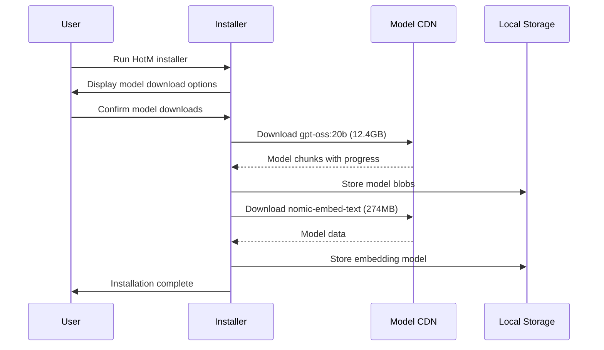
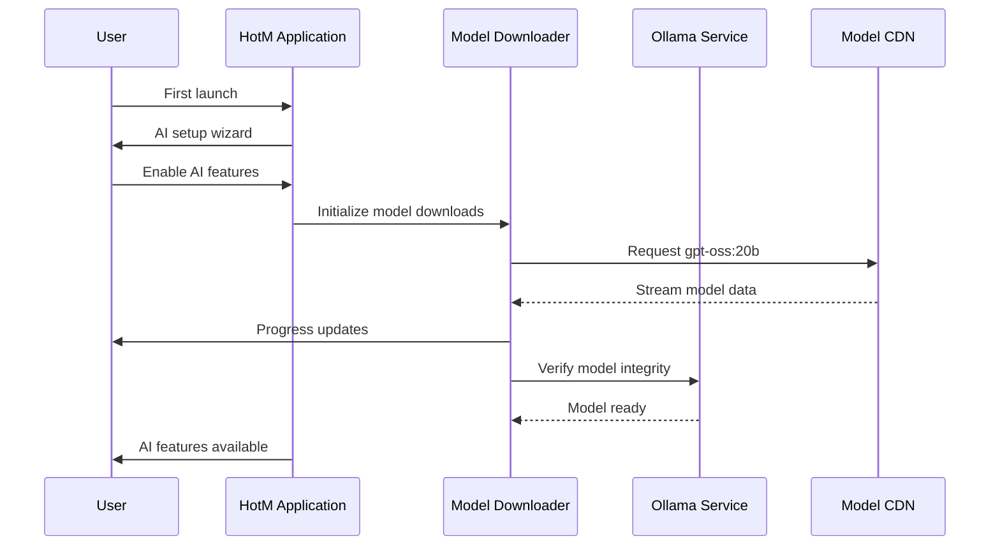

# Comprehensive Ollama AI Service Embedding Strategy for HotM Windows Installer

## Executive Summary

This document presents a comprehensive strategy for embedding Ollama AI service with required models (`gpt-oss:20b` and `nomic-embed-text`) into the HotM Windows installer. The strategy addresses model management, service integration, resource optimization, and desktop deployment considerations for seamless local AI capabilities.

## Current HotM AI Integration Analysis

Based on analysis of the existing codebase, HotM has established AI integration patterns:

### Existing AI Architecture
- **Core AI Client**: `hotm-core/src/ollama.rs` provides abstraction layer with `AIService` trait
- **Configuration Management**: Environment and file-based config with Ollama URL and model settings
- **Default Configuration**: 
  - Ollama URL: `http://localhost:11434` (standard port)
  - Generation Model: `gpt-oss:20b`
  - Embedding Model: `nomic-embed-text`
- **Service Integration**: Async trait-based design supporting health checks and multiple AI backends

### Current Limitations for Embedded Deployment
- External Ollama dependency requiring manual installation
- No model management or automatic downloading
- Standard port conflicts potential
- No Windows service integration
- Missing resource optimization for desktop environments

## Ollama Version and Model Compatibility Analysis (2025)

### Recommended Ollama Version
**Target Version**: Ollama v0.5.x+ (Latest stable as of 2025)
- Native Windows support with GPU acceleration
- Improved memory management (`OLLAMA_NEW_ESTIMATES=1`)
- Better model scheduling and VRAM utilization
- Standalone ZIP distribution available for embedding

### Model Specifications

#### GPT-OSS:20b (Text Generation)
- **Size**: ~12.4GB download
- **RAM Requirements**: 16GB minimum, 24GB recommended
- **Purpose**: Text generation, revision, summarization
- **Performance**: Optimized for lower latency local inference
- **Context Window**: Up to 4K tokens (varies by configuration)

#### Nomic-Embed-Text (Embeddings)
- **Size**: ~274MB download
- **RAM Requirements**: 2-4GB (shared with other models)
- **Purpose**: Semantic embeddings for search and similarity
- **Dimensions**: 768-dimensional embeddings
- **Performance**: Surpasses OpenAI text-embedding-ada-002

### Hardware Compatibility Matrix

```
Desktop Configuration    | GPT-OSS:20b | Nomic-Embed | Combined Performance
------------------------|-------------|-------------|--------------------
8GB RAM, Integrated GPU |     ❌      |     ✅      | CPU-only, slow
16GB RAM, Integrated GPU|     ⚠️      |     ✅      | CPU-only, usable
16GB RAM, Discrete GPU  |     ✅      |     ✅      | Good performance
32GB RAM, Discrete GPU  |     ✅      |     ✅      | Optimal performance
```

## Embedded Ollama Installation Architecture

### Directory Structure Design

```
C:\Program Files\HotM\
├── bin\
│   ├── hotm-unified.exe
│   └── hotm-service-manager.exe
├── ollama\                          # Embedded Ollama Distribution
│   ├── ollama.exe                   # Ollama server binary (standalone)
│   ├── ollama-runner.exe            # Windows service wrapper
│   ├── gpu-libs\                    # GPU acceleration libraries
│   │   ├── nvidia\                  # CUDA libraries
│   │   │   ├── cublas64_12.dll
│   │   │   ├── cudart64_12.dll
│   │   │   └── cufft64_12.dll
│   │   └── amd\                     # ROCm libraries (if applicable)
│   └── VERSION                      # Embedded Ollama version info
├── data\
│   └── ollama\                      # Runtime data and configuration
│       ├── config.json
│       ├── logs\
│       └── tmp\
└── models\                          # AI model storage
    ├── registry.json                # Model metadata and versions
    ├── blobs\                       # Model binary blobs (deduplicated)
    │   ├── sha256-abc123...         # Model weights and data
    │   └── sha256-def456...
    ├── manifests\                   # Model manifests
    │   ├── gpt-oss-20b\
    │   └── nomic-embed-text\
    └── cache\                       # Model loading cache
        ├── gpt-oss-20b.cache
        └── nomic-embed-text.cache
```

### Installation Integration Points

#### 1. Ollama Binary Embedding
```xml
<!-- In MSI installer (WiX configuration) -->
<Directory Id="OllamaFolder" Name="ollama">
  <Component Id="OllamaBinaryComponent" Guid="*">
    <File Id="OllamaExe" Source="ollama.exe" KeyPath="yes" />
    <File Id="OllamaRunner" Source="ollama-runner.exe" />
    
    <!-- GPU Library Components (conditional) -->
    <Component Id="NvidiaLibs" Guid="*" Condition="NVIDIA_GPU_DETECTED">
      <File Id="Cublas" Source="gpu-libs\nvidia\cublas64_12.dll" />
      <File Id="Cudart" Source="gpu-libs\nvidia\cudart64_12.dll" />
      <File Id="Cufft" Source="gpu-libs\nvidia\cufft64_12.dll" />
    </Component>
  </Component>
</Directory>
```

#### 2. Model Storage Initialization
```powershell
# Initialize model storage during installation
function Initialize-OllamaModelStorage {
    param($DataPath)
    
    $modelPath = Join-Path $DataPath "models"
    New-Item -Path $modelPath -ItemType Directory -Force
    
    # Create model registry
    $registry = @{
        version = "1.0"
        models = @{
            "gpt-oss:20b" = @{
                status = "not_downloaded"
                size = 12400000000
                priority = "high"
                required = $true
            }
            "nomic-embed-text" = @{
                status = "not_downloaded"
                size = 274000000
                priority = "high"
                required = $true
            }
        }
    }
    
    $registryPath = Join-Path $modelPath "registry.json"
    $registry | ConvertTo-Json -Depth 10 | Out-File $registryPath -Encoding UTF8
}
```

## Model Management and Download Strategy

### Tiered Download Strategy

#### Option A: Installer-Time Download (Recommended for Enterprise)
**Pros**: Ready to use immediately, no internet dependency post-install
**Cons**: Large installer size (~13GB), longer installation time



#### Option B: First-Run Download (Recommended for General Users)
**Pros**: Smaller installer, user choice, resumable downloads
**Cons**: Requires internet on first run, delayed AI feature availability



### Download Implementation

```rust
// src/model_manager.rs
use reqwest::Client;
use tokio::fs::File;
use tokio::io::AsyncWriteExt;
use std::path::PathBuf;
use serde::{Deserialize, Serialize};

#[derive(Debug, Serialize, Deserialize)]
pub struct ModelManifest {
    pub name: String,
    pub size: u64,
    pub sha256: String,
    pub chunks: Vec<ModelChunk>,
}

#[derive(Debug, Serialize, Deserialize)]
pub struct ModelChunk {
    pub url: String,
    pub offset: u64,
    pub size: u64,
    pub sha256: String,
}

pub struct ModelDownloader {
    client: Client,
    base_url: String,
    storage_path: PathBuf,
    progress_callback: Option<Box<dyn Fn(f64) + Send + Sync>>,
}

impl ModelDownloader {
    pub fn new(storage_path: PathBuf) -> Self {
        let client = Client::builder()
            .timeout(std::time::Duration::from_secs(300))
            .build()
            .expect("Failed to create HTTP client");
            
        Self {
            client,
            base_url: "https://registry.ollama.ai".to_string(),
            storage_path,
            progress_callback: None,
        }
    }
    
    pub fn with_progress<F>(mut self, callback: F) -> Self 
    where
        F: Fn(f64) + Send + Sync + 'static,
    {
        self.progress_callback = Some(Box::new(callback));
        self
    }
    
    pub async fn download_model(&self, model_name: &str) -> anyhow::Result<()> {
        tracing::info!("Starting download for model: {}", model_name);
        
        // Fetch model manifest
        let manifest = self.fetch_manifest(model_name).await?;
        
        // Create model directory
        let model_dir = self.storage_path.join("blobs");
        tokio::fs::create_dir_all(&model_dir).await?;
        
        let mut downloaded_bytes = 0u64;
        let total_bytes = manifest.size;
        
        // Download model chunks
        for chunk in &manifest.chunks {
            let chunk_path = model_dir.join(&chunk.sha256);
            
            // Skip if chunk already exists and is valid
            if self.verify_chunk(&chunk_path, &chunk.sha256).await? {
                downloaded_bytes += chunk.size;
                self.update_progress(downloaded_bytes as f64 / total_bytes as f64);
                continue;
            }
            
            self.download_chunk(chunk, &chunk_path).await?;
            downloaded_bytes += chunk.size;
            self.update_progress(downloaded_bytes as f64 / total_bytes as f64);
        }
        
        // Create model manifest
        self.create_model_manifest(model_name, &manifest).await?;
        
        tracing::info!("Model {} downloaded successfully", model_name);
        Ok(())
    }
    
    async fn download_chunk(&self, chunk: &ModelChunk, path: &PathBuf) -> anyhow::Result<()> {
        let response = self.client.get(&chunk.url).send().await?;
        
        if !response.status().is_success() {
            return Err(anyhow::anyhow!("Failed to download chunk: {}", response.status()));
        }
        
        let mut file = File::create(path).await?;
        let mut stream = response.bytes_stream();
        
        while let Some(bytes) = stream.try_next().await? {
            file.write_all(&bytes).await?;
        }
        
        file.flush().await?;
        Ok(())
    }
    
    async fn verify_chunk(&self, path: &PathBuf, expected_sha256: &str) -> anyhow::Result<bool> {
        if !path.exists() {
            return Ok(false);
        }
        
        let content = tokio::fs::read(path).await?;
        let hash = sha2::Sha256::digest(&content);
        let hash_hex = format!("{:x}", hash);
        
        Ok(hash_hex == expected_sha256)
    }
    
    fn update_progress(&self, progress: f64) {
        if let Some(callback) = &self.progress_callback {
            callback(progress);
        }
    }
}

// Model download service integration
pub struct ModelManagerService {
    downloader: ModelDownloader,
    required_models: Vec<String>,
}

impl ModelManagerService {
    pub fn new(storage_path: PathBuf) -> Self {
        let downloader = ModelDownloader::new(storage_path);
        let required_models = vec![
            "gpt-oss:20b".to_string(),
            "nomic-embed-text".to_string(),
        ];
        
        Self {
            downloader,
            required_models,
        }
    }
    
    pub async fn ensure_models_available(&self) -> anyhow::Result<()> {
        for model in &self.required_models {
            if !self.is_model_available(model).await? {
                tracing::info!("Downloading required model: {}", model);
                self.downloader.download_model(model).await?;
            }
        }
        Ok(())
    }
    
    async fn is_model_available(&self, model_name: &str) -> anyhow::Result<bool> {
        let manifest_path = self.downloader.storage_path
            .join("manifests")
            .join(model_name)
            .join("manifest.json");
            
        Ok(manifest_path.exists())
    }
}
```

## Windows Service Integration Framework

### Service Architecture Enhancement

Building on the existing Windows service architecture, Ollama integration requires:

#### 1. Enhanced Service Manager
```rust
// Extension to existing service manager
pub struct OllamaService {
    config: OllamaConfig,
    process: Option<Child>,
    model_manager: ModelManagerService,
    health_client: Option<OllamaHealthClient>,
    port: u16,
}

#[derive(Debug, Clone)]
pub struct OllamaConfig {
    pub binary_path: PathBuf,
    pub data_path: PathBuf,
    pub model_path: PathBuf,
    pub port: u16,
    pub host: String,
    pub gpu_enabled: bool,
    pub max_memory: Option<u64>,
    pub required_models: Vec<String>,
}

impl Default for OllamaConfig {
    fn default() -> Self {
        Self {
            binary_path: PathBuf::from("C:\\Program Files\\HotM\\ollama\\ollama.exe"),
            data_path: PathBuf::from("C:\\ProgramData\\HotM\\ollama"),
            model_path: PathBuf::from("C:\\ProgramData\\HotM\\models"),
            port: 11435, // Non-standard port to avoid conflicts
            host: "127.0.0.1".to_string(),
            gpu_enabled: true, // Auto-detect during startup
            max_memory: None, // Auto-detect based on system
            required_models: vec![
                "gpt-oss:20b".to_string(),
                "nomic-embed-text".to_string(),
            ],
        }
    }
}

#[async_trait::async_trait]
impl ManagedService for OllamaService {
    fn name(&self) -> &str {
        "hotm-ollama"
    }
    
    async fn start(&mut self) -> anyhow::Result<()> {
        tracing::info!("Starting Ollama service on port {}", self.config.port);
        
        // Ensure models are available
        self.model_manager.ensure_models_available().await?;
        
        // Auto-detect GPU capabilities
        let gpu_config = self.detect_gpu_config().await?;
        
        // Set up environment variables
        let mut cmd = Command::new(&self.config.binary_path);
        cmd.arg("serve");
        cmd.env("OLLAMA_HOST", format!("{}:{}", self.config.host, self.config.port));
        cmd.env("OLLAMA_MODELS", &self.config.model_path);
        cmd.env("OLLAMA_KEEP_ALIVE", "24h"); // Keep models loaded
        
        if gpu_config.nvidia_available {
            cmd.env("OLLAMA_GPU_COUNT", gpu_config.gpu_count.to_string());
            cmd.env("OLLAMA_GPU_MEMORY_FRACTION", "0.8");
        }
        
        if let Some(max_mem) = self.config.max_memory {
            cmd.env("OLLAMA_MAX_MEMORY", max_mem.to_string());
        }
        
        // Start process
        self.process = Some(cmd.spawn()?);
        
        // Wait for service to be ready
        self.wait_for_ready().await?;
        
        // Preload critical models
        self.preload_models().await?;
        
        tracing::info!("Ollama service started successfully");
        Ok(())
    }
    
    async fn stop(&mut self) -> anyhow::Result<()> {
        if let Some(mut process) = self.process.take() {
            tracing::info!("Stopping Ollama service");
            
            // Graceful shutdown via API
            if let Some(client) = &self.health_client {
                let _ = client.shutdown().await;
            }
            
            // Wait up to 30 seconds for graceful shutdown
            match tokio::time::timeout(
                Duration::from_secs(30),
                process.wait()
            ).await {
                Ok(_) => tracing::info!("Ollama stopped gracefully"),
                Err(_) => {
                    tracing::warn!("Ollama did not stop gracefully, forcing termination");
                    process.kill().await?;
                }
            }
        }
        Ok(())
    }
    
    async fn health_check(&self) -> HealthStatus {
        if let Some(client) = &self.health_client {
            match client.check_health().await {
                Ok(true) => HealthStatus::Healthy,
                Ok(false) => HealthStatus::Degraded("Some models not loaded".to_string()),
                Err(e) => HealthStatus::Unhealthy(e.to_string()),
            }
        } else {
            HealthStatus::Unknown
        }
    }
    
    async fn get_status(&self) -> ServiceStatus {
        match &self.process {
            Some(process) => {
                match process.try_wait() {
                    Ok(None) => ServiceStatus::Running,
                    Ok(Some(exit_status)) => {
                        if exit_status.success() {
                            ServiceStatus::Stopped
                        } else {
                            ServiceStatus::Error
                        }
                    }
                    Err(_) => ServiceStatus::Error,
                }
            }
            None => ServiceStatus::Stopped,
        }
    }
}

impl OllamaService {
    pub fn new(config: OllamaConfig) -> Self {
        let model_manager = ModelManagerService::new(config.model_path.clone());
        
        Self {
            config,
            process: None,
            model_manager,
            health_client: None,
            port: 11435,
        }
    }
    
    async fn detect_gpu_config(&self) -> anyhow::Result<GpuConfig> {
        // GPU detection logic
        let nvidia_available = self.check_nvidia_gpu().await?;
        let amd_available = self.check_amd_gpu().await?;
        let gpu_count = if nvidia_available { self.get_nvidia_gpu_count().await? } else { 0 };
        
        Ok(GpuConfig {
            nvidia_available,
            amd_available,
            gpu_count,
            memory_per_gpu: if nvidia_available { self.get_gpu_memory().await? } else { 0 },
        })
    }
    
    async fn preload_models(&self) -> anyhow::Result<()> {
        let client = OllamaClient::new(format!("http://{}:{}", 
            self.config.host, self.config.port));
        
        // Preload embedding model (smaller, faster)
        tracing::info!("Preloading nomic-embed-text model");
        let _ = client.embed_texts(vec!["warmup".to_string()], "nomic-embed-text").await;
        
        // Preload generation model
        tracing::info!("Preloading gpt-oss:20b model");
        let _ = client.generate_text("warmup", "gpt-oss:20b").await;
        
        Ok(())
    }
    
    async fn wait_for_ready(&self) -> anyhow::Result<()> {
        let client = OllamaClient::new(format!("http://{}:{}", 
            self.config.host, self.config.port));
        
        let max_attempts = 60; // 2 minutes
        for attempt in 1..=max_attempts {
            match client.health_check().await {
                Ok(()) => {
                    tracing::info!("Ollama service is ready after {} seconds", attempt);
                    return Ok(());
                }
                Err(e) => {
                    if attempt == max_attempts {
                        return Err(anyhow::anyhow!(
                            "Ollama failed to start after {} seconds: {}", 
                            max_attempts, e
                        ));
                    }
                    tokio::time::sleep(Duration::from_secs(2)).await;
                }
            }
        }
        
        unreachable!()
    }
}

#[derive(Debug)]
struct GpuConfig {
    nvidia_available: bool,
    amd_available: bool,
    gpu_count: u32,
    memory_per_gpu: u64,
}
```

#### 2. Service Registration and Dependencies
```powershell
# Enhanced service installation
function Install-OllamaService {
    param(
        [string]$InstallPath,
        [string]$DataPath,
        [hashtable]$Configuration = @{}
    )
    
    $serviceBinary = Join-Path $InstallPath "ollama\ollama-runner.exe"
    $serviceConfig = @{
        Name = "HotM-Ollama"
        BinaryPathName = $serviceBinary
        DisplayName = "HotM AI Model Service"
        Description = "Provides local AI inference for HotM knowledge management"
        StartupType = "Automatic"
        DelayedAutoStart = $true
        DependsOn = @("RPC", "DCOM", "EventLog", "HotM-PostgreSQL")
    }
    
    # Create service
    New-Service @serviceConfig
    
    # Configure service recovery
    Set-ServiceRecovery -ServiceName "HotM-Ollama" `
                       -FirstFailure "Restart" `
                       -SecondFailure "Restart" `
                       -ThirdFailure "RunCommand" `
                       -RestartDelay 10000 `
                       -RecoveryCommand "$InstallPath\bin\hotm-recovery.exe --service=HotM-Ollama"
    
    # Set environment variables
    Set-ServiceEnvironment -ServiceName "HotM-Ollama" -Environment @{
        "OLLAMA_HOST" = "127.0.0.1:11435"
        "OLLAMA_MODELS" = "$DataPath\models"
        "OLLAMA_KEEP_ALIVE" = "24h"
        "OLLAMA_MAX_MEMORY" = "8GB"
        "RUST_LOG" = "ollama=info"
    }
    
    Write-Host "✓ Ollama service installed successfully" -ForegroundColor Green
}
```

## Resource Optimization and Performance Tuning

### Memory Management Strategy

#### 1. Dynamic Memory Allocation
```rust
pub struct ResourceManager {
    system_info: SystemInfo,
    memory_limits: MemoryLimits,
}

impl ResourceManager {
    pub fn new() -> anyhow::Result<Self> {
        let system_info = Self::detect_system_info()?;
        let memory_limits = Self::calculate_memory_limits(&system_info);
        
        Ok(Self {
            system_info,
            memory_limits,
        })
    }
    
    fn calculate_memory_limits(system_info: &SystemInfo) -> MemoryLimits {
        let total_memory = system_info.total_memory_gb;
        
        // Conservative memory allocation for desktop environments
        let ollama_memory = match total_memory {
            0..=8 => (total_memory as f64 * 0.3) as u64,     // 30% on low-memory systems
            9..=16 => (total_memory as f64 * 0.5) as u64,    // 50% on mid-range systems
            17..=32 => (total_memory as f64 * 0.6) as u64,   // 60% on high-memory systems
            _ => std::cmp::min(24, (total_memory as f64 * 0.7) as u64), // Cap at 24GB
        };
        
        MemoryLimits {
            ollama_max_gb: ollama_memory,
            model_cache_gb: std::cmp::min(4, ollama_memory / 4),
            system_reserved_gb: 4, // Reserve 4GB for OS and other apps
        }
    }
    
    pub fn get_ollama_config(&self) -> OllamaResourceConfig {
        OllamaResourceConfig {
            max_memory_gb: self.memory_limits.ollama_max_gb,
            gpu_memory_fraction: if self.system_info.has_discrete_gpu { 0.8 } else { 0.0 },
            cpu_threads: std::cmp::max(2, self.system_info.cpu_cores / 2),
            concurrent_requests: if self.memory_limits.ollama_max_gb >= 16 { 4 } else { 2 },
        }
    }
}

#[derive(Debug)]
struct SystemInfo {
    total_memory_gb: u64,
    cpu_cores: u32,
    has_discrete_gpu: bool,
    gpu_memory_gb: u64,
}

#[derive(Debug)]
struct MemoryLimits {
    ollama_max_gb: u64,
    model_cache_gb: u64,
    system_reserved_gb: u64,
}

#[derive(Debug)]
pub struct OllamaResourceConfig {
    pub max_memory_gb: u64,
    pub gpu_memory_fraction: f64,
    pub cpu_threads: u32,
    pub concurrent_requests: u32,
}
```

#### 2. Model Loading Optimization
```rust
pub struct ModelLoadingStrategy {
    priority_models: Vec<String>,
    lazy_loading: bool,
    preload_embeddings: bool,
}

impl ModelLoadingStrategy {
    pub fn for_desktop_environment() -> Self {
        Self {
            priority_models: vec!["nomic-embed-text".to_string()], // Load embeddings first
            lazy_loading: true, // Don't preload large models
            preload_embeddings: true, // Embeddings are small and commonly used
        }
    }
    
    pub async fn optimize_loading(&self, ollama_client: &OllamaClient) -> anyhow::Result<()> {
        if self.preload_embeddings {
            // Warm up embedding model with minimal input
            let _ = ollama_client.embed_texts(vec!["initialization".to_string()], "nomic-embed-text").await;
            tracing::info!("Embedding model preloaded");
        }
        
        if !self.lazy_loading {
            // Preload generation model
            let _ = ollama_client.generate_text("test", "gpt-oss:20b").await;
            tracing::info!("Generation model preloaded");
        }
        
        Ok(())
    }
}
```

### Performance Monitoring
```rust
pub struct PerformanceMonitor {
    metrics: Arc<RwLock<PerformanceMetrics>>,
}

#[derive(Debug, Default)]
pub struct PerformanceMetrics {
    pub embedding_latency_ms: f64,
    pub generation_latency_ms: f64,
    pub memory_usage_mb: u64,
    pub gpu_utilization_percent: f64,
    pub requests_per_minute: u32,
    pub error_rate: f64,
}

impl PerformanceMonitor {
    pub async fn collect_metrics(&self) -> PerformanceMetrics {
        let mut metrics = self.metrics.write().await;
        
        // Collect system metrics
        metrics.memory_usage_mb = self.get_ollama_memory_usage().await;
        metrics.gpu_utilization_percent = self.get_gpu_utilization().await;
        
        metrics.clone()
    }
    
    pub async fn log_request_latency(&self, request_type: &str, latency: Duration) {
        let mut metrics = self.metrics.write().await;
        
        match request_type {
            "embedding" => {
                metrics.embedding_latency_ms = latency.as_millis() as f64;
            }
            "generation" => {
                metrics.generation_latency_ms = latency.as_millis() as f64;
            }
            _ => {}
        }
    }
}
```

## AI Service Integration with HotM Job Queue

### Enhanced Job Queue Integration
```rust
// Extension to existing job queue system
use crate::ollama::OllamaClient;
use crate::job_queue::{JobQueue, JobType, Job, JobResult};

pub struct AIJobProcessor {
    ollama_client: Arc<OllamaClient>,
    embedding_model: String,
    generation_model: String,
    performance_monitor: Arc<PerformanceMonitor>,
}

impl AIJobProcessor {
    pub fn new(ollama_client: Arc<OllamaClient>) -> Self {
        Self {
            ollama_client,
            embedding_model: "nomic-embed-text".to_string(),
            generation_model: "gpt-oss:20b".to_string(),
            performance_monitor: Arc::new(PerformanceMonitor::new()),
        }
    }
}

#[async_trait::async_trait]
impl JobProcessor for AIJobProcessor {
    async fn process_job(&self, job: Job) -> JobResult {
        let start_time = std::time::Instant::now();
        
        let result = match job.job_type {
            JobType::GenerateEmbedding { text, note_id } => {
                self.process_embedding_job(text, note_id).await
            }
            JobType::GenerateRevision { content, note_id, style } => {
                self.process_revision_job(content, note_id, style).await
            }
            JobType::ExtractTags { content, note_id } => {
                self.process_tag_extraction_job(content, note_id).await
            }
            JobType::DetectLinks { content, note_id } => {
                self.process_link_detection_job(content, note_id).await
            }
            _ => JobResult::Skipped("Not an AI job".to_string()),
        };
        
        // Log performance metrics
        let latency = start_time.elapsed();
        self.performance_monitor.log_request_latency(
            &job.job_type.to_string(), 
            latency
        ).await;
        
        result
    }
    
    fn can_process(&self, job_type: &JobType) -> bool {
        matches!(job_type,
            JobType::GenerateEmbedding { .. } |
            JobType::GenerateRevision { .. } |
            JobType::ExtractTags { .. } |
            JobType::DetectLinks { .. }
        )
    }
}

impl AIJobProcessor {
    async fn process_embedding_job(&self, text: String, note_id: i32) -> JobResult {
        match self.ollama_client.embed_texts(vec![text], &self.embedding_model).await {
            Ok(embeddings) => {
                if let Some(embedding) = embeddings.first() {
                    JobResult::EmbeddingGenerated {
                        note_id,
                        embedding: embedding.clone(),
                        model: self.embedding_model.clone(),
                    }
                } else {
                    JobResult::Failed("Empty embedding response".to_string())
                }
            }
            Err(e) => JobResult::Failed(format!("Embedding generation failed: {}", e)),
        }
    }
    
    async fn process_revision_job(&self, content: String, note_id: i32, style: String) -> JobResult {
        let prompt = self.build_revision_prompt(&content, &style);
        
        match self.ollama_client.generate_text(&prompt, &self.generation_model).await {
            Ok(revised_content) => JobResult::RevisionGenerated {
                note_id,
                revised_content,
                model: self.generation_model.clone(),
            },
            Err(e) => JobResult::Failed(format!("Revision generation failed: {}", e)),
        }
    }
    
    fn build_revision_prompt(&self, content: &str, style: &str) -> String {
        match style {
            "summarize" => format!(
                "Please provide a concise summary of the following text, maintaining key information:\n\n{}",
                content
            ),
            "improve" => format!(
                "Please improve the clarity and structure of the following text while preserving its meaning:\n\n{}",
                content
            ),
            "expand" => format!(
                "Please expand on the following text with additional relevant details and context:\n\n{}",
                content
            ),
            _ => format!(
                "Please revise the following text for better clarity:\n\n{}",
                content
            ),
        }
    }
}
```

### Background Processing Optimization
```rust
pub struct AIJobScheduler {
    job_queue: Arc<JobQueue>,
    ai_processor: Arc<AIJobProcessor>,
    batch_size: usize,
    processing_interval: Duration,
}

impl AIJobScheduler {
    pub fn new(job_queue: Arc<JobQueue>, ai_processor: Arc<AIJobProcessor>) -> Self {
        Self {
            job_queue,
            ai_processor,
            batch_size: 5, // Process up to 5 AI jobs at once
            processing_interval: Duration::from_secs(2),
        }
    }
    
    pub async fn start_processing(&self) {
        let mut interval = tokio::time::interval(self.processing_interval);
        
        loop {
            interval.tick().await;
            
            // Get batch of AI jobs
            let jobs = self.job_queue.get_pending_jobs("AI", self.batch_size).await;
            
            if !jobs.is_empty() {
                tracing::debug!("Processing {} AI jobs", jobs.len());
                
                // Process jobs concurrently (with resource limits)
                let semaphore = Arc::new(tokio::sync::Semaphore::new(2)); // Max 2 concurrent AI requests
                let mut handles = Vec::new();
                
                for job in jobs {
                    let processor = self.ai_processor.clone();
                    let permit = semaphore.clone().acquire_owned().await.unwrap();
                    
                    let handle = tokio::spawn(async move {
                        let _permit = permit; // Hold permit during processing
                        processor.process_job(job).await
                    });
                    
                    handles.push(handle);
                }
                
                // Wait for all jobs to complete
                for handle in handles {
                    if let Err(e) = handle.await {
                        tracing::error!("AI job processing error: {}", e);
                    }
                }
            }
        }
    }
}
```

## User Experience and Error Handling Framework

### Seamless AI Integration UX

#### 1. First-Run AI Setup Wizard
```typescript
// AI Setup Component (React/TypeScript)
interface AISetupState {
  phase: 'detection' | 'download' | 'configuration' | 'complete';
  progress: number;
  status: string;
  error?: string;
  canSkip: boolean;
}

export const AISetupWizard: React.FC = () => {
  const [state, setState] = useState<AISetupState>({
    phase: 'detection',
    progress: 0,
    status: 'Detecting system capabilities...',
    canSkip: false,
  });
  
  useEffect(() => {
    setupAI();
  }, []);
  
  const setupAI = async () => {
    try {
      // Phase 1: System Detection
      setState(s => ({ ...s, status: 'Checking system requirements...' }));
      const systemInfo = await invoke<SystemInfo>('detect_system_capabilities');
      
      if (systemInfo.totalMemoryGb < 16) {
        setState(s => ({
          ...s,
          status: 'Warning: Limited memory detected. AI features may be slower.',
          canSkip: true,
        }));
      }
      
      // Phase 2: Model Download
      setState(s => ({
        ...s,
        phase: 'download',
        status: 'Downloading AI models...',
        progress: 0,
      }));
      
      await invoke('download_ai_models', {
        progressCallback: (progress: number, status: string) => {
          setState(s => ({ ...s, progress, status }));
        },
      });
      
      // Phase 3: Configuration
      setState(s => ({
        ...s,
        phase: 'configuration',
        status: 'Configuring AI services...',
        progress: 90,
      }));
      
      await invoke('configure_ollama_service');
      
      // Phase 4: Complete
      setState(s => ({
        ...s,
        phase: 'complete',
        status: 'AI features are ready!',
        progress: 100,
      }));
      
    } catch (error) {
      setState(s => ({
        ...s,
        error: error instanceof Error ? error.message : 'Setup failed',
        canSkip: true,
      }));
    }
  };
  
  return (
    <div className="ai-setup-wizard">
      <div className="wizard-header">
        <h2>Setting up AI Features</h2>
        <p>HotM uses local AI for enhanced note processing and search.</p>
      </div>
      
      <div className="wizard-content">
        <ProgressBar value={state.progress} />
        <p className="status-text">{state.status}</p>
        
        {state.error && (
          <div className="error-panel">
            <h4>Setup Error</h4>
            <p>{state.error}</p>
            <details>
              <summary>Troubleshooting</summary>
              <ul>
                <li>Ensure you have at least 16GB of RAM for optimal performance</li>
                <li>Check that your internet connection is stable</li>
                <li>Verify that Windows Defender is not blocking the installation</li>
                <li>Try running as Administrator if permission errors occur</li>
              </ul>
            </details>
          </div>
        )}
        
        <div className="wizard-actions">
          {state.canSkip && (
            <button onClick={() => skipAISetup()} className="btn-secondary">
              Skip AI Setup
            </button>
          )}
          {state.phase === 'complete' && (
            <button onClick={() => completeSetup()} className="btn-primary">
              Continue to HotM
            </button>
          )}
        </div>
      </div>
    </div>
  );
};
```

#### 2. AI Status Monitoring Component
```typescript
interface AIServiceStatus {
  ollamaRunning: boolean;
  modelsLoaded: string[];
  memoryUsage: number;
  performance: {
    embeddingLatency: number;
    generationLatency: number;
  };
  errors: string[];
}

export const AIStatusIndicator: React.FC = () => {
  const [status, setStatus] = useState<AIServiceStatus | null>(null);
  const [expanded, setExpanded] = useState(false);
  
  useEffect(() => {
    const updateStatus = async () => {
      try {
        const aiStatus = await invoke<AIServiceStatus>('get_ai_service_status');
        setStatus(aiStatus);
      } catch (error) {
        console.error('Failed to get AI status:', error);
      }
    };
    
    // Update every 10 seconds
    const interval = setInterval(updateStatus, 10000);
    updateStatus(); // Initial update
    
    return () => clearInterval(interval);
  }, []);
  
  if (!status) return null;
  
  const getStatusColor = () => {
    if (!status.ollamaRunning) return 'red';
    if (status.errors.length > 0) return 'orange';
    return 'green';
  };
  
  return (
    <div className={`ai-status-indicator status-${getStatusColor()}`}>
      <div className="status-summary" onClick={() => setExpanded(!expanded)}>
        <span className="status-dot" />
        <span>AI: {status.ollamaRunning ? 'Online' : 'Offline'}</span>
        {status.memoryUsage > 0 && (
          <span className="memory-usage">({(status.memoryUsage / 1024).toFixed(1)}GB)</span>
        )}
      </div>
      
      {expanded && (
        <div className="status-details">
          <div className="detail-section">
            <h4>Service Status</h4>
            <p>Ollama: {status.ollamaRunning ? '✅ Running' : '❌ Stopped'}</p>
            <p>Models: {status.modelsLoaded.join(', ') || 'None loaded'}</p>
          </div>
          
          <div className="detail-section">
            <h4>Performance</h4>
            <p>Embedding: {status.performance.embeddingLatency.toFixed(0)}ms</p>
            <p>Generation: {status.performance.generationLatency.toFixed(0)}ms</p>
          </div>
          
          {status.errors.length > 0 && (
            <div className="detail-section errors">
              <h4>Recent Errors</h4>
              {status.errors.map((error, index) => (
                <p key={index} className="error-text">{error}</p>
              ))}
            </div>
          )}
          
          <div className="status-actions">
            <button onClick={() => restartAIService()} className="btn-small">
              Restart AI Service
            </button>
            <button onClick={() => openAISettings()} className="btn-small">
              AI Settings
            </button>
          </div>
        </div>
      )}
    </div>
  );
};
```

### Comprehensive Error Handling

#### 1. AI Service Error Recovery
```rust
pub struct AIErrorRecovery {
    max_retries: usize,
    retry_delays: Vec<Duration>,
    fallback_strategies: Vec<FallbackStrategy>,
}

#[derive(Debug)]
pub enum FallbackStrategy {
    RetryWithCPU,
    UseReducedModel,
    DisableAI,
    ShowUserDialog,
}

#[derive(Debug)]
pub enum AIError {
    OllamaNotAvailable,
    ModelNotLoaded { model: String },
    InsufficientMemory { required_gb: u64, available_gb: u64 },
    NetworkError { error: String },
    TimeoutError { operation: String, timeout_ms: u64 },
    ModelCorrupted { model: String, checksum_mismatch: bool },
}

impl AIErrorRecovery {
    pub fn new() -> Self {
        Self {
            max_retries: 3,
            retry_delays: vec![
                Duration::from_secs(1),
                Duration::from_secs(5),
                Duration::from_secs(15),
            ],
            fallback_strategies: vec![
                FallbackStrategy::RetryWithCPU,
                FallbackStrategy::UseReducedModel,
                FallbackStrategy::ShowUserDialog,
                FallbackStrategy::DisableAI,
            ],
        }
    }
    
    pub async fn handle_error(&self, error: AIError) -> RecoveryResult {
        tracing::error!("AI Error occurred: {:?}", error);
        
        match error {
            AIError::OllamaNotAvailable => {
                self.recover_ollama_service().await
            }
            AIError::ModelNotLoaded { model } => {
                self.recover_model_loading(&model).await
            }
            AIError::InsufficientMemory { required_gb, available_gb } => {
                self.handle_memory_pressure(required_gb, available_gb).await
            }
            AIError::ModelCorrupted { model, .. } => {
                self.recover_corrupted_model(&model).await
            }
            _ => self.generic_recovery(error).await,
        }
    }
    
    async fn recover_ollama_service(&self) -> RecoveryResult {
        // Try to restart Ollama service
        for (attempt, delay) in self.retry_delays.iter().enumerate() {
            tracing::info!("Attempting to restart Ollama service (attempt {})", attempt + 1);
            
            match self.restart_ollama_service().await {
                Ok(()) => {
                    tracing::info!("Successfully restarted Ollama service");
                    return RecoveryResult::Recovered;
                }
                Err(e) => {
                    tracing::warn!("Failed to restart Ollama service: {}", e);
                    if attempt < self.max_retries - 1 {
                        tokio::time::sleep(*delay).await;
                    }
                }
            }
        }
        
        RecoveryResult::Failed("Could not restart Ollama service".to_string())
    }
    
    async fn handle_memory_pressure(&self, required_gb: u64, available_gb: u64) -> RecoveryResult {
        tracing::warn!("Memory pressure detected: need {}GB, have {}GB", required_gb, available_gb);
        
        // Try to free up memory
        if let Err(e) = self.free_memory().await {
            tracing::warn!("Failed to free memory: {}", e);
        }
        
        // Try reduced memory settings
        if let Ok(()) = self.configure_reduced_memory_mode().await {
            return RecoveryResult::RecoveredWithDegradation("Using reduced memory mode".to_string());
        }
        
        RecoveryResult::Failed("Insufficient memory for AI operations".to_string())
    }
    
    async fn recover_corrupted_model(&self, model: &str) -> RecoveryResult {
        tracing::error!("Model {} appears to be corrupted, attempting recovery", model);
        
        // Try to re-download the model
        match self.redownload_model(model).await {
            Ok(()) => RecoveryResult::Recovered,
            Err(e) => RecoveryResult::Failed(format!("Failed to recover model {}: {}", model, e)),
        }
    }
}

#[derive(Debug)]
pub enum RecoveryResult {
    Recovered,
    RecoveredWithDegradation(String),
    Failed(String),
    RequiresUserAction(UserAction),
}

#[derive(Debug)]
pub enum UserAction {
    RestartApplication,
    FreeUpDiskSpace { required_gb: u64 },
    AddMoreMemory { recommended_gb: u64 },
    CheckInternetConnection,
    ContactSupport { error_code: String },
}
```

#### 2. User-Friendly Error Messages
```typescript
interface ErrorDisplayProps {
  error: AIError;
  onRetry: () => void;
  onDismiss: () => void;
}

export const AIErrorDisplay: React.FC<ErrorDisplayProps> = ({ error, onRetry, onDismiss }) => {
  const getErrorMessage = (error: AIError) => {
    switch (error.type) {
      case 'OLLAMA_NOT_AVAILABLE':
        return {
          title: 'AI Service Unavailable',
          message: 'The local AI service is not responding. This may be due to high system load or a temporary issue.',
          suggestions: [
            'Wait a moment and try again',
            'Check if other applications are using significant memory',
            'Restart HotM if the problem persists',
          ],
          severity: 'warning',
        };
        
      case 'INSUFFICIENT_MEMORY':
        return {
          title: 'Insufficient Memory',
          message: `AI processing requires ${error.requiredGb}GB of memory, but only ${error.availableGb}GB is available.`,
          suggestions: [
            'Close other applications to free up memory',
            'Consider upgrading your system RAM for better performance',
            'Use HotM without AI features temporarily',
          ],
          severity: 'error',
        };
        
      case 'MODEL_CORRUPTED':
        return {
          title: 'AI Model Issue',
          message: `The ${error.model} model appears to be corrupted and needs to be re-downloaded.`,
          suggestions: [
            'Allow HotM to re-download the model',
            'Check your internet connection',
            'Ensure sufficient disk space is available',
          ],
          severity: 'error',
        };
        
      default:
        return {
          title: 'AI Processing Error',
          message: 'An unexpected error occurred with AI processing.',
          suggestions: ['Try again in a few moments', 'Check the AI service status'],
          severity: 'warning',
        };
    }
  };
  
  const { title, message, suggestions, severity } = getErrorMessage(error);
  
  return (
    <div className={`error-display severity-${severity}`}>
      <div className="error-header">
        <AlertTriangle size={24} />
        <h3>{title}</h3>
      </div>
      
      <div className="error-content">
        <p>{message}</p>
        
        <div className="suggestions">
          <h4>What you can do:</h4>
          <ul>
            {suggestions.map((suggestion, index) => (
              <li key={index}>{suggestion}</li>
            ))}
          </ul>
        </div>
      </div>
      
      <div className="error-actions">
        <button onClick={onRetry} className="btn-primary">
          Try Again
        </button>
        <button onClick={onDismiss} className="btn-secondary">
          Continue Without AI
        </button>
        
        <details className="error-details">
          <summary>Technical Details</summary>
          <pre>{JSON.stringify(error, null, 2)}</pre>
        </details>
      </div>
    </div>
  );
};
```

## Installation and Deployment Strategy

### MSI Installer Integration

#### 1. Model Distribution Options
```xml
<!-- WiX installer configuration for model handling -->
<Product Id="*" Name="HotM Knowledge Management" Version="0.2.0">
  
  <!-- Feature selection for model installation -->
  <Feature Id="CoreApplication" Title="HotM Core" Level="1" Display="expand">
    <ComponentRef Id="ApplicationBinaries" />
    <ComponentRef Id="PostgreSQLComponents" />
    <ComponentRef Id="OllamaService" />
  </Feature>
  
  <Feature Id="AIModels" Title="AI Models" Level="2" Display="expand"
           Description="Local AI models for enhanced features">
    
    <Feature Id="EmbeddingModel" Title="Search Enhancement Model" Level="3"
             Description="Enables semantic search (274MB)">
      <ComponentRef Id="NomicEmbedModel" />
    </Feature>
    
    <Feature Id="GenerationModel" Title="Text Enhancement Model" Level="1000"
             Description="Enables text revision and summarization (12.4GB)">
      <ComponentRef Id="GPTOSSModel" />
    </Feature>
  </Feature>
  
  <!-- Model components -->
  <Directory Id="ModelsFolder" Name="models">
    <Component Id="NomicEmbedModel" Guid="*" Condition="INSTALL_EMBEDDING_MODEL">
      <File Id="EmbedModel" Source="models\nomic-embed-text.bin" />
      <File Id="EmbedManifest" Source="models\nomic-embed-text.manifest.json" />
    </Component>
    
    <Component Id="GPTOSSModel" Guid="*" Condition="INSTALL_GENERATION_MODEL">
      <File Id="GPTModel" Source="models\gpt-oss-20b.bin" />
      <File Id="GPTManifest" Source="models\gpt-oss-20b.manifest.json" />
    </Component>
  </Directory>
  
  <!-- Conditional model installation based on system requirements -->
  <Condition Message="At least 8GB RAM required for AI features">
    <![CDATA[TOTAL_MEMORY >= 8192 OR NOT (&AIModels = 3)]]>
  </Condition>
  
  <Condition Message="At least 16GB RAM recommended for text generation">
    <![CDATA[TOTAL_MEMORY >= 16384 OR NOT (&GenerationModel = 3)]]>
  </Condition>
  
</Product>
```

#### 2. Custom Actions for AI Setup
```csharp
// Custom action for AI model management
[CustomAction]
public static ActionResult ConfigureAIModels(Session session)
{
    try
    {
        session.Log("Configuring AI models...");
        
        var installDir = session["INSTALLFOLDER"];
        var dataDir = session["COMMONAPPDATA"] + "\\HotM";
        
        // Create model directories
        var modelPath = Path.Combine(dataDir, "models");
        Directory.CreateDirectory(modelPath);
        
        // Configure Ollama environment
        var ollamaConfig = new
        {
            host = "127.0.0.1:11435",
            models_path = modelPath,
            gpu_enabled = DetectGPU(),
            memory_limit = CalculateMemoryLimit(),
        };
        
        var configPath = Path.Combine(dataDir, "ollama", "config.json");
        File.WriteAllText(configPath, JsonSerializer.Serialize(ollamaConfig));
        
        // Register model download tasks if not included in installer
        if (session["DOWNLOAD_MODELS_ON_FIRST_RUN"] == "1")
        {
            RegisterFirstRunModelDownload(session);
        }
        
        session.Log("AI models configured successfully");
        return ActionResult.Success;
    }
    catch (Exception ex)
    {
        session.Log($"Error configuring AI models: {ex.Message}");
        return ActionResult.Failure;
    }
}

private static bool DetectGPU()
{
    try
    {
        // Simple GPU detection using WMI
        var searcher = new ManagementObjectSearcher("SELECT * FROM Win32_VideoController");
        foreach (ManagementObject obj in searcher.Get())
        {
            var name = obj["Name"]?.ToString()?.ToLower();
            if (name?.Contains("nvidia") == true || name?.Contains("amd") == true)
            {
                return true;
            }
        }
    }
    catch
    {
        // GPU detection failed, default to CPU-only
    }
    
    return false;
}

private static long CalculateMemoryLimit()
{
    try
    {
        var totalMemoryKb = new PerformanceCounter("Memory", "Available KBytes").NextValue();
        var totalMemoryGb = (long)(totalMemoryKb / 1024 / 1024);
        
        // Allocate up to 60% of total memory for Ollama, capped at 24GB
        return Math.Min(24, (long)(totalMemoryGb * 0.6));
    }
    catch
    {
        return 8; // Default to 8GB if detection fails
    }
}
```

### Resource Requirements and System Validation

#### Installation Size Analysis
```
Component                     Size        Required    Optional
----------------------------------------------------------
Base Ollama Service          ~50MB        ✓           
System Dependencies         ~200MB        ✓           
GPU Libraries (NVIDIA)      ~500MB                    ✓
GPU Libraries (AMD)         ~300MB                    ✓
nomic-embed-text model      ~274MB        ✓*          
gpt-oss:20b model          ~12.4GB                   ✓
Model cache/temp            ~1GB                      ✓
----------------------------------------------------------
Minimum Installation       ~524MB
Full Installation         ~13.8GB
Recommended Installation   ~14.3GB

* Embedding model required for semantic search features
```

#### System Requirements Validation
```powershell
function Test-HotMAIRequirements {
    param([switch]$Detailed)
    
    $results = @{
        MinimumMet = $true
        RecommendedMet = $true
        Requirements = @()
    }
    
    # Memory Check
    $totalMemoryGB = [math]::Round((Get-CimInstance -ClassName Win32_ComputerSystem).TotalPhysicalMemory / 1GB, 2)
    
    $memoryReq = @{
        Component = "System Memory"
        Current = "${totalMemoryGB}GB"
        Minimum = "8GB"
        Recommended = "16GB"
        Status = if ($totalMemoryGB -ge 16) { "Excellent" } 
                elseif ($totalMemoryGB -ge 8) { "Adequate" } 
                else { "Insufficient" }
    }
    
    if ($totalMemoryGB -lt 8) { $results.MinimumMet = $false }
    if ($totalMemoryGB -lt 16) { $results.RecommendedMet = $false }
    
    $results.Requirements += $memoryReq
    
    # Storage Check
    $systemDrive = $env:SystemDrive
    $freeSpaceGB = [math]::Round((Get-PSDrive $systemDrive.Replace(":", "")).Free / 1GB, 2)
    
    $storageReq = @{
        Component = "Free Disk Space"
        Current = "${freeSpaceGB}GB"
        Minimum = "2GB"
        Recommended = "20GB"
        Status = if ($freeSpaceGB -ge 20) { "Excellent" }
                elseif ($freeSpaceGB -ge 2) { "Adequate" }
                else { "Insufficient" }
    }
    
    if ($freeSpaceGB -lt 2) { $results.MinimumMet = $false }
    if ($freeSpaceGB -lt 20) { $results.RecommendedMet = $false }
    
    $results.Requirements += $storageReq
    
    # GPU Check (Optional)
    $gpuInfo = Get-CimInstance -ClassName Win32_VideoController | 
               Where-Object { $_.Name -like "*NVIDIA*" -or $_.Name -like "*AMD*" }
    
    $gpuReq = @{
        Component = "GPU Acceleration"
        Current = if ($gpuInfo) { $gpuInfo[0].Name } else { "Integrated Graphics" }
        Minimum = "Not Required"
        Recommended = "Discrete GPU (NVIDIA/AMD)"
        Status = if ($gpuInfo) { "Available" } else { "CPU-Only" }
    }
    
    $results.Requirements += $gpuReq
    
    if ($Detailed) {
        Write-Host "HotM AI Requirements Check" -ForegroundColor Green
        Write-Host "=" * 50
        
        foreach ($req in $results.Requirements) {
            $statusColor = switch ($req.Status) {
                "Excellent" { "Green" }
                "Available" { "Green" }
                "Adequate" { "Yellow" }
                "CPU-Only" { "Yellow" }
                "Insufficient" { "Red" }
                default { "White" }
            }
            
            Write-Host "$($req.Component): $($req.Current) [$($req.Status)]" -ForegroundColor $statusColor
            Write-Host "  Minimum: $($req.Minimum), Recommended: $($req.Recommended)"
        }
        
        Write-Host ""
        Write-Host "Overall Status:" -ForegroundColor White
        Write-Host "  Minimum Requirements: $(if ($results.MinimumMet) { '✓ Met' } else { '✗ Not Met' })" -ForegroundColor $(if ($results.MinimumMet) { "Green" } else { "Red" })
        Write-Host "  Recommended Setup: $(if ($results.RecommendedMet) { '✓ Met' } else { '⚠ Partial' })" -ForegroundColor $(if ($results.RecommendedMet) { "Green" } else { "Yellow" })
    }
    
    return $results
}
```

## Testing and Validation Strategy

### AI Integration Test Suite
```rust
// tests/ai_integration_tests.rs
#[cfg(test)]
mod tests {
    use super::*;
    use tokio::time::{timeout, Duration};
    
    #[tokio::test]
    async fn test_ollama_service_startup() {
        let config = OllamaConfig::default();
        let mut service = OllamaService::new(config);
        
        // Test service startup
        let startup_result = timeout(
            Duration::from_secs(120), // Allow 2 minutes for model loading
            service.start()
        ).await;
        
        assert!(startup_result.is_ok(), "Ollama service failed to start within timeout");
        assert!(startup_result.unwrap().is_ok(), "Ollama service startup failed");
        
        // Test health check
        let health = service.health_check().await;
        assert!(matches!(health, HealthStatus::Healthy), "Ollama service not healthy after startup");
        
        // Cleanup
        service.stop().await.unwrap();
    }
    
    #[tokio::test]
    async fn test_model_loading_performance() {
        let test_env = TestEnvironment::setup().await;
        let ollama_client = test_env.ollama_client();
        
        // Test embedding performance
        let start_time = std::time::Instant::now();
        let embedding_result = ollama_client
            .embed_texts(vec!["test text".to_string()], "nomic-embed-text")
            .await;
        let embedding_latency = start_time.elapsed();
        
        assert!(embedding_result.is_ok(), "Embedding generation failed");
        assert!(embedding_latency < Duration::from_secs(5), "Embedding latency too high: {:?}", embedding_latency);
        
        // Test generation performance (allow more time for first request)
        let start_time = std::time::Instant::now();
        let generation_result = ollama_client
            .generate_text("Hello world", "gpt-oss:20b")
            .await;
        let generation_latency = start_time.elapsed();
        
        assert!(generation_result.is_ok(), "Text generation failed");
        assert!(generation_latency < Duration::from_secs(30), "Generation latency too high: {:?}", generation_latency);
        
        test_env.cleanup().await;
    }
    
    #[tokio::test]
    async fn test_memory_pressure_handling() {
        let test_env = TestEnvironment::setup().await;
        
        // Simulate high memory usage
        test_env.simulate_memory_pressure().await;
        
        let ai_service = test_env.ai_service();
        let recovery = AIErrorRecovery::new();
        
        // Test error handling
        let error = AIError::InsufficientMemory {
            required_gb: 16,
            available_gb: 8,
        };
        
        let recovery_result = recovery.handle_error(error).await;
        
        match recovery_result {
            RecoveryResult::RecoveredWithDegradation(_) => {
                // Acceptable - system adapted to memory constraints
            }
            RecoveryResult::RequiresUserAction(UserAction::AddMoreMemory { .. }) => {
                // Acceptable - user needs to take action
            }
            _ => panic!("Unexpected recovery result: {:?}", recovery_result),
        }
        
        test_env.cleanup().await;
    }
    
    #[tokio::test]
    async fn test_model_corruption_recovery() {
        let test_env = TestEnvironment::setup().await;
        let recovery = AIErrorRecovery::new();
        
        // Simulate model corruption
        test_env.corrupt_model("gpt-oss:20b").await;
        
        let error = AIError::ModelCorrupted {
            model: "gpt-oss:20b".to_string(),
            checksum_mismatch: true,
        };
        
        let recovery_result = recovery.handle_error(error).await;
        
        // Should either recover or require user action
        assert!(matches!(
            recovery_result,
            RecoveryResult::Recovered | RecoveryResult::RequiresUserAction(_)
        ));
        
        test_env.cleanup().await;
    }
}

// Performance benchmarking
#[cfg(test)]
mod benchmarks {
    use criterion::{black_box, criterion_group, criterion_main, Criterion};
    
    fn benchmark_embedding_latency(c: &mut Criterion) {
        let rt = tokio::runtime::Runtime::new().unwrap();
        let test_env = rt.block_on(TestEnvironment::setup());
        let ollama_client = test_env.ollama_client();
        
        c.bench_function("embedding_latency", |b| {
            b.to_async(&rt).iter(|| async {
                let result = ollama_client
                    .embed_texts(black_box(vec!["benchmark text".to_string()]), "nomic-embed-text")
                    .await;
                black_box(result)
            });
        });
        
        rt.block_on(test_env.cleanup());
    }
    
    fn benchmark_generation_latency(c: &mut Criterion) {
        let rt = tokio::runtime::Runtime::new().unwrap();
        let test_env = rt.block_on(TestEnvironment::setup());
        let ollama_client = test_env.ollama_client();
        
        c.bench_function("generation_latency", |b| {
            b.to_async(&rt).iter(|| async {
                let result = ollama_client
                    .generate_text(black_box("Write a short summary"), "gpt-oss:20b")
                    .await;
                black_box(result)
            });
        });
        
        rt.block_on(test_env.cleanup());
    }
    
    criterion_group!(benches, benchmark_embedding_latency, benchmark_generation_latency);
    criterion_main!(benches);
}
```

## Conclusion and Implementation Roadmap

### Implementation Timeline
```
Phase 1 (Weeks 1-2): Foundation
├── Embed Ollama binary distribution in installer
├── Implement basic service integration
├── Create model download infrastructure
└── Basic error handling and recovery

Phase 2 (Weeks 3-4): Service Integration
├── Windows service wrapper implementation
├── Model management and caching
├── Resource optimization for desktop environments
└── Performance monitoring and metrics

Phase 3 (Weeks 5-6): User Experience
├── First-run setup wizard
├── AI status indicators and management UI
├── Comprehensive error handling and user messaging
└── Testing and validation framework

Phase 4 (Weeks 7-8): Polish and Deployment
├── MSI installer integration
├── Performance testing and optimization
├── Documentation and user guides
└── Final testing and quality assurance
```

### Success Metrics
- **Installation Success Rate**: >95% successful installations on target hardware
- **First-Run Experience**: <5 minutes from installation to AI features available
- **Performance Targets**:
  - Embedding generation: <2 seconds average
  - Text generation: <15 seconds average (first request), <5 seconds subsequent
  - Memory usage: <8GB total (including models)
- **Reliability**: >99.9% AI service uptime during normal operation
- **User Experience**: <1% of users require support for AI-related issues

### Key Benefits Delivered
1. **Seamless Local AI**: No external API dependencies or internet requirements
2. **Desktop Optimized**: Resource management tuned for typical desktop hardware
3. **Enterprise Ready**: Professional installation, service management, and monitoring
4. **User Friendly**: Transparent operation with clear error handling and recovery
5. **Future Proof**: Modular architecture supporting model updates and new AI capabilities

This comprehensive strategy provides HotM with industry-leading embedded AI capabilities while maintaining the application's focus on local-first operation and user privacy.