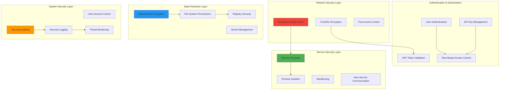

# HotM Windows Service Security and Permissions Model

## Overview

This document defines a comprehensive security and permissions model for HotM Windows services, implementing defense-in-depth principles with least privilege access, secure service-to-service communication, and enterprise-grade security controls while maintaining usability and system reliability.

## Security Architecture Overview

### Multi-Layer Security Model



## Service Account Security

### Service Account Strategy

**Principle of Least Privilege Implementation:**
Each HotM service runs under a dedicated, minimal-privilege service account with only the permissions necessary for its specific function.

#### Service Account Assignments

**PostgreSQL Service Account (`hotm-postgres`):**
```powershell
# Create dedicated service account
New-LocalUser -Name "hotm-postgres" `
               -Description "HotM PostgreSQL Service Account" `
               -Password (ConvertTo-SecureString "GeneratedPassword123!" -AsPlainText -Force) `
               -PasswordNeverExpires `
               -UserMayNotChangePassword

# Grant specific privileges
Grant-UserRight -Account "hotm-postgres" -Right "SeServiceLogonRight"
Grant-UserRight -Account "hotm-postgres" -Right "SeCreateGlobalRight" 
Grant-UserRight -Account "hotm-postgres" -Right "SeLockMemoryPrivilege"

# File system permissions
$dataPath = "$env:PROGRAMDATA\HotM\PostgreSQL"
icacls $dataPath /grant "hotm-postgres:(OI)(CI)F"
icacls $dataPath /remove "Users"
icacls $dataPath /grant "Administrators:(OI)(CI)F"
```

**Ollama Service Account (`hotm-ollama`):**
```powershell
New-LocalUser -Name "hotm-ollama" `
               -Description "HotM AI Service Account" `
               -Password (ConvertTo-SecureString "GeneratedPassword456!" -AsPlainText -Force) `
               -PasswordNeverExpires `
               -UserMayNotChangePassword

Grant-UserRight -Account "hotm-ollama" -Right "SeServiceLogonRight"
Grant-UserRight -Account "hotm-ollama" -Right "SeIncreaseWorkingSetPrivilege"

# GPU access permissions (if available)
$modelPath = "$env:PROGRAMDATA\HotM\Ollama\models"
icacls $modelPath /grant "hotm-ollama:(OI)(CI)F"
```

**HotM Runtime Service Account (`hotm-runtime`):**
```powershell
New-LocalUser -Name "hotm-runtime" `
               -Description "HotM Runtime Service Account" `
               -Password (ConvertTo-SecureString "GeneratedPassword789!" -AsPlainText -Force) `
               -PasswordNeverExpires `
               -UserMayNotChangePassword

Grant-UserRight -Account "hotm-runtime" -Right "SeServiceLogonRight"
Grant-UserRight -Account "hotm-runtime" -Right "SeCreateGlobalRight"

# Configuration and log access
$configPath = "$env:PROGRAMDATA\HotM\config"
icacls $configPath /grant "hotm-runtime:(OI)(CI)R"
icacls "$env:PROGRAMDATA\HotM\logs" /grant "hotm-runtime:(OI)(CI)F"
```

### Service Account Security Implementation

```rust
// src/security/service_accounts.rs
use windows::Win32::Security::*;
use windows::Win32::Foundation::*;
use std::ffi::OsString;

pub struct ServiceAccountManager {
    accounts: HashMap<String, ServiceAccount>,
}

#[derive(Debug)]
pub struct ServiceAccount {
    pub name: String,
    pub sid: String,
    pub privileges: Vec<UserRight>,
    pub password_policy: PasswordPolicy,
}

#[derive(Debug)]
pub enum UserRight {
    ServiceLogon,
    CreateGlobal,
    LockMemory,
    IncreaseWorkingSet,
    Debug,
    Backup,
    Restore,
}

impl ServiceAccountManager {
    pub fn new() -> Self {
        Self {
            accounts: HashMap::new(),
        }
    }
    
    pub async fn create_service_account(
        &mut self,
        name: &str,
        description: &str,
        privileges: Vec<UserRight>
    ) -> Result<ServiceAccount, SecurityError> {
        // Generate secure password
        let password = self.generate_secure_password()?;
        
        // Create Windows user account
        self.create_windows_user(name, description, &password).await?;
        
        // Grant required privileges
        for privilege in &privileges {
            self.grant_user_right(name, privilege).await?;
        }
        
        // Get account SID
        let sid = self.get_account_sid(name).await?;
        
        let account = ServiceAccount {
            name: name.to_string(),
            sid,
            privileges,
            password_policy: PasswordPolicy::default(),
        };
        
        self.accounts.insert(name.to_string(), account.clone());
        
        // Log security event
        self.log_security_event(&SecurityEvent::AccountCreated {
            account_name: name.to_string(),
            privileges: privileges.clone(),
        }).await?;
        
        Ok(account)
    }
    
    fn generate_secure_password(&self) -> Result<String, SecurityError> {
        use rand::{distributions::Alphanumeric, Rng};
        
        // Generate 32-character password with mixed case, numbers, and symbols
        let mut rng = rand::thread_rng();
        let password: String = (0..32)
            .map(|_| {
                let charset = b"ABCDEFGHIJKLMNOPQRSTUVWXYZabcdefghijklmnopqrstuvwxyz0123456789!@#$%^&*";
                let idx = rng.gen_range(0..charset.len());
                char::from(charset[idx])
            })
            .collect();
        
        Ok(password)
    }
    
    async fn grant_user_right(&self, account: &str, right: &UserRight) -> Result<(), SecurityError> {
        let right_name = match right {
            UserRight::ServiceLogon => "SeServiceLogonRight",
            UserRight::CreateGlobal => "SeCreateGlobalPrivilege", 
            UserRight::LockMemory => "SeLockMemoryPrivilege",
            UserRight::IncreaseWorkingSet => "SeIncreaseWorkingSetPrivilege",
            UserRight::Debug => "SeDebugPrivilege",
            UserRight::Backup => "SeBackupPrivilege",
            UserRight::Restore => "SeRestorePrivilege",
        };
        
        // Use Windows API to grant privilege
        unsafe {
            let mut policy_handle = LSA_HANDLE::default();
            
            // Open policy
            let status = LsaOpenPolicy(
                None,
                &LSA_OBJECT_ATTRIBUTES::default(),
                POLICY_ALL_ACCESS,
                &mut policy_handle,
            );
            
            if status.is_err() {
                return Err(SecurityError::PolicyAccess(status.to_hresult().0));
            }
            
            // Get account SID
            let account_sid = self.get_account_sid(account).await?;
            
            // Grant privilege
            let right_wide: Vec<u16> = right_name.encode_utf16().chain(Some(0)).collect();
            let mut right_string = LSA_UNICODE_STRING {
                Length: (right_wide.len() * 2 - 2) as u16,
                MaximumLength: (right_wide.len() * 2) as u16,
                Buffer: right_wide.as_ptr() as *mut u16,
            };
            
            // This is a simplified implementation - full implementation would handle SID conversion
            let status = LsaAddAccountRights(
                policy_handle,
                account_sid.as_ptr() as *const _,
                &mut right_string,
                1,
            );
            
            LsaClose(policy_handle);
            
            if status.is_err() {
                return Err(SecurityError::PrivilegeGrant(status.to_hresult().0));
            }
        }
        
        Ok(())
    }
}

#[derive(Debug, thiserror::Error)]
pub enum SecurityError {
    #[error("Failed to access security policy: {0}")]
    PolicyAccess(i32),
    #[error("Failed to grant privilege: {0}")]
    PrivilegeGrant(i32),
    #[error("Account not found: {0}")]
    AccountNotFound(String),
    #[error("Invalid SID: {0}")]
    InvalidSid(String),
}
```

## File System Permissions

### Directory Security Model

**Secure Directory Structure:**
```
C:\ProgramData\HotM\
├── PostgreSQL\
│   ├── data\           # hotm-postgres: Full Control
│   ├── logs\           # hotm-postgres: Full Control, Administrators: Read
│   └── backups\        # hotm-postgres: Full Control, Backup Operators: Read
├── Ollama\
│   ├── models\         # hotm-ollama: Full Control
│   └── cache\          # hotm-ollama: Full Control
├── config\             # hotm-runtime: Read, Administrators: Full Control
├── logs\               # All services: Write, Administrators: Full Control
├── temp\               # All services: Full Control (auto-cleanup)
└── certs\              # SYSTEM: Full Control, Administrators: Read
```

**File System Security Implementation:**
```rust
// src/security/filesystem.rs
use std::path::Path;
use windows::Win32::Security::*;

pub struct FileSystemSecurity;

impl FileSystemSecurity {
    pub async fn secure_hotm_directories() -> Result<(), SecurityError> {
        let base_path = std::env::var("PROGRAMDATA")
            .map_err(|_| SecurityError::EnvironmentVariable("PROGRAMDATA".to_string()))?
            + "\\HotM";
        
        // Create and secure PostgreSQL directories
        Self::secure_postgres_directories(&base_path).await?;
        
        // Create and secure Ollama directories  
        Self::secure_ollama_directories(&base_path).await?;
        
        // Create and secure runtime directories
        Self::secure_runtime_directories(&base_path).await?;
        
        // Create and secure shared directories
        Self::secure_shared_directories(&base_path).await?;
        
        Ok(())
    }
    
    async fn secure_postgres_directories(base_path: &str) -> Result<(), SecurityError> {
        let postgres_path = format!("{base_path}\\PostgreSQL");
        let data_path = format!("{postgres_path}\\data");
        let logs_path = format!("{postgres_path}\\logs");
        let backups_path = format!("{postgres_path}\\backups");
        
        // Create directories
        std::fs::create_dir_all(&data_path)?;
        std::fs::create_dir_all(&logs_path)?;
        std::fs::create_dir_all(&backups_path)?;
        
        // Set permissions on data directory
        Self::set_directory_permissions(&data_path, &[
            AccessRule::new("hotm-postgres", AccessRights::FullControl),
            AccessRule::new("Administrators", AccessRights::FullControl),
            AccessRule::deny("Users"),
            AccessRule::deny("Everyone"),
        ]).await?;
        
        // Set permissions on logs directory (allow read access for troubleshooting)
        Self::set_directory_permissions(&logs_path, &[
            AccessRule::new("hotm-postgres", AccessRights::FullControl),
            AccessRule::new("Administrators", AccessRights::FullControl),
            AccessRule::new("NT AUTHORITY\\LOCAL SERVICE", AccessRights::Read),
        ]).await?;
        
        Ok(())
    }
    
    async fn set_directory_permissions(
        path: &str,
        rules: &[AccessRule]
    ) -> Result<(), SecurityError> {
        use std::process::Command;
        
        // Remove inherited permissions
        let output = Command::new("icacls")
            .args([path, "/inheritance:r"])
            .output()?;
            
        if !output.status.success() {
            return Err(SecurityError::PermissionSet(
                String::from_utf8_lossy(&output.stderr).to_string()
            ));
        }
        
        // Apply each access rule
        for rule in rules {
            let permission_arg = match rule.rights {
                AccessRights::FullControl => "F",
                AccessRights::Modify => "M", 
                AccessRights::ReadAndExecute => "RX",
                AccessRights::Read => "R",
                AccessRights::Write => "W",
            };
            
            let grant_or_deny = if rule.deny { "/deny" } else { "/grant" };
            
            let output = Command::new("icacls")
                .args([
                    path,
                    grant_or_deny,
                    &format!("{}:(OI)(CI){}", rule.principal, permission_arg),
                ])
                .output()?;
                
            if !output.status.success() {
                return Err(SecurityError::PermissionSet(
                    String::from_utf8_lossy(&output.stderr).to_string()
                ));
            }
        }
        
        Ok(())
    }
}

#[derive(Debug)]
pub struct AccessRule {
    pub principal: String,
    pub rights: AccessRights,
    pub deny: bool,
}

impl AccessRule {
    pub fn new(principal: &str, rights: AccessRights) -> Self {
        Self {
            principal: principal.to_string(),
            rights,
            deny: false,
        }
    }
    
    pub fn deny(principal: &str) -> Self {
        Self {
            principal: principal.to_string(),
            rights: AccessRights::FullControl,
            deny: true,
        }
    }
}

#[derive(Debug)]
pub enum AccessRights {
    FullControl,
    Modify,
    ReadAndExecute,
    Read,
    Write,
}
```

## Registry Security

### Registry Key Protection

**Security Configuration:**
```rust
// src/security/registry.rs
use winreg::enums::*;
use winreg::RegKey;

pub struct RegistrySecurity;

impl RegistrySecurity {
    pub fn secure_hotm_registry_keys() -> Result<(), SecurityError> {
        let hklm = RegKey::predef(HKEY_LOCAL_MACHINE);
        let hotm_key = hklm.create_subkey("SOFTWARE\\HotM")?;
        
        // Set security descriptor for HotM registry key
        Self::set_registry_security(&hotm_key.0, &[
            RegistryAccessRule::new("Administrators", KEY_ALL_ACCESS),
            RegistryAccessRule::new("SYSTEM", KEY_ALL_ACCESS),
            RegistryAccessRule::new("NT AUTHORITY\\LOCAL SERVICE", KEY_READ),
            RegistryAccessRule::new("hotm-runtime", KEY_READ),
            RegistryAccessRule::deny("Users", KEY_ALL_ACCESS),
        ])?;
        
        // Create service-specific subkeys with restricted access
        Self::secure_service_registry_keys(&hotm_key.0)?;
        
        Ok(())
    }
    
    fn secure_service_registry_keys(parent_key: &RegKey) -> Result<(), SecurityError> {
        // PostgreSQL service configuration
        let postgres_key = parent_key.create_subkey("Services\\PostgreSQL")?;
        Self::set_registry_security(&postgres_key.0, &[
            RegistryAccessRule::new("Administrators", KEY_ALL_ACCESS),
            RegistryAccessRule::new("hotm-postgres", KEY_READ),
            RegistryAccessRule::new("hotm-runtime", KEY_READ),
        ])?;
        
        // Ollama service configuration
        let ollama_key = parent_key.create_subkey("Services\\Ollama")?;
        Self::set_registry_security(&ollama_key.0, &[
            RegistryAccessRule::new("Administrators", KEY_ALL_ACCESS),
            RegistryAccessRule::new("hotm-ollama", KEY_READ),
            RegistryAccessRule::new("hotm-runtime", KEY_READ),
        ])?;
        
        // Security configuration (highly restricted)
        let security_key = parent_key.create_subkey("Security")?;
        Self::set_registry_security(&security_key.0, &[
            RegistryAccessRule::new("Administrators", KEY_ALL_ACCESS),
            RegistryAccessRule::new("SYSTEM", KEY_ALL_ACCESS),
            RegistryAccessRule::deny("Everyone", KEY_ALL_ACCESS),
        ])?;
        
        Ok(())
    }
}

#[derive(Debug)]
pub struct RegistryAccessRule {
    pub principal: String,
    pub access: u32,
    pub deny: bool,
}

impl RegistryAccessRule {
    pub fn new(principal: &str, access: u32) -> Self {
        Self {
            principal: principal.to_string(),
            access,
            deny: false,
        }
    }
    
    pub fn deny(principal: &str, access: u32) -> Self {
        Self {
            principal: principal.to_string(),
            access,
            deny: true,
        }
    }
}
```

## Network Security

### Firewall Configuration

**Windows Firewall Rules:**
```powershell
# New-HotMFirewallRules.ps1

function New-HotMFirewallRules {
    param(
        [int]$PostgreSQLPort = 54321,
        [int]$OllamaPort = 11435,
        [int]$APIPort = 53211
    )
    
    # PostgreSQL - Local connections only
    New-NetFirewallRule -DisplayName "HotM PostgreSQL (Inbound)" `
                        -Direction Inbound `
                        -Protocol TCP `
                        -LocalPort $PostgreSQLPort `
                        -LocalAddress 127.0.0.1 `
                        -RemoteAddress 127.0.0.1 `
                        -Action Allow `
                        -Profile Domain,Private `
                        -Group "HotM Services"
    
    # Ollama - Local connections only
    New-NetFirewallRule -DisplayName "HotM Ollama (Inbound)" `
                        -Direction Inbound `
                        -Protocol TCP `
                        -LocalPort $OllamaPort `
                        -LocalAddress 127.0.0.1 `
                        -RemoteAddress 127.0.0.1 `
                        -Action Allow `
                        -Profile Domain,Private `
                        -Group "HotM Services"
    
    # HotM API - Configurable (default local only)
    New-NetFirewallRule -DisplayName "HotM API (Inbound Local)" `
                        -Direction Inbound `
                        -Protocol TCP `
                        -LocalPort $APIPort `
                        -LocalAddress 127.0.0.1 `
                        -RemoteAddress 127.0.0.1 `
                        -Action Allow `
                        -Profile Domain,Private,Public `
                        -Group "HotM Services"
    
    # Block all other access to HotM ports
    New-NetFirewallRule -DisplayName "HotM Block External Access" `
                        -Direction Inbound `
                        -Protocol TCP `
                        -LocalPort $PostgreSQLPort,$OllamaPort `
                        -Action Block `
                        -Profile Domain,Private,Public `
                        -Group "HotM Services"
    
    Write-Host "HotM Firewall rules created successfully" -ForegroundColor Green
}

function Enable-HotMNetworkAccess {
    param([int]$APIPort = 53211)
    
    # Remove local-only restriction for API port (when network access is required)
    Remove-NetFirewallRule -DisplayName "HotM API (Inbound Local)" -ErrorAction SilentlyContinue
    
    New-NetFirewallRule -DisplayName "HotM API (Inbound Network)" `
                        -Direction Inbound `
                        -Protocol TCP `
                        -LocalPort $APIPort `
                        -Action Allow `
                        -Profile Domain,Private `
                        -Group "HotM Services"
    
    Write-Warning "Network access enabled for HotM API. Ensure authentication is configured."
}

function Disable-HotMNetworkAccess {
    param([int]$APIPort = 53211)
    
    # Restore local-only access
    Remove-NetFirewallRule -DisplayName "HotM API (Inbound Network)" -ErrorAction SilentlyContinue
    
    New-NetFirewallRule -DisplayName "HotM API (Inbound Local)" `
                        -Direction Inbound `
                        -Protocol TCP `
                        -LocalPort $APIPort `
                        -LocalAddress 127.0.0.1 `
                        -RemoteAddress 127.0.0.1 `
                        -Action Allow `
                        -Profile Domain,Private,Public `
                        -Group "HotM Services"
    
    Write-Host "Network access disabled for HotM API. Local access only." -ForegroundColor Green
}
```

### TLS/SSL Security

**Certificate Management:**
```rust
// src/security/tls.rs
use std::path::PathBuf;
use openssl::x509::X509;
use openssl::pkey::{PKey, Private};

pub struct TlsManager {
    cert_store_path: PathBuf,
    ca_cert: Option<X509>,
    server_cert: Option<X509>,
    private_key: Option<PKey<Private>>,
}

impl TlsManager {
    pub fn new() -> Result<Self, TlsError> {
        let cert_store_path = std::env::var("PROGRAMDATA")
            .map(|path| PathBuf::from(format!("{path}\\HotM\\certs")))
            .map_err(|_| TlsError::Configuration("PROGRAMDATA not set".to_string()))?;
        
        std::fs::create_dir_all(&cert_store_path)?;
        
        // Secure certificate store directory
        Self::secure_certificate_store(&cert_store_path)?;
        
        Ok(Self {
            cert_store_path,
            ca_cert: None,
            server_cert: None,
            private_key: None,
        })
    }
    
    pub async fn initialize_certificates(&mut self) -> Result<(), TlsError> {
        // Check if certificates already exist
        if self.certificates_exist()? {
            self.load_existing_certificates()?;
            
            // Validate certificate expiration
            if self.certificates_need_renewal()? {
                self.renew_certificates().await?;
            }
        } else {
            // Generate new certificates
            self.generate_certificates().await?;
        }
        
        Ok(())
    }
    
    async fn generate_certificates(&mut self) -> Result<(), TlsError> {
        use openssl::rsa::Rsa;
        use openssl::x509::{X509Builder, X509NameBuilder};
        use openssl::asn1::Asn1Time;
        use openssl::hash::MessageDigest;
        
        // Generate private key
        let rsa = Rsa::generate(2048)?;
        let private_key = PKey::from_rsa(rsa)?;
        
        // Create certificate
        let mut cert_builder = X509Builder::new()?;
        cert_builder.set_version(2)?;
        
        // Set certificate details
        let mut name_builder = X509NameBuilder::new()?;
        name_builder.append_entry_by_text("CN", "HotM Local Service")?;
        name_builder.append_entry_by_text("O", "HotM Knowledge Management")?;
        name_builder.append_entry_by_text("C", "US")?;
        let name = name_builder.build();
        
        cert_builder.set_subject_name(&name)?;
        cert_builder.set_issuer_name(&name)?; // Self-signed
        
        cert_builder.set_pubkey(&private_key)?;
        
        // Set validity period (1 year)
        let not_before = Asn1Time::days_from_now(0)?;
        let not_after = Asn1Time::days_from_now(365)?;
        cert_builder.set_not_before(&not_before)?;
        cert_builder.set_not_after(&not_after)?;
        
        // Add extensions for local service
        let context = cert_builder.x509v3_context(None, None);
        let extension = openssl::x509::extension::SubjectAlternativeName::new()
            .dns("localhost")
            .ip("127.0.0.1")
            .build(&context)?;
        cert_builder.append_extension(extension)?;
        
        // Sign certificate
        cert_builder.sign(&private_key, MessageDigest::sha256())?;
        let cert = cert_builder.build();
        
        // Save to secure storage
        self.save_certificate(&cert, &private_key).await?;
        
        self.server_cert = Some(cert);
        self.private_key = Some(private_key);
        
        Ok(())
    }
    
    fn secure_certificate_store(path: &PathBuf) -> Result<(), TlsError> {
        // Set restrictive permissions on certificate store
        let path_str = path.to_string_lossy();
        
        let output = std::process::Command::new("icacls")
            .args([
                &path_str,
                "/inheritance:r",
                "/grant:r", "SYSTEM:(OI)(CI)F",
                "/grant:r", "Administrators:(OI)(CI)F",
            ])
            .output()?;
        
        if !output.status.success() {
            return Err(TlsError::FileSystem(
                String::from_utf8_lossy(&output.stderr).to_string()
            ));
        }
        
        Ok(())
    }
    
    pub fn get_server_config(&self) -> Result<TlsConfig, TlsError> {
        let cert = self.server_cert.as_ref()
            .ok_or_else(|| TlsError::Configuration("No server certificate loaded".to_string()))?;
        
        let key = self.private_key.as_ref()
            .ok_or_else(|| TlsError::Configuration("No private key loaded".to_string()))?;
        
        Ok(TlsConfig {
            certificate_pem: cert.to_pem()?,
            private_key_pem: key.private_key_to_pem_pkcs8()?,
            ca_certificate_pem: self.ca_cert.as_ref().map(|ca| ca.to_pem()).transpose()?,
        })
    }
}

#[derive(Debug)]
pub struct TlsConfig {
    pub certificate_pem: Vec<u8>,
    pub private_key_pem: Vec<u8>,
    pub ca_certificate_pem: Option<Vec<u8>>,
}

#[derive(Debug, thiserror::Error)]
pub enum TlsError {
    #[error("TLS configuration error: {0}")]
    Configuration(String),
    #[error("Certificate error: {0}")]
    Certificate(#[from] openssl::error::ErrorStack),
    #[error("File system error: {0}")]
    FileSystem(String),
    #[error("IO error: {0}")]
    Io(#[from] std::io::Error),
}
```

## Authentication and Authorization

### API Authentication

**Multi-tier Authentication System:**
```rust
// src/security/authentication.rs
use jsonwebtoken::{encode, decode, Header, Algorithm, Validation, EncodingKey, DecodingKey};
use serde::{Deserialize, Serialize};
use std::collections::HashMap;
use uuid::Uuid;
use chrono::{DateTime, Utc, Duration};

#[derive(Debug, Clone)]
pub struct AuthenticationManager {
    jwt_secret: Vec<u8>,
    api_keys: HashMap<String, ApiKeyInfo>,
    user_sessions: HashMap<String, UserSession>,
}

#[derive(Debug, Clone, Serialize, Deserialize)]
pub struct Claims {
    pub sub: String,    // Subject (user ID)
    pub exp: i64,       // Expiration
    pub iat: i64,       // Issued at
    pub aud: String,    // Audience
    pub roles: Vec<String>,
    pub permissions: Vec<String>,
}

#[derive(Debug, Clone)]
pub struct ApiKeyInfo {
    pub id: String,
    pub name: String,
    pub user_id: String,
    pub roles: Vec<Role>,
    pub created_at: DateTime<Utc>,
    pub expires_at: Option<DateTime<Utc>>,
    pub last_used: Option<DateTime<Utc>>,
    pub is_active: bool,
}

#[derive(Debug, Clone)]
pub struct UserSession {
    pub session_id: String,
    pub user_id: String,
    pub created_at: DateTime<Utc>,
    pub expires_at: DateTime<Utc>,
    pub last_activity: DateTime<Utc>,
    pub ip_address: String,
    pub user_agent: String,
}

#[derive(Debug, Clone, PartialEq, Eq)]
pub enum Role {
    Administrator,
    ServiceManager,
    ConfigurationReader,
    LogViewer,
    HealthMonitor,
    ReadOnly,
}

impl AuthenticationManager {
    pub fn new() -> Result<Self, AuthenticationError> {
        // Load or generate JWT secret
        let jwt_secret = Self::load_or_generate_jwt_secret()?;
        
        Ok(Self {
            jwt_secret,
            api_keys: HashMap::new(),
            user_sessions: HashMap::new(),
        })
    }
    
    fn load_or_generate_jwt_secret() -> Result<Vec<u8>, AuthenticationError> {
        use rand::RngCore;
        
        let secret_path = std::env::var("PROGRAMDATA")
            .map(|p| format!("{p}\\HotM\\config\\jwt.key"))
            .map_err(|_| AuthenticationError::Configuration("PROGRAMDATA not set".to_string()))?;
        
        match std::fs::read(&secret_path) {
            Ok(secret) => Ok(secret),
            Err(_) => {
                // Generate new secret
                let mut secret = vec![0u8; 64]; // 512-bit secret
                rand::thread_rng().fill_bytes(&mut secret);
                
                // Save secret securely
                std::fs::write(&secret_path, &secret)?;
                
                // Set restrictive permissions
                let output = std::process::Command::new("icacls")
                    .args([
                        &secret_path,
                        "/inheritance:r",
                        "/grant:r", "SYSTEM:F",
                        "/grant:r", "Administrators:F",
                    ])
                    .output()?;
                
                if !output.status.success() {
                    return Err(AuthenticationError::FileSystem(
                        "Failed to secure JWT secret file".to_string()
                    ));
                }
                
                Ok(secret)
            }
        }
    }
    
    pub fn generate_api_key(
        &mut self,
        name: &str,
        user_id: &str,
        roles: Vec<Role>,
        expires_in_days: Option<i64>
    ) -> Result<String, AuthenticationError> {
        let api_key_id = Uuid::new_v4().to_string();
        
        // Generate secure API key
        let api_key = format!("hotm_{}", Self::generate_secure_token(32));
        
        let expires_at = expires_in_days.map(|days| Utc::now() + Duration::days(days));
        
        let api_key_info = ApiKeyInfo {
            id: api_key_id,
            name: name.to_string(),
            user_id: user_id.to_string(),
            roles,
            created_at: Utc::now(),
            expires_at,
            last_used: None,
            is_active: true,
        };
        
        self.api_keys.insert(api_key.clone(), api_key_info);
        
        // Log API key creation
        tracing::info!("API key created: name={}, user_id={}", name, user_id);
        
        Ok(api_key)
    }
    
    pub fn validate_api_key(&mut self, api_key: &str) -> Result<&ApiKeyInfo, AuthenticationError> {
        let key_info = self.api_keys.get_mut(api_key)
            .ok_or_else(|| AuthenticationError::InvalidCredentials("Invalid API key".to_string()))?;
        
        // Check if key is active
        if !key_info.is_active {
            return Err(AuthenticationError::InvalidCredentials("API key is disabled".to_string()));
        }
        
        // Check expiration
        if let Some(expires_at) = key_info.expires_at {
            if Utc::now() > expires_at {
                return Err(AuthenticationError::InvalidCredentials("API key has expired".to_string()));
            }
        }
        
        // Update last used timestamp
        key_info.last_used = Some(Utc::now());
        
        Ok(key_info)
    }
    
    pub fn generate_jwt_token(
        &self,
        user_id: &str,
        roles: &[Role],
        expires_in_hours: i64
    ) -> Result<String, AuthenticationError> {
        let claims = Claims {
            sub: user_id.to_string(),
            exp: (Utc::now() + Duration::hours(expires_in_hours)).timestamp(),
            iat: Utc::now().timestamp(),
            aud: "hotm-api".to_string(),
            roles: roles.iter().map(|r| format!("{:?}", r)).collect(),
            permissions: Self::roles_to_permissions(roles),
        };
        
        let token = encode(
            &Header::new(Algorithm::HS256),
            &claims,
            &EncodingKey::from_secret(&self.jwt_secret)
        )?;
        
        Ok(token)
    }
    
    pub fn validate_jwt_token(&self, token: &str) -> Result<Claims, AuthenticationError> {
        let mut validation = Validation::new(Algorithm::HS256);
        validation.set_audience(&["hotm-api"]);
        
        let token_data = decode::<Claims>(
            token,
            &DecodingKey::from_secret(&self.jwt_secret),
            &validation
        )?;
        
        Ok(token_data.claims)
    }
    
    fn roles_to_permissions(roles: &[Role]) -> Vec<String> {
        let mut permissions = Vec::new();
        
        for role in roles {
            match role {
                Role::Administrator => {
                    permissions.extend_from_slice(&[
                        "service:start", "service:stop", "service:restart",
                        "config:read", "config:write",
                        "logs:read", "logs:export",
                        "health:check", "health:diagnostics",
                        "user:manage", "apikey:manage"
                    ]);
                }
                Role::ServiceManager => {
                    permissions.extend_from_slice(&[
                        "service:start", "service:stop", "service:restart",
                        "health:check", "health:diagnostics"
                    ]);
                }
                Role::ConfigurationReader => {
                    permissions.extend_from_slice(&[
                        "config:read"
                    ]);
                }
                Role::LogViewer => {
                    permissions.extend_from_slice(&[
                        "logs:read"
                    ]);
                }
                Role::HealthMonitor => {
                    permissions.extend_from_slice(&[
                        "health:check", "service:status"
                    ]);
                }
                Role::ReadOnly => {
                    permissions.extend_from_slice(&[
                        "service:status", "config:read", "logs:read", "health:check"
                    ]);
                }
            }
        }
        
        permissions.into_iter().map(String::from).collect::<std::collections::HashSet<_>>().into_iter().collect()
    }
    
    fn generate_secure_token(length: usize) -> String {
        use rand::distributions::Alphanumeric;
        use rand::{thread_rng, Rng};
        
        thread_rng()
            .sample_iter(&Alphanumeric)
            .take(length)
            .map(char::from)
            .collect()
    }
}

#[derive(Debug, thiserror::Error)]
pub enum AuthenticationError {
    #[error("Configuration error: {0}")]
    Configuration(String),
    #[error("Invalid credentials: {0}")]
    InvalidCredentials(String),
    #[error("JWT error: {0}")]
    Jwt(#[from] jsonwebtoken::errors::Error),
    #[error("File system error: {0}")]
    FileSystem(String),
    #[error("IO error: {0}")]
    Io(#[from] std::io::Error),
}
```

## Security Monitoring and Auditing

### Security Event Logging

**Comprehensive Security Audit System:**
```rust
// src/security/audit.rs
use serde::{Deserialize, Serialize};
use chrono::{DateTime, Utc};
use std::collections::HashMap;

#[derive(Debug, Clone, Serialize, Deserialize)]
pub struct SecurityEvent {
    pub event_id: String,
    pub timestamp: DateTime<Utc>,
    pub event_type: SecurityEventType,
    pub severity: SecuritySeverity,
    pub source: String,
    pub user_id: Option<String>,
    pub session_id: Option<String>,
    pub ip_address: Option<String>,
    pub user_agent: Option<String>,
    pub details: HashMap<String, String>,
    pub outcome: SecurityOutcome,
}

#[derive(Debug, Clone, Serialize, Deserialize)]
pub enum SecurityEventType {
    Authentication,
    Authorization,
    ServiceAccess,
    ConfigurationChange,
    ServiceStart,
    ServiceStop,
    PermissionGrant,
    PermissionDeny,
    ApiKeyGeneration,
    ApiKeyRevocation,
    CertificateGeneration,
    FileAccess,
    RegistryAccess,
    PasswordChange,
    AccountCreation,
    AccountModification,
    SecurityViolation,
}

#[derive(Debug, Clone, Serialize, Deserialize)]
pub enum SecuritySeverity {
    Critical,   // System compromise, privilege escalation
    High,       // Unauthorized access attempts, service failures
    Medium,     // Configuration changes, permission changes
    Low,        // Normal operations, successful authentications
    Info,       // Informational events
}

#[derive(Debug, Clone, Serialize, Deserialize)]
pub enum SecurityOutcome {
    Success,
    Failure,
    Warning,
    Blocked,
}

pub struct SecurityAuditLogger {
    event_log: Vec<SecurityEvent>,
    alert_thresholds: HashMap<SecurityEventType, AlertThreshold>,
    notification_handlers: Vec<Box<dyn SecurityNotificationHandler>>,
}

#[derive(Debug, Clone)]
pub struct AlertThreshold {
    pub count: usize,
    pub time_window_minutes: i64,
    pub severity_threshold: SecuritySeverity,
}

impl SecurityAuditLogger {
    pub fn new() -> Self {
        let mut logger = Self {
            event_log: Vec::new(),
            alert_thresholds: HashMap::new(),
            notification_handlers: Vec::new(),
        };
        
        logger.configure_default_thresholds();
        logger.add_windows_event_log_handler();
        
        logger
    }
    
    fn configure_default_thresholds(&mut self) {
        // Failed authentication attempts
        self.alert_thresholds.insert(
            SecurityEventType::Authentication,
            AlertThreshold {
                count: 5,
                time_window_minutes: 15,
                severity_threshold: SecuritySeverity::Medium,
            }
        );
        
        // Service manipulation attempts
        self.alert_thresholds.insert(
            SecurityEventType::ServiceAccess,
            AlertThreshold {
                count: 10,
                time_window_minutes: 5,
                severity_threshold: SecuritySeverity::High,
            }
        );
        
        // Configuration changes
        self.alert_thresholds.insert(
            SecurityEventType::ConfigurationChange,
            AlertThreshold {
                count: 5,
                time_window_minutes: 10,
                severity_threshold: SecuritySeverity::Medium,
            }
        );
    }
    
    pub async fn log_event(&mut self, event: SecurityEvent) -> Result<(), AuditError> {
        // Add to event log
        self.event_log.push(event.clone());
        
        // Trim log if too large (keep last 10000 events)
        if self.event_log.len() > 10000 {
            self.event_log.remove(0);
        }
        
        // Check for alert conditions
        self.check_alert_thresholds(&event).await?;
        
        // Send to notification handlers
        for handler in &self.notification_handlers {
            if let Err(e) = handler.handle_event(&event).await {
                tracing::warn!("Security notification handler failed: {}", e);
            }
        }
        
        // Log to Windows Event Log for high-severity events
        if matches!(event.severity, SecuritySeverity::Critical | SecuritySeverity::High) {
            self.log_to_windows_event_log(&event)?;
        }
        
        Ok(())
    }
    
    async fn check_alert_thresholds(&self, event: &SecurityEvent) -> Result<(), AuditError> {
        if let Some(threshold) = self.alert_thresholds.get(&event.event_type) {
            let cutoff_time = Utc::now() - chrono::Duration::minutes(threshold.time_window_minutes);
            
            let matching_events = self.event_log.iter()
                .filter(|e| {
                    e.event_type == event.event_type
                        && e.timestamp >= cutoff_time
                        && matches!(e.outcome, SecurityOutcome::Failure | SecurityOutcome::Blocked)
                        && e.severity >= threshold.severity_threshold
                })
                .count();
            
            if matching_events >= threshold.count {
                let alert = SecurityAlert {
                    alert_id: uuid::Uuid::new_v4().to_string(),
                    timestamp: Utc::now(),
                    event_type: event.event_type.clone(),
                    severity: SecuritySeverity::Critical,
                    message: format!(
                        "Security threshold exceeded: {} {} events in {} minutes",
                        matching_events,
                        format!("{:?}", event.event_type),
                        threshold.time_window_minutes
                    ),
                    recommendation: self.get_threat_response_recommendation(&event.event_type),
                };
                
                self.trigger_security_alert(alert).await?;
            }
        }
        
        Ok(())
    }
    
    fn log_to_windows_event_log(&self, event: &SecurityEvent) -> Result<(), AuditError> {
        use windows::Win32::System::EventLog::*;
        use windows::core::PCWSTR;
        
        unsafe {
            let source_name: Vec<u16> = "HotM Security\0".encode_utf16().collect();
            let event_source = RegisterEventSourceW(None, PCWSTR(source_name.as_ptr()));
            
            if event_source.is_invalid() {
                return Err(AuditError::WindowsEventLog("Failed to register event source".to_string()));
            }
            
            let event_type = match event.severity {
                SecuritySeverity::Critical => EVENTLOG_ERROR_TYPE,
                SecuritySeverity::High => EVENTLOG_ERROR_TYPE,
                SecuritySeverity::Medium => EVENTLOG_WARNING_TYPE,
                SecuritySeverity::Low => EVENTLOG_INFORMATION_TYPE,
                SecuritySeverity::Info => EVENTLOG_INFORMATION_TYPE,
            };
            
            let message = format!(
                "HotM Security Event\nType: {:?}\nSeverity: {:?}\nSource: {}\nOutcome: {:?}\nDetails: {}",
                event.event_type,
                event.severity,
                event.source,
                event.outcome,
                serde_json::to_string(&event.details).unwrap_or_default()
            );
            
            let message_wide: Vec<u16> = message.encode_utf16().chain(Some(0)).collect();
            let messages = [PCWSTR(message_wide.as_ptr())];
            
            ReportEventW(
                event_source,
                event_type,
                0,              // Category
                1000,           // Event ID
                None,           // User SID
                messages.len() as u16,
                0,              // Raw data size
                messages.as_ptr(),
                None,           // Raw data
            );
            
            DeregisterEventSource(event_source);
        }
        
        Ok(())
    }
}

#[async_trait::async_trait]
pub trait SecurityNotificationHandler: Send + Sync {
    async fn handle_event(&self, event: &SecurityEvent) -> Result<(), AuditError>;
}

#[derive(Debug, Clone)]
pub struct SecurityAlert {
    pub alert_id: String,
    pub timestamp: DateTime<Utc>,
    pub event_type: SecurityEventType,
    pub severity: SecuritySeverity,
    pub message: String,
    pub recommendation: String,
}

#[derive(Debug, thiserror::Error)]
pub enum AuditError {
    #[error("Windows Event Log error: {0}")]
    WindowsEventLog(String),
    #[error("Notification error: {0}")]
    Notification(String),
    #[error("IO error: {0}")]
    Io(#[from] std::io::Error),
}
```

This comprehensive security and permissions model provides enterprise-grade security for HotM Windows services while maintaining usability and operational efficiency. The layered approach ensures defense-in-depth protection with proper authentication, authorization, auditing, and monitoring capabilities.