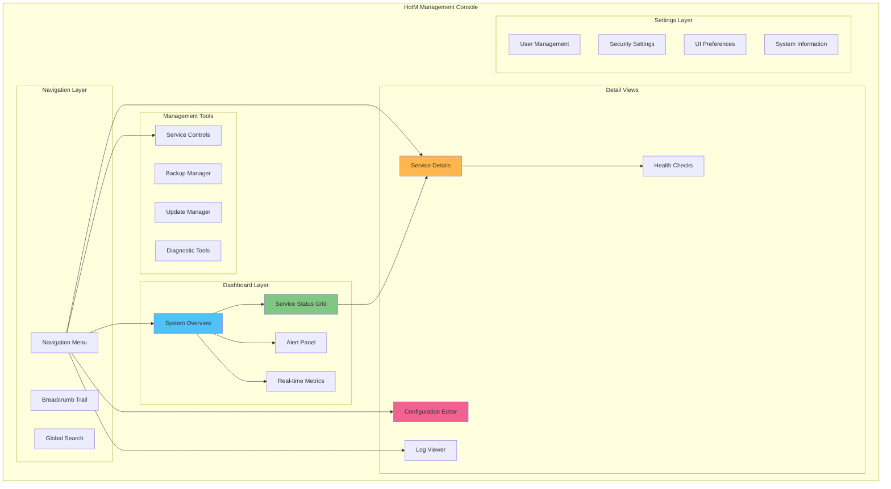

# HotM Service Monitoring and Management UI Design

## Overview

This document defines comprehensive user interface patterns for monitoring and managing HotM Windows services, providing administrators with intuitive controls, real-time insights, and troubleshooting capabilities through a modern, accessible web-based management console.

## UI Architecture Overview

### Management Console Structure



## Main Dashboard Design

### System Overview Dashboard

```typescript
interface SystemOverview {
  // System Health Summary
  overallHealth: 'healthy' | 'degraded' | 'unhealthy';
  servicesRunning: number;
  servicesTotal: number;
  uptime: number;
  lastUpdate: Date;
  
  // Service Status Summary
  services: ServiceStatusSummary[];
  
  // Resource Usage
  systemResources: SystemResourceUsage;
  
  // Recent Events
  recentAlerts: Alert[];
  recentActivities: Activity[];
  
  // Quick Actions
  availableActions: QuickAction[];
}

interface ServiceStatusSummary {
  name: string;
  displayName: string;
  status: 'running' | 'stopped' | 'starting' | 'stopping' | 'error';
  health: 'healthy' | 'degraded' | 'unhealthy' | 'unknown';
  uptime: number;
  lastRestart: Date;
  cpuUsage: number;
  memoryUsage: number;
  connectionCount?: number;
  errorCount: number;
  warningCount: number;
}
```

**Dashboard Layout:**
```jsx
function SystemOverviewDashboard() {
  const { systemStatus, services, alerts, metrics } = useSystemStatus();
  
  return (
    <div className="dashboard-grid">
      {/* Health Status Header */}
      <div className="status-header">
        <HealthIndicator 
          status={systemStatus.overallHealth}
          uptime={systemStatus.uptime}
          lastUpdate={systemStatus.lastUpdate}
        />
        <QuickActions actions={systemStatus.availableActions} />
      </div>
      
      {/* Service Status Grid */}
      <div className="service-grid">
        <ServiceStatusGrid services={services} />
      </div>
      
      {/* Alerts and Activities */}
      <div className="info-panels">
        <AlertsPanel alerts={alerts} />
        <ActivitiesPanel activities={systemStatus.recentActivities} />
      </div>
      
      {/* Real-time Metrics */}
      <div className="metrics-section">
        <SystemMetricsCharts metrics={metrics} />
      </div>
    </div>
  );
}

// Service Status Card Component
function ServiceStatusCard({ service }: { service: ServiceStatusSummary }) {
  const statusColor = {
    running: 'green',
    stopped: 'gray',
    starting: 'blue',
    stopping: 'orange', 
    error: 'red'
  }[service.status];
  
  const healthColor = {
    healthy: 'green',
    degraded: 'yellow',
    unhealthy: 'red',
    unknown: 'gray'
  }[service.health];
  
  return (
    <div className={`service-card status-${service.status}`}>
      <div className="card-header">
        <h3>{service.displayName}</h3>
        <div className="status-indicators">
          <StatusBadge color={statusColor} text={service.status} />
          <HealthBadge color={healthColor} text={service.health} />
        </div>
      </div>
      
      <div className="card-metrics">
        <MetricDisplay
          label="CPU"
          value={service.cpuUsage}
          suffix="%"
          threshold={80}
        />
        <MetricDisplay
          label="Memory" 
          value={service.memoryUsage}
          suffix="MB"
          threshold={1000}
        />
        {service.connectionCount !== undefined && (
          <MetricDisplay
            label="Connections"
            value={service.connectionCount}
            threshold={90}
          />
        )}
      </div>
      
      <div className="card-status">
        <div className="uptime">
          <span>Uptime: {formatDuration(service.uptime)}</span>
        </div>
        <div className="issues">
          {service.errorCount > 0 && (
            <span className="error-count">{service.errorCount} errors</span>
          )}
          {service.warningCount > 0 && (
            <span className="warning-count">{service.warningCount} warnings</span>
          )}
        </div>
      </div>
      
      <div className="card-actions">
        <ServiceControlButtons service={service} />
        <DropdownMenu>
          <MenuItem onClick={() => viewDetails(service)}>View Details</MenuItem>
          <MenuItem onClick={() => viewLogs(service)}>View Logs</MenuItem>
          <MenuItem onClick={() => runDiagnostics(service)}>Diagnostics</MenuItem>
        </DropdownMenu>
      </div>
    </div>
  );
}
```

### Service Status Grid

**Interactive Service Management:**
```jsx
function ServiceStatusGrid({ services }: { services: ServiceStatusSummary[] }) {
  const [selectedServices, setSelectedServices] = useState<string[]>([]);
  const [sortBy, setSortBy] = useState<SortOption>('name');
  const [filterBy, setFilterBy] = useState<FilterOption>('all');
  
  const filteredServices = useMemo(() => {
    return services
      .filter(service => applyFilter(service, filterBy))
      .sort((a, b) => applySorting(a, b, sortBy));
  }, [services, filterBy, sortBy]);
  
  return (
    <div className="service-status-grid">
      <div className="grid-controls">
        <FilterDropdown value={filterBy} onChange={setFilterBy} />
        <SortDropdown value={sortBy} onChange={setSortBy} />
        <BulkActions selectedServices={selectedServices} />
        <RefreshButton />
      </div>
      
      <div className="grid-header">
        <div className="select-column">
          <Checkbox
            checked={selectedServices.length === services.length}
            indeterminate={selectedServices.length > 0 && selectedServices.length < services.length}
            onChange={(checked) => 
              setSelectedServices(checked ? services.map(s => s.name) : [])
            }
          />
        </div>
        <div className="service-column">Service</div>
        <div className="status-column">Status</div>
        <div className="health-column">Health</div>
        <div className="metrics-column">Resources</div>
        <div className="uptime-column">Uptime</div>
        <div className="actions-column">Actions</div>
      </div>
      
      <div className="grid-body">
        {filteredServices.map(service => (
          <ServiceGridRow
            key={service.name}
            service={service}
            selected={selectedServices.includes(service.name)}
            onSelect={(selected) => toggleSelection(service.name, selected)}
          />
        ))}
      </div>
    </div>
  );
}

function ServiceGridRow({ 
  service, 
  selected, 
  onSelect 
}: {
  service: ServiceStatusSummary;
  selected: boolean;
  onSelect: (selected: boolean) => void;
}) {
  const [isExpanded, setIsExpanded] = useState(false);
  
  return (
    <div className={`grid-row ${selected ? 'selected' : ''}`}>
      <div className="row-main" onClick={() => setIsExpanded(!isExpanded)}>
        <div className="select-column">
          <Checkbox
            checked={selected}
            onChange={onSelect}
            onClick={(e) => e.stopPropagation()}
          />
        </div>
        
        <div className="service-column">
          <div className="service-info">
            <span className="service-icon">
              {getServiceIcon(service.name)}
            </span>
            <div>
              <div className="service-name">{service.displayName}</div>
              <div className="service-id">{service.name}</div>
            </div>
          </div>
        </div>
        
        <div className="status-column">
          <StatusIndicator status={service.status} />
        </div>
        
        <div className="health-column">
          <HealthIndicator health={service.health} />
        </div>
        
        <div className="metrics-column">
          <ResourceBar
            cpu={service.cpuUsage}
            memory={service.memoryUsage}
          />
        </div>
        
        <div className="uptime-column">
          {formatDuration(service.uptime)}
        </div>
        
        <div className="actions-column">
          <ServiceControlButtons service={service} compact />
        </div>
      </div>
      
      {isExpanded && (
        <div className="row-expanded">
          <ServiceDetailsPreview service={service} />
        </div>
      )}
    </div>
  );
}
```

## Service Detail Views

### Individual Service Management

```jsx
function ServiceDetailView({ serviceName }: { serviceName: string }) {
  const { service, loading, error } = useServiceDetails(serviceName);
  const [activeTab, setActiveTab] = useState('overview');
  
  if (loading) return <LoadingSpinner />;
  if (error) return <ErrorMessage error={error} />;
  
  return (
    <div className="service-detail-view">
      <div className="service-header">
        <div className="service-title">
          <h1>{service.displayName}</h1>
          <StatusBadge status={service.status} size="large" />
        </div>
        
        <div className="service-controls">
          <ServiceControlButtons service={service} />
          <DropdownMenu>
            <MenuItem onClick={() => exportLogs(service)}>Export Logs</MenuItem>
            <MenuItem onClick={() => exportMetrics(service)}>Export Metrics</MenuItem>
            <MenuItem onClick={() => generateReport(service)}>Generate Report</MenuItem>
            <MenuItem onClick={() => scheduleRestart(service)}>Schedule Restart</MenuItem>
          </DropdownMenu>
        </div>
      </div>
      
      <TabNavigation
        tabs={['overview', 'configuration', 'logs', 'metrics', 'health']}
        activeTab={activeTab}
        onTabChange={setActiveTab}
      />
      
      <div className="tab-content">
        {activeTab === 'overview' && <ServiceOverviewTab service={service} />}
        {activeTab === 'configuration' && <ServiceConfigTab service={service} />}
        {activeTab === 'logs' && <ServiceLogsTab service={service} />}
        {activeTab === 'metrics' && <ServiceMetricsTab service={service} />}
        {activeTab === 'health' && <ServiceHealthTab service={service} />}
      </div>
    </div>
  );
}

// Service Overview Tab
function ServiceOverviewTab({ service }: { service: ServiceDetails }) {
  return (
    <div className="overview-tab">
      <div className="overview-grid">
        {/* Current Status */}
        <div className="status-panel">
          <h3>Current Status</h3>
          <div className="status-details">
            <StatusDisplay
              status={service.status}
              health={service.health}
              uptime={service.uptime}
              lastRestart={service.lastRestart}
            />
          </div>
        </div>
        
        {/* Resource Usage */}
        <div className="resources-panel">
          <h3>Resource Usage</h3>
          <ResourceMetrics
            cpu={service.resources.cpu}
            memory={service.resources.memory}
            disk={service.resources.disk}
            network={service.resources.network}
          />
        </div>
        
        {/* Service Configuration */}
        <div className="config-panel">
          <h3>Configuration Summary</h3>
          <ConfigurationSummary config={service.configuration} />
        </div>
        
        {/* Recent Activity */}
        <div className="activity-panel">
          <h3>Recent Activity</h3>
          <ActivityTimeline activities={service.recentActivity} />
        </div>
        
        {/* Health Checks */}
        <div className="health-panel">
          <h3>Health Checks</h3>
          <HealthCheckResults checks={service.healthChecks} />
        </div>
        
        {/* Dependencies */}
        <div className="dependencies-panel">
          <h3>Dependencies</h3>
          <DependencyMap dependencies={service.dependencies} />
        </div>
      </div>
    </div>
  );
}
```

### Real-time Log Viewer

```jsx
function ServiceLogsTab({ service }: { service: ServiceDetails }) {
  const [logs, setLogs] = useState<LogEntry[]>([]);
  const [isStreaming, setIsStreaming] = useState(false);
  const [filters, setFilters] = useState<LogFilters>({
    level: 'all',
    search: '',
    timeRange: '1h'
  });
  
  const { streamLogs, stopStream } = useLogStreaming(service.name);
  
  useEffect(() => {
    if (isStreaming) {
      const unsubscribe = streamLogs((newLog) => {
        setLogs(prev => [newLog, ...prev.slice(0, 999)]); // Keep last 1000 logs
      });
      
      return unsubscribe;
    }
  }, [isStreaming, streamLogs]);
  
  const filteredLogs = useMemo(() => {
    return logs.filter(log => applyLogFilters(log, filters));
  }, [logs, filters]);
  
  return (
    <div className="logs-tab">
      <div className="logs-controls">
        <div className="left-controls">
          <Button
            onClick={() => setIsStreaming(!isStreaming)}
            variant={isStreaming ? 'secondary' : 'primary'}
          >
            {isStreaming ? 'Stop Streaming' : 'Start Streaming'}
          </Button>
          <Button onClick={() => setLogs([])}>Clear</Button>
        </div>
        
        <div className="filter-controls">
          <SearchInput
            value={filters.search}
            onChange={(search) => setFilters(prev => ({ ...prev, search }))}
            placeholder="Search logs..."
          />
          <LogLevelFilter
            value={filters.level}
            onChange={(level) => setFilters(prev => ({ ...prev, level }))}
          />
          <TimeRangeFilter
            value={filters.timeRange}
            onChange={(timeRange) => setFilters(prev => ({ ...prev, timeRange }))}
          />
        </div>
        
        <div className="right-controls">
          <Button onClick={() => exportLogs(filteredLogs)}>Export</Button>
          <DropdownMenu>
            <MenuItem onClick={() => downloadLogs('json')}>Download JSON</MenuItem>
            <MenuItem onClick={() => downloadLogs('csv')}>Download CSV</MenuItem>
            <MenuItem onClick={() => downloadLogs('txt')}>Download Text</MenuItem>
          </DropdownMenu>
        </div>
      </div>
      
      <div className="logs-container">
        <VirtualizedLogViewer
          logs={filteredLogs}
          isStreaming={isStreaming}
          onEntrySelect={(entry) => showLogDetails(entry)}
        />
      </div>
      
      <div className="logs-footer">
        <div className="logs-stats">
          Showing {filteredLogs.length} of {logs.length} entries
          {isStreaming && <span className="streaming-indicator">● Live</span>}
        </div>
      </div>
    </div>
  );
}

// Virtualized log viewer for performance
function VirtualizedLogViewer({ 
  logs, 
  isStreaming, 
  onEntrySelect 
}: {
  logs: LogEntry[];
  isStreaming: boolean;
  onEntrySelect: (entry: LogEntry) => void;
}) {
  const containerRef = useRef<HTMLDivElement>(null);
  const [visibleRange, setVisibleRange] = useState({ start: 0, end: 50 });
  
  // Auto-scroll to bottom when streaming new logs
  useEffect(() => {
    if (isStreaming && containerRef.current) {
      containerRef.current.scrollTop = 0; // Scroll to top (newest logs)
    }
  }, [logs.length, isStreaming]);
  
  const visibleLogs = logs.slice(visibleRange.start, visibleRange.end);
  
  return (
    <div 
      ref={containerRef}
      className="virtualized-log-viewer"
      onScroll={handleScroll}
    >
      {visibleLogs.map((log, index) => (
        <LogEntryRow
          key={`${log.timestamp}-${index}`}
          entry={log}
          onClick={() => onEntrySelect(log)}
        />
      ))}
      
      {logs.length === 0 && (
        <div className="empty-logs">
          No log entries available
          {isStreaming && <div>Waiting for new entries...</div>}
        </div>
      )}
    </div>
  );
}

function LogEntryRow({ 
  entry, 
  onClick 
}: { 
  entry: LogEntry; 
  onClick: () => void; 
}) {
  const levelColor = {
    error: '#f44336',
    warn: '#ff9800', 
    info: '#2196f3',
    debug: '#4caf50',
    trace: '#9e9e9e'
  }[entry.level];
  
  return (
    <div 
      className={`log-entry log-level-${entry.level}`}
      onClick={onClick}
    >
      <div className="log-timestamp">
        {formatTimestamp(entry.timestamp)}
      </div>
      <div 
        className="log-level"
        style={{ backgroundColor: levelColor }}
      >
        {entry.level.toUpperCase()}
      </div>
      <div className="log-service">
        {entry.service}
      </div>
      <div className="log-message">
        <HighlightedText text={entry.message} />
      </div>
      {entry.correlation_id && (
        <div className="log-correlation">
          {entry.correlation_id.slice(0, 8)}
        </div>
      )}
    </div>
  );
}
```

## Configuration Management Interface

### Visual Configuration Editor

```jsx
function ServiceConfigTab({ service }: { service: ServiceDetails }) {
  const [config, setConfig] = useState(service.configuration);
  const [isDirty, setIsDirty] = useState(false);
  const [validationErrors, setValidationErrors] = useState<ValidationError[]>([]);
  const [previewMode, setPreviewMode] = useState(false);
  
  const handleConfigChange = useCallback((path: string, value: any) => {
    setConfig(prev => updateNestedValue(prev, path, value));
    setIsDirty(true);
    
    // Real-time validation
    validateConfiguration(config).then(setValidationErrors);
  }, [config]);
  
  const handleSave = async () => {
    try {
      await saveServiceConfiguration(service.name, config);
      setIsDirty(false);
      toast.success('Configuration saved successfully');
      
      // Check if restart is required
      if (requiresRestart(service.configuration, config)) {
        showRestartPrompt(service);
      }
    } catch (error) {
      toast.error('Failed to save configuration');
    }
  };
  
  const handleReset = () => {
    setConfig(service.configuration);
    setIsDirty(false);
    setValidationErrors([]);
  };
  
  return (
    <div className="config-tab">
      <div className="config-controls">
        <div className="left-controls">
          <Button 
            onClick={handleSave}
            disabled={!isDirty || validationErrors.length > 0}
            variant="primary"
          >
            Save Changes
          </Button>
          <Button onClick={handleReset} disabled={!isDirty}>
            Reset
          </Button>
        </div>
        
        <div className="center-controls">
          {validationErrors.length > 0 && (
            <ValidationStatus errors={validationErrors} />
          )}
        </div>
        
        <div className="right-controls">
          <ToggleButton
            checked={previewMode}
            onChange={setPreviewMode}
            label="Preview Mode"
          />
          <DropdownMenu>
            <MenuItem onClick={() => exportConfig(config)}>Export Config</MenuItem>
            <MenuItem onClick={() => importConfig()}>Import Config</MenuItem>
            <MenuItem onClick={() => resetToDefaults()}>Reset to Defaults</MenuItem>
          </DropdownMenu>
        </div>
      </div>
      
      {previewMode ? (
        <ConfigPreview 
          config={config}
          originalConfig={service.configuration}
        />
      ) : (
        <ConfigEditor
          config={config}
          schema={service.configSchema}
          onChange={handleConfigChange}
          errors={validationErrors}
        />
      )}
    </div>
  );
}

function ConfigEditor({ 
  config, 
  schema, 
  onChange, 
  errors 
}: {
  config: Configuration;
  schema: ConfigurationSchema;
  onChange: (path: string, value: any) => void;
  errors: ValidationError[];
}) {
  const [expandedSections, setExpandedSections] = useState<string[]>(['general']);
  
  const toggleSection = (sectionName: string) => {
    setExpandedSections(prev => 
      prev.includes(sectionName)
        ? prev.filter(s => s !== sectionName)
        : [...prev, sectionName]
    );
  };
  
  return (
    <div className="config-editor">
      {schema.sections.map(section => (
        <ConfigSection
          key={section.name}
          section={section}
          config={config}
          isExpanded={expandedSections.includes(section.name)}
          onToggle={() => toggleSection(section.name)}
          onChange={onChange}
          errors={errors.filter(e => e.path.startsWith(section.name))}
        />
      ))}
    </div>
  );
}

function ConfigSection({
  section,
  config,
  isExpanded,
  onToggle,
  onChange,
  errors
}: {
  section: ConfigSection;
  config: Configuration;
  isExpanded: boolean;
  onToggle: () => void;
  onChange: (path: string, value: any) => void;
  errors: ValidationError[];
}) {
  const sectionErrors = errors.filter(e => e.path.startsWith(section.name));
  
  return (
    <div className={`config-section ${sectionErrors.length > 0 ? 'has-errors' : ''}`}>
      <div className="section-header" onClick={onToggle}>
        <div className="section-title">
          <h3>{section.displayName}</h3>
          <p className="section-description">{section.description}</p>
        </div>
        <div className="section-controls">
          {sectionErrors.length > 0 && (
            <ErrorBadge count={sectionErrors.length} />
          )}
          <ChevronIcon expanded={isExpanded} />
        </div>
      </div>
      
      {isExpanded && (
        <div className="section-content">
          {section.fields.map(field => (
            <ConfigField
              key={field.path}
              field={field}
              value={getNestedValue(config, field.path)}
              onChange={(value) => onChange(field.path, value)}
              error={errors.find(e => e.path === field.path)}
            />
          ))}
        </div>
      )}
    </div>
  );
}

function ConfigField({
  field,
  value,
  onChange,
  error
}: {
  field: ConfigFieldSchema;
  value: any;
  onChange: (value: any) => void;
  error?: ValidationError;
}) {
  const renderInput = () => {
    switch (field.type) {
      case 'string':
        return (
          <TextInput
            value={value || ''}
            onChange={onChange}
            placeholder={field.placeholder}
            disabled={field.readonly}
          />
        );
        
      case 'number':
        return (
          <NumberInput
            value={value || 0}
            onChange={onChange}
            min={field.min}
            max={field.max}
            step={field.step}
            disabled={field.readonly}
          />
        );
        
      case 'boolean':
        return (
          <Toggle
            checked={value || false}
            onChange={onChange}
            disabled={field.readonly}
          />
        );
        
      case 'select':
        return (
          <Select
            value={value}
            onChange={onChange}
            options={field.options}
            disabled={field.readonly}
          />
        );
        
      case 'path':
        return (
          <PathInput
            value={value || ''}
            onChange={onChange}
            type={field.pathType} // file|directory
            disabled={field.readonly}
          />
        );
        
      default:
        return <span>Unknown field type: {field.type}</span>;
    }
  };
  
  return (
    <div className={`config-field ${error ? 'has-error' : ''}`}>
      <div className="field-label">
        <label>{field.displayName}</label>
        {field.required && <span className="required">*</span>}
        {field.requiresRestart && <RestartBadge />}
      </div>
      
      <div className="field-input">
        {renderInput()}
      </div>
      
      {field.description && (
        <div className="field-description">
          {field.description}
        </div>
      )}
      
      {error && (
        <div className="field-error">
          {error.message}
        </div>
      )}
    </div>
  );
}
```

## Health Monitoring Interface

### Comprehensive Health Dashboard

```jsx
function ServiceHealthTab({ service }: { service: ServiceDetails }) {
  const { healthChecks, loading } = useHealthChecks(service.name);
  const [selectedCategory, setSelectedCategory] = useState<string>('all');
  const [autoRefresh, setAutoRefresh] = useState(true);
  
  const healthCategories = useMemo(() => {
    const categories = new Set(healthChecks.map(check => check.category));
    return ['all', ...Array.from(categories)];
  }, [healthChecks]);
  
  const filteredChecks = useMemo(() => {
    return selectedCategory === 'all' 
      ? healthChecks 
      : healthChecks.filter(check => check.category === selectedCategory);
  }, [healthChecks, selectedCategory]);
  
  return (
    <div className="health-tab">
      <div className="health-controls">
        <div className="category-filter">
          <ButtonGroup>
            {healthCategories.map(category => (
              <Button
                key={category}
                variant={selectedCategory === category ? 'primary' : 'secondary'}
                onClick={() => setSelectedCategory(category)}
              >
                {capitalize(category)}
              </Button>
            ))}
          </ButtonGroup>
        </div>
        
        <div className="refresh-controls">
          <ToggleButton
            checked={autoRefresh}
            onChange={setAutoRefresh}
            label="Auto Refresh"
          />
          <Button onClick={() => runAllHealthChecks(service.name)}>
            Run All Checks
          </Button>
        </div>
      </div>
      
      <div className="health-overview">
        <HealthSummaryCards checks={filteredChecks} />
      </div>
      
      <div className="health-checks">
        <HealthCheckGrid checks={filteredChecks} loading={loading} />
      </div>
      
      <div className="health-history">
        <HealthTrendChart service={service.name} />
      </div>
    </div>
  );
}

function HealthCheckGrid({ 
  checks, 
  loading 
}: { 
  checks: HealthCheck[]; 
  loading: boolean; 
}) {
  if (loading) return <LoadingSpinner />;
  
  return (
    <div className="health-check-grid">
      {checks.map(check => (
        <HealthCheckCard key={check.name} check={check} />
      ))}
    </div>
  );
}

function HealthCheckCard({ check }: { check: HealthCheck }) {
  const [expanded, setExpanded] = useState(false);
  
  const statusColor = {
    pass: '#4caf50',
    warn: '#ff9800',
    fail: '#f44336'
  }[check.status];
  
  return (
    <div className={`health-check-card status-${check.status}`}>
      <div className="card-header" onClick={() => setExpanded(!expanded)}>
        <div className="check-info">
          <div className="check-name">{check.name}</div>
          <div className="check-category">{check.category}</div>
        </div>
        <div className="check-status">
          <StatusIcon status={check.status} color={statusColor} />
          <span className="status-text">{check.status.toUpperCase()}</span>
        </div>
      </div>
      
      <div className="card-summary">
        <div className="check-message">{check.message}</div>
        <div className="check-duration">
          Duration: {check.duration}ms
        </div>
      </div>
      
      {expanded && (
        <div className="card-details">
          {check.value !== undefined && (
            <div className="check-value">
              Value: {check.value}
              {check.threshold && ` (threshold: ${check.threshold})`}
            </div>
          )}
          
          {check.details && (
            <div className="check-details-text">
              <pre>{JSON.stringify(check.details, null, 2)}</pre>
            </div>
          )}
          
          <div className="check-actions">
            <Button 
              size="small" 
              onClick={() => rerunHealthCheck(check.name)}
            >
              Rerun Check
            </Button>
            {check.status === 'fail' && (
              <Button 
                size="small" 
                variant="secondary"
                onClick={() => showTroubleshootingGuide(check)}
              >
                Troubleshoot
              </Button>
            )}
          </div>
        </div>
      )}
    </div>
  );
}
```

This comprehensive service monitoring and management UI design provides administrators with powerful, intuitive tools for managing HotM Windows services while maintaining enterprise-grade functionality and user experience standards.