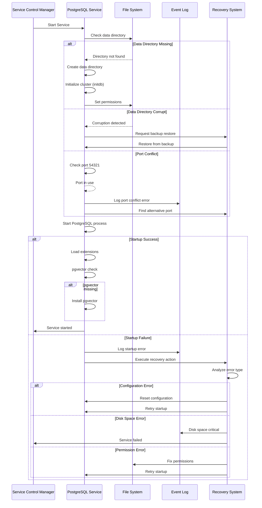
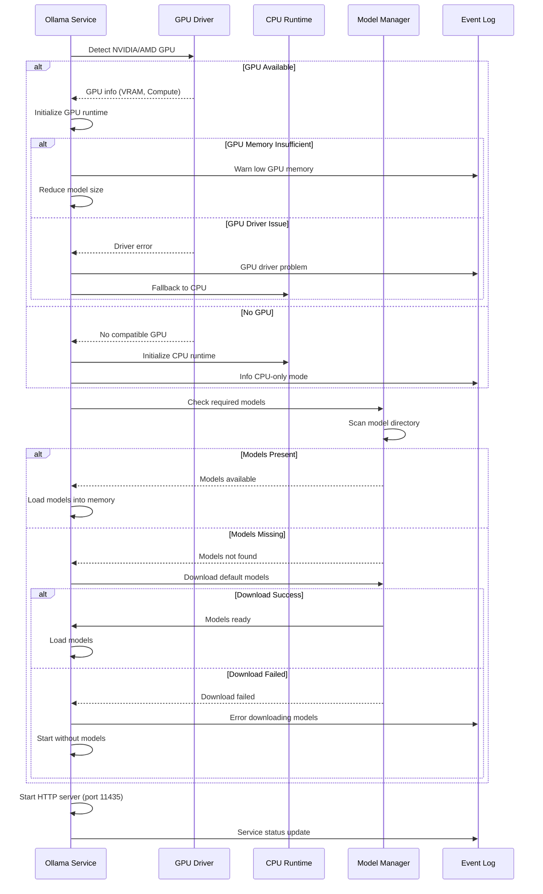
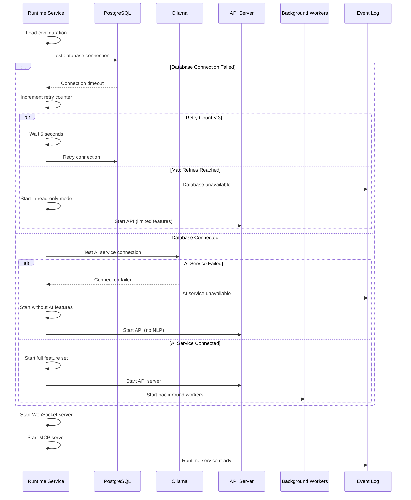

# HotM Windows Service Startup Sequencing and Error Handling

## Overview

This document defines the detailed startup sequencing, error handling, and recovery mechanisms for the HotM Windows service stack. The design ensures reliable service initialization with comprehensive error recovery and graceful degradation.

## Service Startup Flow

### Complete Startup Sequence

```mermaid
graph TD
    START([System Boot]) --> SCM_INIT[SCM Initialization]
    SCM_INIT --> DEPS_CHECK{Check System Dependencies}
    
    DEPS_CHECK -->|Missing| DEPS_ERROR[Log Dependency Error]
    DEPS_CHECK -->|Available| PG_START[Start hotm-postgres]
    
    PG_START --> PG_INIT[Initialize PostgreSQL]
    PG_INIT --> PG_CLUSTER{Data Cluster Exists?}
    
    PG_CLUSTER -->|No| PG_INITDB[Run initdb]
    PG_CLUSTER -->|Yes| PG_CONFIG[Load Configuration]
    
    PG_INITDB --> PG_CONFIG
    PG_CONFIG --> PG_EXTENSIONS[Load Extensions]
    PG_EXTENSIONS --> PG_VECTOR{pgvector Available?}
    
    PG_VECTOR -->|No| PG_VECTOR_INSTALL[Install pgvector]
    PG_VECTOR -->|Yes| PG_READY[PostgreSQL Ready]
    PG_VECTOR_INSTALL --> PG_READY
    
    PG_READY --> PG_HEALTH[Health Check]
    PG_HEALTH -->|Pass| OL_START[Start hotm-ollama]
    PG_HEALTH -->|Fail| PG_ERROR[PostgreSQL Error]
    
    OL_START --> OL_GPU{GPU Available?}
    OL_GPU -->|Yes| OL_GPU_INIT[Initialize GPU Support]
    OL_GPU -->|No| OL_CPU[CPU-Only Mode]
    
    OL_GPU_INIT --> OL_MODELS[Check Required Models]
    OL_CPU --> OL_MODELS
    
    OL_MODELS --> OL_DOWNLOAD{Models Missing?}
    OL_DOWNLOAD -->|Yes| OL_PULL[Download Models]
    OL_DOWNLOAD -->|No| OL_LOAD[Load Models]
    
    OL_PULL --> OL_LOAD
    OL_LOAD --> OL_READY[Ollama Ready]
    OL_READY --> OL_HEALTH[Health Check]
    
    OL_HEALTH -->|Pass| RT_START[Start hotm-runtime]
    OL_HEALTH -->|Fail| OL_ERROR[Ollama Error]
    
    RT_START --> RT_CONFIG[Load Runtime Config]
    RT_CONFIG --> RT_DB_CONN[Test DB Connection]
    RT_DB_CONN -->|Success| RT_AI_CONN[Test AI Connection]
    RT_DB_CONN -->|Fail| RT_DB_ERROR[Database Connection Error]
    
    RT_AI_CONN -->|Success| RT_API[Start API Server]
    RT_AI_CONN -->|Fail| RT_AI_ERROR[AI Connection Error]
    
    RT_API --> RT_WORKERS[Start Background Workers]
    RT_WORKERS --> RT_MCP[Start MCP Server]
    RT_MCP --> RT_READY[Runtime Ready]
    
    RT_READY --> RT_HEALTH[Health Check]
    RT_HEALTH -->|Pass| MON_START[Start hotm-monitor]
    RT_HEALTH -->|Fail| RT_ERROR[Runtime Error]
    
    MON_START --> MON_REGISTER[Register Monitoring]
    MON_REGISTER --> MON_METRICS[Start Metrics Collection]
    MON_METRICS --> MON_READY[Monitor Ready]
    
    MON_READY --> STARTUP_COMPLETE([All Services Running])
    
    %% Error Handlers
    DEPS_ERROR --> STARTUP_FAILED([Startup Failed])
    PG_ERROR --> RECOVERY_PG[PostgreSQL Recovery]
    OL_ERROR --> RECOVERY_OL[Ollama Recovery]  
    RT_DB_ERROR --> RECOVERY_RT_DB[Runtime DB Recovery]
    RT_AI_ERROR --> RECOVERY_RT_AI[Runtime AI Recovery]
    RT_ERROR --> RECOVERY_RT[Runtime Recovery]
    
    RECOVERY_PG --> PG_RETRY{Retry Count < 3?}
    PG_RETRY -->|Yes| PG_START
    PG_RETRY -->|No| STARTUP_FAILED
    
    RECOVERY_OL --> OL_RETRY{Retry Count < 3?}
    OL_RETRY -->|Yes| OL_START
    OL_RETRY -->|No| OL_DEGRADED[Ollama Disabled Mode]
    OL_DEGRADED --> RT_START
    
    RECOVERY_RT_DB --> RT_DB_RETRY{Retry Count < 3?}
    RT_DB_RETRY -->|Yes| RT_DB_CONN
    RT_DB_RETRY -->|No| RT_READONLY[Read-Only Mode]
    RT_READONLY --> RT_API
    
    RECOVERY_RT_AI --> RT_AI_RETRY{Retry Count < 3?}
    RT_AI_RETRY -->|Yes| RT_AI_CONN
    RT_AI_RETRY -->|No| RT_NO_AI[No AI Mode]
    RT_NO_AI --> RT_API
    
    RECOVERY_RT --> RT_RETRY{Retry Count < 3?}
    RT_RETRY -->|Yes| RT_START
    RT_RETRY -->|No| STARTUP_FAILED
    
    style START fill:#4fc3f7
    style STARTUP_COMPLETE fill:#81c784
    style STARTUP_FAILED fill:#f44336
    style PG_READY fill:#8bc34a
    style OL_READY fill:#ffc107
    style RT_READY fill:#ff9800
    style MON_READY fill:#9c27b0
```



## Detailed Error Handling Strategies

### PostgreSQL Service Error Handling

#### Startup Errors and Recovery



#### PostgreSQL Recovery Actions

**Configuration Error Recovery:**
```sql
-- Reset to safe defaults
# postgresql.conf
listen_addresses = 'localhost'
port = 54321
max_connections = 100
shared_buffers = 128MB
log_destination = 'eventlog'
log_statement = 'error'
```

**Data Corruption Recovery:**
```bash
# Automatic recovery sequence
pg_ctl stop -D $DATA_DIR
pg_resetwal -f $DATA_DIR
pg_ctl start -D $DATA_DIR

# Rebuild indexes if needed
REINDEX DATABASE hotm;
```

**Permission Recovery:**
```powershell
# Fix directory permissions
$dataPath = "$env:PROGRAMDATA\HotM\PostgreSQL\data"
icacls $dataPath /grant "NT AUTHORITY\LocalService:(OI)(CI)F"
icacls $dataPath /grant "Administrators:(OI)(CI)F"
```

### Ollama Service Error Handling

#### GPU Detection and Fallback



#### Model Management and Recovery

**Model Download Recovery:**
```rust
pub struct ModelManager {
    required_models: Vec<String>,
    download_retries: u32,
    fallback_models: Vec<String>,
}

impl ModelManager {
    pub async fn ensure_models(&self) -> Result<()> {
        for model in &self.required_models {
            if !self.model_exists(model).await? {
                match self.download_model(model).await {
                    Ok(_) => info!("Downloaded model: {}", model),
                    Err(e) => {
                        warn!("Failed to download {}: {}", model, e);
                        if let Some(fallback) = self.get_fallback(model) {
                            self.download_model(fallback).await?;
                        }
                    }
                }
            }
        }
        Ok(())
    }
}
```

**GPU Memory Management:**
```bash
# Monitor GPU memory usage
nvidia-smi --query-gpu=memory.used,memory.total --format=csv

# Adjust Ollama GPU memory fraction
export OLLAMA_GPU_MEMORY_FRACTION=0.6

# Enable CPU fallback for large models
export OLLAMA_CPU_FALLBACK=true
```

### HotM Runtime Service Error Handling

#### Service Dependency Validation



#### Graceful Degradation Modes

**Database Connection Failure:**
```rust
pub enum RuntimeMode {
    Full,           // All features available
    NoAI,          // Database only, no AI processing
    ReadOnly,      // Read operations only
    Maintenance,   // Health checks and diagnostics only
}

impl RuntimeService {
    pub async fn start_with_mode(&mut self, mode: RuntimeMode) -> Result<()> {
        match mode {
            RuntimeMode::Full => {
                self.start_database().await?;
                self.start_ai_service().await?;
                self.start_workers().await?;
            }
            RuntimeMode::NoAI => {
                self.start_database().await?;
                warn!("Starting without AI features");
            }
            RuntimeMode::ReadOnly => {
                self.start_database_readonly().await?;
                warn!("Starting in read-only mode");
            }
            RuntimeMode::Maintenance => {
                self.start_health_checks_only().await?;
                warn!("Starting in maintenance mode");
            }
        }
        Ok(())
    }
}
```

**Circuit Breaker Pattern for External Services:**
```rust
pub struct CircuitBreaker {
    failure_count: AtomicU32,
    last_failure: AtomicU64,
    threshold: u32,
    timeout: Duration,
    state: AtomicU8, // 0=Closed, 1=Open, 2=HalfOpen
}

impl CircuitBreaker {
    pub async fn call<F, T>(&self, f: F) -> Result<T>
    where
        F: Future<Output = Result<T>>,
    {
        match self.get_state() {
            CircuitState::Open => {
                if self.should_attempt_reset() {
                    self.set_state(CircuitState::HalfOpen);
                } else {
                    return Err(Error::CircuitOpen);
                }
            }
            CircuitState::HalfOpen => {
                // Allow one test request
            }
            CircuitState::Closed => {
                // Normal operation
            }
        }
        
        match f.await {
            Ok(result) => {
                self.on_success();
                Ok(result)
            }
            Err(e) => {
                self.on_failure();
                Err(e)
            }
        }
    }
}
```

## Service Recovery Mechanisms

### Automatic Recovery Actions

#### Service Recovery Configuration

```ini
[Recovery Actions]
# First failure: Restart the service
First Failure Action: Restart Service
First Failure Delay: 5000 ms

# Second failure: Restart the service
Second Failure Action: Restart Service  
Second Failure Delay: 10000 ms

# Third failure: Run recovery program
Third Failure Action: Run Program
Recovery Program: "%ProgramFiles%\HotM\bin\hotm-recovery.exe"
Recovery Parameters: "--service=%1 --mode=full"

# Reset counter after 24 hours
Reset Counter: 86400 seconds
```

#### Recovery Program Implementation

```rust
// hotm-recovery.exe
pub struct ServiceRecovery {
    service_name: String,
    recovery_mode: RecoveryMode,
    max_attempts: u32,
}

#[derive(Debug, Clone)]
pub enum RecoveryMode {
    Full,           // Full recovery attempt
    Conservative,   // Safe mode recovery
    Emergency,      // Minimal functionality
}

impl ServiceRecovery {
    pub async fn execute(&self) -> Result<()> {
        info!("Starting recovery for service: {}", self.service_name);
        
        match self.service_name.as_str() {
            "hotm-postgres" => self.recover_postgres().await,
            "hotm-ollama" => self.recover_ollama().await,
            "hotm-runtime" => self.recover_runtime().await,
            _ => Err(Error::UnknownService(self.service_name.clone())),
        }
    }
    
    async fn recover_postgres(&self) -> Result<()> {
        // 1. Check data directory integrity
        self.check_postgres_data_dir().await?;
        
        // 2. Verify port availability
        self.check_port_availability(54321).await?;
        
        // 3. Validate configuration
        self.validate_postgres_config().await?;
        
        // 4. Repair if necessary
        if self.recovery_mode == RecoveryMode::Full {
            self.repair_postgres_cluster().await?;
        }
        
        // 5. Restart service
        self.restart_service("hotm-postgres").await?;
        
        // 6. Verify startup
        self.verify_postgres_health().await?;
        
        Ok(())
    }
    
    async fn recover_ollama(&self) -> Result<()> {
        // 1. Check GPU status
        let gpu_available = self.check_gpu_availability().await?;
        
        // 2. Verify model files
        self.check_model_integrity().await?;
        
        // 3. Clear model cache if corrupted
        if self.recovery_mode == RecoveryMode::Full {
            self.clear_model_cache().await?;
        }
        
        // 4. Restart with appropriate configuration
        if gpu_available {
            self.restart_ollama_with_gpu().await?;
        } else {
            self.restart_ollama_cpu_only().await?;
        }
        
        // 5. Verify model loading
        self.verify_ollama_models().await?;
        
        Ok(())
    }
}
```

### Health Monitoring and Proactive Recovery

#### Continuous Health Monitoring

```rust
pub struct HealthMonitor {
    checks: Vec<Box<dyn HealthCheck>>,
    check_interval: Duration,
    alert_threshold: u32,
    recovery_actions: HashMap<String, Box<dyn RecoveryAction>>,
}

impl HealthMonitor {
    pub async fn start_monitoring(&mut self) -> Result<()> {
        loop {
            let mut failed_checks = Vec::new();
            
            for check in &self.checks {
                match check.execute().await {
                    Ok(HealthStatus::Healthy) => {
                        // All good, continue
                    }
                    Ok(HealthStatus::Degraded { service, message }) => {
                        warn!("Service degraded: {} - {}", service, message);
                    }
                    Ok(HealthStatus::Unhealthy { service, error }) => {
                        error!("Service unhealthy: {} - {}", service, error);
                        failed_checks.push(service);
                    }
                    Err(e) => {
                        error!("Health check failed: {}", e);
                    }
                }
            }
            
            // Execute recovery actions for failed services
            for service in failed_checks {
                if let Some(action) = self.recovery_actions.get(&service) {
                    action.execute().await.unwrap_or_else(|e| {
                        error!("Recovery action failed for {}: {}", service, e);
                    });
                }
            }
            
            tokio::time::sleep(self.check_interval).await;
        }
    }
}

#[derive(Debug)]
pub enum HealthStatus {
    Healthy,
    Degraded { service: String, message: String },
    Unhealthy { service: String, error: String },
}

#[async_trait]
pub trait HealthCheck: Send + Sync {
    async fn execute(&self) -> Result<HealthStatus>;
}

// Example health checks
pub struct DatabaseHealthCheck {
    connection_pool: Pool<PostgresConnectionManager<tokio_postgres::NoTls>>,
}

#[async_trait]
impl HealthCheck for DatabaseHealthCheck {
    async fn execute(&self) -> Result<HealthStatus> {
        let start = Instant::now();
        
        match self.connection_pool.get().await {
            Ok(conn) => {
                let latency = start.elapsed();
                
                // Test simple query
                match conn.query_one("SELECT 1", &[]).await {
                    Ok(_) => {
                        if latency > Duration::from_millis(1000) {
                            Ok(HealthStatus::Degraded {
                                service: "postgresql".to_string(),
                                message: format!("High latency: {}ms", latency.as_millis()),
                            })
                        } else {
                            Ok(HealthStatus::Healthy)
                        }
                    }
                    Err(e) => Ok(HealthStatus::Unhealthy {
                        service: "postgresql".to_string(),
                        error: e.to_string(),
                    }),
                }
            }
            Err(e) => Ok(HealthStatus::Unhealthy {
                service: "postgresql".to_string(),
                error: format!("Connection pool exhausted: {}", e),
            }),
        }
    }
}
```

## Error Logging and Diagnostics

### Structured Error Logging

```rust
use serde_json::json;
use tracing::{error, warn, info, event, Level};

#[derive(Debug, Serialize)]
pub struct ServiceError {
    pub service: String,
    pub error_type: ErrorType,
    pub message: String,
    pub timestamp: DateTime<Utc>,
    pub correlation_id: String,
    pub recovery_action: Option<String>,
    pub metadata: serde_json::Value,
}

#[derive(Debug, Serialize)]
pub enum ErrorType {
    StartupFailure,
    ConnectionTimeout,
    ConfigurationError,
    DependencyUnavailable,
    ResourceExhausted,
    PermissionDenied,
    DataCorruption,
}

impl ServiceError {
    pub fn log_to_event_log(&self) {
        let message = format!(
            "HotM Service Error\nService: {}\nType: {:?}\nMessage: {}\nCorrelation ID: {}",
            self.service, self.error_type, self.message, self.correlation_id
        );
        
        // Windows Event Log entry
        event!(Level::ERROR, 
            service = %self.service,
            error_type = ?self.error_type,
            correlation_id = %self.correlation_id,
            "{}",
            message
        );
    }
    
    pub fn to_json(&self) -> String {
        serde_json::to_string_pretty(self).unwrap_or_default()
    }
}
```

### Diagnostic Data Collection

```rust
pub struct DiagnosticCollector {
    services: Vec<String>,
    output_path: PathBuf,
}

impl DiagnosticCollector {
    pub async fn collect_all(&self) -> Result<DiagnosticReport> {
        let mut report = DiagnosticReport::new();
        
        // System information
        report.system_info = self.collect_system_info().await?;
        
        // Service status
        report.service_status = self.collect_service_status().await?;
        
        // Configuration files
        report.configurations = self.collect_configurations().await?;
        
        // Recent logs
        report.logs = self.collect_recent_logs().await?;
        
        // Performance metrics
        report.metrics = self.collect_metrics().await?;
        
        // Network connectivity
        report.connectivity = self.test_connectivity().await?;
        
        Ok(report)
    }
    
    async fn collect_system_info(&self) -> Result<SystemInfo> {
        Ok(SystemInfo {
            os_version: std::env::var("OS")?,
            cpu_info: self.get_cpu_info().await?,
            memory_info: self.get_memory_info().await?,
            disk_info: self.get_disk_info().await?,
            gpu_info: self.get_gpu_info().await?,
            network_interfaces: self.get_network_info().await?,
        })
    }
    
    pub async fn generate_support_package(&self) -> Result<PathBuf> {
        let report = self.collect_all().await?;
        let package_path = self.output_path.join(format!(
            "hotm-diagnostics-{}.zip",
            Utc::now().format("%Y%m%d_%H%M%S")
        ));
        
        let mut zip = ZipWriter::new(File::create(&package_path)?);
        
        // Add diagnostic report
        zip.start_file("diagnostic-report.json", FileOptions::default())?;
        zip.write_all(serde_json::to_string_pretty(&report)?.as_bytes())?;
        
        // Add log files
        for log_file in report.logs.files {
            zip.start_file(&format!("logs/{}", log_file.name), FileOptions::default())?;
            zip.write_all(&log_file.content)?;
        }
        
        // Add configuration files
        for config_file in report.configurations.files {
            zip.start_file(&format!("configs/{}", config_file.name), FileOptions::default())?;
            zip.write_all(&config_file.content)?;
        }
        
        zip.finish()?;
        Ok(package_path)
    }
}
```

This comprehensive startup sequencing and error handling strategy ensures that the HotM Windows service stack can handle a wide variety of failure scenarios while maintaining system stability and providing detailed diagnostics for troubleshooting.