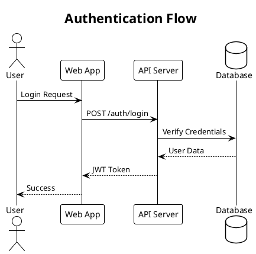
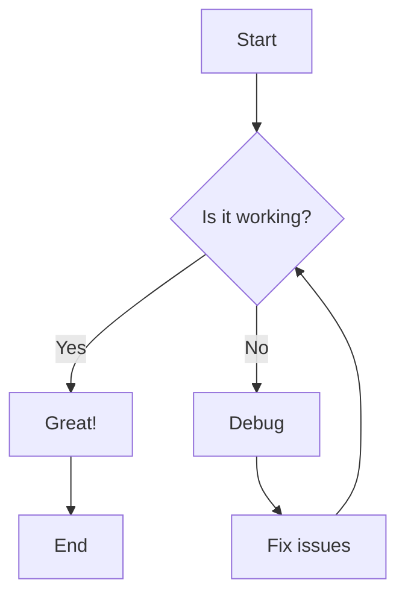
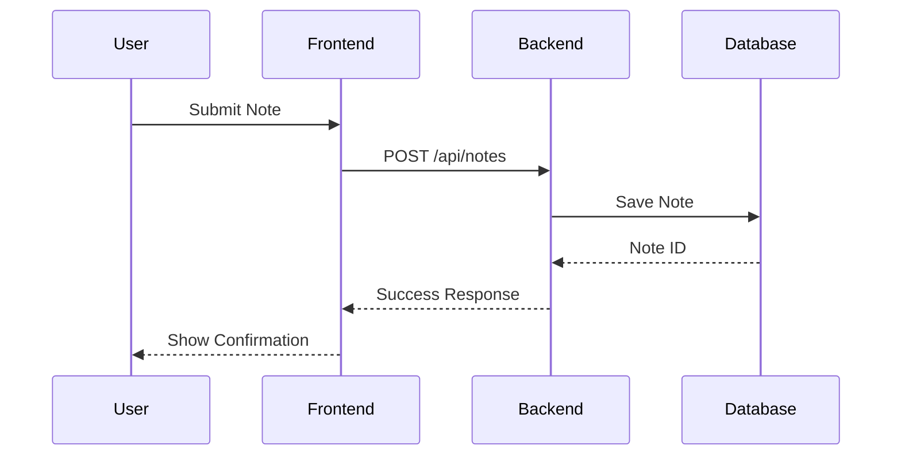
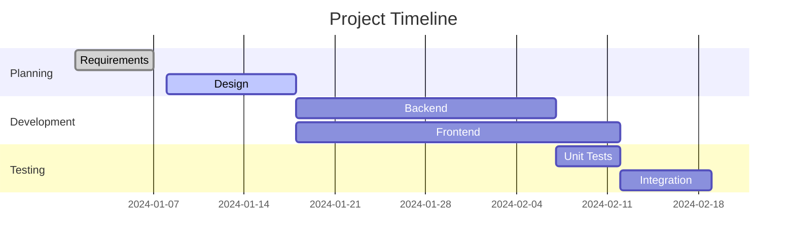
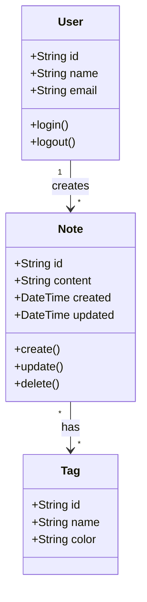
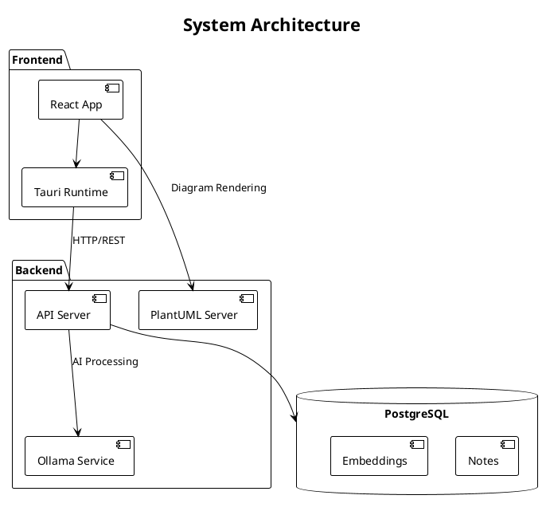
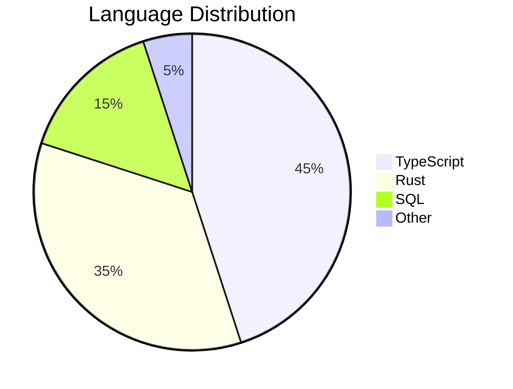

# Diagram Test Document

This document tests both PlantUML and Mermaid diagram rendering.

## PlantUML Example - Sequence Diagram



## Mermaid Example - Flowchart



## Mermaid Example - Sequence Diagram



## Mermaid Example - Gantt Chart



## Mermaid Example - Class Diagram



## PlantUML Example - Component Diagram



## Regular Code Block (should not be rendered as diagram)

```javascript
// This is just regular code
function hello() {
    console.log("Hello, World!");
}
```

## Mixed Content

Here's some regular markdown with **bold** and *italic* text, followed by a diagram:



And here's a math equation: $E = mc^2$

And a block equation:

$$
\int_0^\infty e^{-x^2} dx = \frac{\sqrt{\pi}}{2}
$$

End of test document.