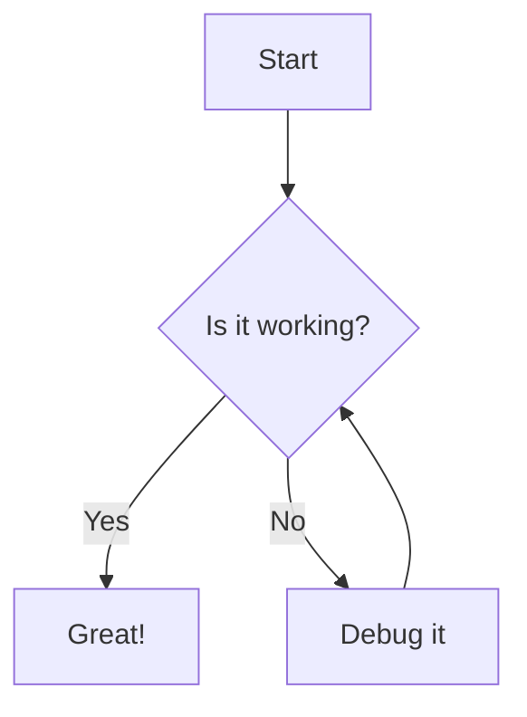
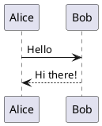

# Test Note with Rich Content

## Headers Work Now

This is a test note with **bold text** and *italic text*.

### Lists Should Render

- First item
- Second item with **bold**
- Third item with `inline code`

1. Numbered list
2. Another item
3. Final item

### Blockquotes

> This is a blockquote
> It should have special styling

### Code Blocks

```python
def hello_world():
    print("Hello from Python!")
    return 42
```

### Mermaid Diagram



### PlantUML Diagram



### Math with KaTeX

Inline math: $E = mc^2$

Block math:
$$
\int_{-\infty}^{\infty} e^{-x^2} dx = \sqrt{\pi}
$$

### Tables

| Feature | Status | Notes |
|---------|--------|-------|
| Markdown | Working | Typography plugin active |
| Mermaid | Testing | Client-side rendering |
| PlantUML | Testing | Server-side rendering |